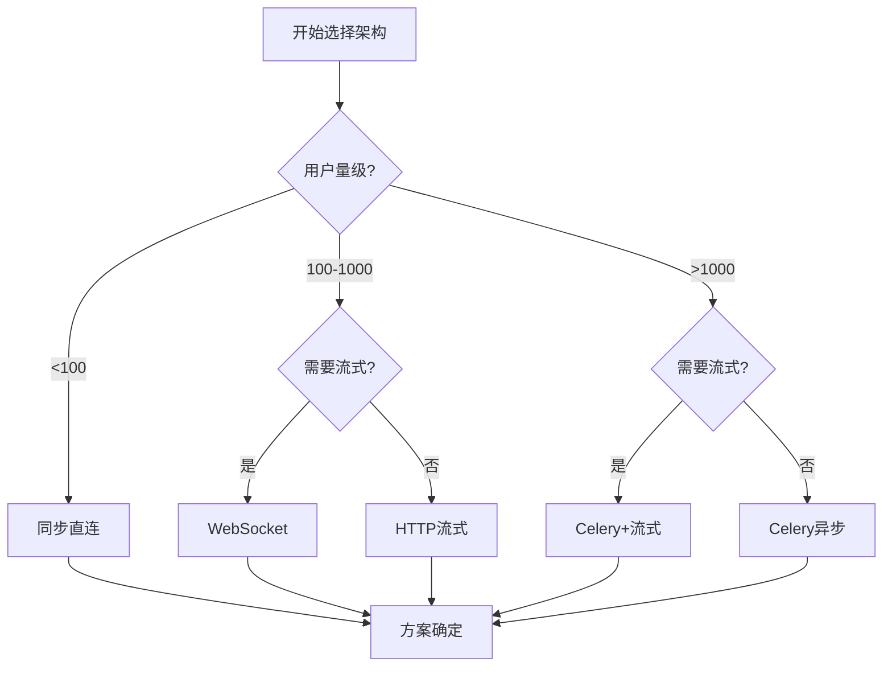

# LangGraph + FastAPI 高性能AI服务架构选择指南

## 📋 概述

本指南基于对ReActAgentHILApiMultiSessionTest项目的深入分析，总结了使用LangGraph + FastAPI构建企业级AI服务的各种架构方案及其适用场景。

## 🏗️ 核心架构组件

### 基础技术栈
- **LangGraph**: ReAct Agent框架，支持Human-in-the-Loop
- **FastAPI**: 高性能异步Web框架
- **PostgreSQL**: 持久化存储(对话历史、长期记忆)
- **Redis**: 缓存和消息队列
- **Celery**: 分布式任务队列(可选)

## 🎯 架构方案对比

### 方案一：同步直连架构

```
用户请求 → FastAPI → LangGraph Agent → 直接返回
```

**适用场景**: 
- 简单问答系统
- Agent处理时间 < 5秒
- 用户量 < 100并发
- 不需要复杂工具调用

**优势**:
- ✅ 实现简单
- ✅ 延迟最低
- ✅ 调试容易

**劣势**:
- ❌ HTTP超时风险
- ❌ 扩展性差
- ❌ 无故障恢复

```python
@app.post("/chat")
async def simple_chat(request: ChatRequest):
    agent = create_react_agent(model=llm, tools=tools)
    result = await agent.ainvoke({"messages": [request.message]})
    return {"response": result["messages"][-1].content}
```

---

### 方案二：WebSocket实时交互

```
用户 ↔ WebSocket ↔ FastAPI ↔ LangGraph Agent
```

**适用场景**:
- 实时对话应用
- 需要流式输出
- 用户量 < 1000并发
- 交互频繁的场景

**优势**:
- ✅ 真正实时交互
- ✅ 流式输出体验好
- ✅ 双向通信
- ✅ 低网络开销

**劣势**:
- ❌ 连接状态管理复杂
- ❌ 负载均衡困难
- ❌ 故障恢复弱
- ❌ 内存消耗大

```python
@app.websocket("/chat")
async def websocket_chat(websocket: WebSocket):
    await websocket.accept()
    agent = create_react_agent(...)  # 每个连接一个agent实例
    
    while True:
        message = await websocket.receive_text()
        async for chunk in agent.astream({"messages": [{"role": "user", "content": message}]}):
            await websocket.send_text(json.dumps(chunk))
```

---

### 方案三：HTTP流式输出

```
用户请求 → FastAPI → LangGraph Agent → SSE流式返回
```

**适用场景**:
- 需要流式输出
- 中等并发(1000-5000)
- 不需要复杂状态管理
- 对实时性要求高

**优势**:
- ✅ 流式体验好
- ✅ HTTP标准协议
- ✅ 负载均衡简单
- ✅ 缓存友好

**劣势**:
- ❌ HIL处理复杂
- ❌ 长连接资源占用
- ❌ 故障恢复有限

```python
@app.post("/chat/stream")
async def stream_chat(request: ChatRequest):
    async def generate():
        agent = create_react_agent(...)
        async for chunk in agent.astream({"messages": [request.messages]}):
            yield f"data: {json.dumps(chunk)}\n\n"
    
    return StreamingResponse(generate(), media_type="text/event-stream")
```

---

### 方案四：Celery异步任务架构

```
用户请求 → FastAPI → Celery Queue → Worker → LangGraph Agent
          ↓
    立即返回task_id ← Redis状态管理 ← 轮询查询结果
```

**适用场景**:
- 企业级应用
- 高并发(5000+)
- 复杂的HIL流程
- 需要故障恢复

**优势**:
- ✅ 高扩展性
- ✅ 故障恢复强
- ✅ 资源隔离好
- ✅ 支持分布式部署

**劣势**:
- ❌ 实现复杂
- ❌ 需要轮询
- ❌ 用户体验不够实时

```python
@celery_app.task
def async_agent_task(user_id, query):
    agent = create_react_agent(...)
    result = asyncio.run(agent.ainvoke({"messages": [{"role": "user", "content": query}]}))
    return result

@app.post("/chat/async")
async def async_chat(request: ChatRequest):
    task = async_agent_task.delay(request.user_id, request.message)
    return {"task_id": task.id}
```

---

### 方案五：Celery + 流式混合架构 ⭐ **推荐**

```
用户请求 → FastAPI → Celery Task → Redis Stream → SSE流式返回
```

**适用场景**:
- 需要流式输出的企业级应用
- 高并发 + 好体验
- 复杂HIL流程
- 生产环境部署

**优势**:
- ✅ 兼具扩展性和实时性
- ✅ 故障恢复能力强
- ✅ 用户体验好
- ✅ 支持复杂工作流

**劣势**:
- ❌ 架构复杂度最高
- ❌ 需要Redis Stream支持

```python
@celery_app.task
def streaming_agent_task(task_id, query):
    redis_client = redis.Redis()
    stream_key = f"agent_stream:{task_id}"
    
    async def run_agent():
        agent = create_react_agent(...)
        async for chunk in agent.astream({"messages": [{"role": "user", "content": query}]}):
            # 实时写入Redis Stream
            redis_client.xadd(stream_key, {"data": json.dumps(chunk)})
    
    return asyncio.run(run_agent())

@app.post("/chat/celery-stream")
async def celery_stream_chat(request: ChatRequest):
    task_id = str(uuid.uuid4())
    streaming_agent_task.delay(task_id, request.message)
    
    async def stream_from_redis():
        redis_client = redis.Redis()
        stream_key = f"agent_stream:{task_id}"
        last_id = "0-0"
        
        while True:
            streams = redis_client.xread({stream_key: last_id}, block=1000)
            for stream, messages in streams:
                for message_id, fields in messages:
                    yield f"data: {fields[b'data'].decode()}\n\n"
                    last_id = message_id
    
    return StreamingResponse(stream_from_redis(), media_type="text/event-stream")
```

## 🎯 决策矩阵

| 需求场景 | 推荐方案 | 关键考虑因素 |
|---------|---------|------------|
| **MVP/原型** | 方案一(同步) | 快速验证，简单实现 |
| **实时聊天** | 方案二(WebSocket) | 用户体验优先 |
| **内容生成** | 方案三(HTTP流式) | 流式体验 + HTTP标准 |
| **企业级服务** | 方案四(Celery异步) | 扩展性 + 稳定性 |
| **生产级AI助手** | 方案五(Celery+流式) | 全面优化 |

## 🔧 Human-in-the-Loop实现对比

### 提示词确认 vs HIL机制

| 实现方式 | 优势 | 劣势 | 适用场景 |
|---------|------|------|---------|
| **提示词确认** | 简单、自然对话 | 依赖LLM、不可靠 | 简单工具调用 |
| **HIL机制** | 强制性、可审计 | 复杂、中断流程 | 企业级、安全要求高 |

```python
# 提示词确认实现
@tool
def book_hotel(hotel_name: str):
    """预订酒店 - 调用前必须获得用户明确确认"""
    return f"已预订{hotel_name}"

# HIL机制实现  
async def add_human_in_the_loop(tool):
    async def wrapper(*args, **kwargs):
        # 触发中断，等待用户决策
        approval = await interrupt({"tool": tool.__name__, "args": args})
        if approval.get("approved"):
            return await tool(*args, **kwargs)
        else:
            return "操作已取消"
    return wrapper
```

## 💾 数据存储策略

### PostgreSQL vs Redis分工

| 数据类型 | 存储选择 | 原因 |
|---------|---------|------|
| **对话历史** | PostgreSQL | 持久化、事务性 |
| **长期记忆** | PostgreSQL | 结构化查询 |
| **会话状态** | Redis | 高速访问、TTL |
| **任务状态** | Redis | 实时更新 |
| **流式数据** | Redis Stream | 流式处理 |

```python
# 数据分层存储
class DataManager:
    def __init__(self):
        self.postgres = AsyncPostgresSaver()  # LangGraph checkpointer
        self.redis = redis.Redis()
    
    async def save_conversation(self, thread_id, messages):
        # 持久化到PostgreSQL
        await self.postgres.aput(thread_id, messages)
    
    async def cache_session(self, user_id, session_data, ttl=3600):
        # 缓存到Redis
        await self.redis.setex(f"session:{user_id}", ttl, json.dumps(session_data))
```

## 🚀 性能优化建议

### 1. Agent实例管理

```python
# ❌ 每次创建新实例
def bad_approach():
    agent = create_react_agent(...)  # 重复创建开销大
    return agent

# ✅ 单例模式 + 线程安全
class AgentManager:
    _agents = {}
    
    @classmethod
    def get_agent(cls, model_type: str):
        if model_type not in cls._agents:
            cls._agents[model_type] = create_react_agent(...)
        return cls._agents[model_type]
```

### 2. 连接池优化

```python
# PostgreSQL连接池
async with AsyncConnectionPool(
    conninfo=DB_URI,
    min_size=5,    # 最小连接数
    max_size=20,   # 最大连接数
) as pool:
    checkpointer = AsyncPostgresSaver(pool)
```

### 3. Redis优化

```python
# Redis连接池 + Pipeline
redis_pool = redis.ConnectionPool(host='localhost', port=6379, db=0)
redis_client = redis.Redis(connection_pool=redis_pool)

# 批量操作
pipeline = redis_client.pipeline()
pipeline.set("key1", "value1")
pipeline.set("key2", "value2")
pipeline.execute()
```

## 🛡️ 故障恢复和监控

### 故障恢复策略

```python
class FaultTolerantAgent:
    def __init__(self):
        self.retry_config = {
            'max_retries': 3,
            'backoff_factor': 2,
            'exceptions': (ConnectionError, TimeoutError)
        }
    
    async def robust_invoke(self, input_data, config):
        for attempt in range(self.retry_config['max_retries']):
            try:
                return await self.agent.ainvoke(input_data, config)
            except self.retry_config['exceptions'] as e:
                if attempt == self.retry_config['max_retries'] - 1:
                    raise
                await asyncio.sleep(self.retry_config['backoff_factor'] ** attempt)
```

### 监控指标

```python
# 关键监控指标
metrics = {
    "agent_response_time": "Agent响应时间",
    "active_sessions": "活跃会话数",
    "hil_approval_rate": "HIL批准率",
    "task_success_rate": "任务成功率",
    "redis_memory_usage": "Redis内存使用",
    "postgres_connections": "数据库连接数"
}
```

## 📊 部署配置建议

### 小规模部署 (< 1000用户)

```yaml
# docker-compose.yml
version: '3.8'
services:
  api:
    image: fastapi-app
    replicas: 2
    
  redis:
    image: redis:7-alpine
    
  postgres:
    image: postgres:15
```

### 大规模部署 (> 5000用户)

```yaml
services:
  api:
    replicas: 5
    
  celery-worker:
    replicas: 10
    
  redis:
    image: redis:7-alpine
    command: redis-server --maxmemory 2gb
    
  postgres:
    image: postgres:15
    shm_size: 256MB
```

## 🎯 最佳实践总结

### 1. 选择原则
- **简单场景**: 优先选择简单方案
- **扩展性要求**: 选择Celery架构
- **用户体验要求**: 增加流式输出
- **安全性要求**: 使用HIL机制

### 2. 性能优化
- 使用连接池减少创建开销
- 合理设置Redis TTL防止内存泄漏
- 实现Agent实例复用
- 添加监控和告警

### 3. 故障处理
- 实现重试机制
- 设置合理的超时时间
- 保存关键状态到持久化存储
- 提供故障恢复接口

### 4. 安全考虑
- 对敏感操作启用HIL
- 记录所有工具调用日志
- 实现用户权限控制
- 定期清理过期数据

## 🏆 方案性能对比表

| 特性/方案 | 同步直连 | WebSocket | HTTP流式 | Celery异步 | Celery+流式 |
|---------|---------|-----------|----------|-----------|------------|
| **实时性** | ⭐⭐⭐⭐⭐ | ⭐⭐⭐⭐⭐ | ⭐⭐⭐⭐⭐ | ⭐⭐ | ⭐⭐⭐⭐⭐ |
| **扩展性** | ⭐ | ⭐⭐ | ⭐⭐⭐ | ⭐⭐⭐⭐⭐ | ⭐⭐⭐⭐⭐ |
| **故障恢复** | ⭐ | ⭐⭐ | ⭐⭐ | ⭐⭐⭐⭐⭐ | ⭐⭐⭐⭐⭐ |
| **实现复杂度** | ⭐⭐⭐⭐⭐ | ⭐⭐⭐ | ⭐⭐⭐⭐ | ⭐⭐ | ⭐ |
| **用户体验** | ⭐⭐ | ⭐⭐⭐⭐⭐ | ⭐⭐⭐⭐⭐ | ⭐⭐ | ⭐⭐⭐⭐⭐ |
| **HIL支持** | ⭐⭐⭐ | ⭐⭐⭐ | ⭐⭐⭐ | ⭐⭐⭐⭐⭐ | ⭐⭐⭐⭐⭐ |
| **并发能力** | ⭐⭐ | ⭐⭐⭐ | ⭐⭐⭐ | ⭐⭐⭐⭐⭐ | ⭐⭐⭐⭐⭐ |

---

## 📝 结论

根据具体需求选择合适的架构方案，没有银弹，只有最适合的解决方案。对于大多数生产环境，**Celery + 流式混合架构(方案五)**提供了最佳的性能、扩展性和用户体验平衡。

### 快速决策指南



选择合适的架构方案，平衡技术复杂度和业务需求，构建高性能的AI服务系统。