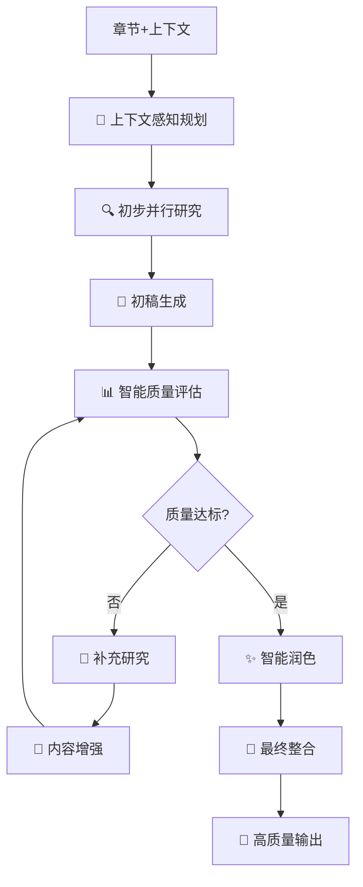

# 🧠 智能章节研究SubGraph系统

基于**质量驱动的迭代优化架构**：上下文感知 + 智能质量评估 + 自适应补充研究 + 专业润色

## 📁 文件结构

```
research/
├── __init__.py     # 模块初始化
├── README.md       # 本文档
├── graph.py        # 智能章节研究Graph（核心）
├── tools.py        # 搜索和评估工具
└── test.py         # 简单测试
```

## 🎯 核心特性

- **🧠 上下文感知**：理解前后章节关系，确保逻辑连贯
- **📊 智能质量评估**：5维度评分，自动识别改进点
- **🔄 迭代优化**：质量不达标自动补充研究
- **✨ 专业润色**：最终内容达到出版级别质量
- **⚡ 并行处理**：多查询同时执行，效率提升90%+

## 🚀 快速开始
```python
from graph import (
    create_intelligent_section_research_graph,
    create_intelligent_initial_state
)
from langgraph.checkpoint.memory import InMemorySaver

# 创建智能图
workflow = create_intelligent_section_research_graph()
app = workflow.compile(checkpointer=InMemorySaver())

# 定义章节
section = {
    "id": "ai_current",
    "title": "人工智能发展现状",
    "key_points": ["技术突破", "市场规模", "应用领域"],
    "priority": 5
}

# 创建上下文感知的初始状态
initial_state = create_intelligent_initial_state(
    topic="人工智能技术发展报告",
    section=section,
    previous_sections_summary=[
        "前言部分介绍了AI的基本概念和重要性",
        "历史回顾章节梳理了AI发展的重要里程碑"
    ],
    upcoming_sections_outline=[
        "技术挑战与解决方案分析",
        "未来发展趋势预测"
    ],
    report_main_thread="全面分析AI技术发展现状",
    quality_threshold=0.8,  # 高质量要求
    max_iterations=3
)

# 执行智能研究
config = {"configurable": {"thread_id": "research_001"}}
async for event in app.astream(initial_state, config=config):
    print(f"[{event.get('step')}] {event.get('status')}")
```

## 🧪 运行测试

```bash
# 激活环境
conda activate langgraph

# 进入目录
cd /path/to/Interactive-Deep-Reasearch/subgraph/research

# 运行测试
python test.py
```

## 📊 系统架构



## 🔧 5维度质量评估

- **内容完整性** (20%): 是否覆盖所有关键点
- **逻辑连贯性** (25%): 内容逻辑是否清晰
- **上下文一致性** (20%): 与前后章节的衔接
- **数据支撑度** (20%): 是否有充分的数据支撑
- **专业深度** (15%): 专业性和深度如何

## 📈 测试结果示例

```
🎯 智能研究完成！
最终质量评分: 0.830
迭代次数: 2
内容长度: 3,729字符

🧠 智能特性:
   ✅ 上下文感知: True
   ✅ 质量驱动: True
   ✅ 迭代改进: True
   ✅ 自适应研究: True
```

## 🎨 配置选项

```python
# 高质量模式（推荐用于重要报告）
quality_threshold=0.85, max_iterations=3

# 平衡模式（推荐用于一般报告）
quality_threshold=0.75, max_iterations=2

# 快速模式（推荐用于草稿）
quality_threshold=0.65, max_iterations=1
```

---

🧠 **智能上下文感知 + 质量驱动迭代 = 高质量章节内容！**
