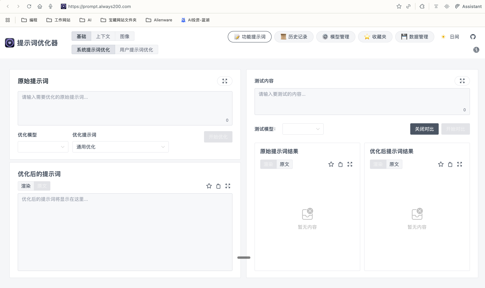

# LangSmith Prompt工程

## 提示词设计的金字塔思维


### 金字塔思维：自上而下的设计方法

我们采用金字塔思维，从业务需求出发，层层拆解：

```
                  ┌─────────────────┐
                  │  第一层：业务需求 │
                  │  What & Why     │
                  └────────┬────────┘
                           │
                  ┌────────▼────────┐
                  │ 第二层：功能要求  │
                  │     How         │
                  └────────┬────────┘
                           │
            ┌──────────────┼──────────────┐
            ▼              ▼              ▼
      ┌─────────┐    ┌─────────┐   ┌─────────┐
      │ 输入要求 │    │ 输出要求 │   │ 约束条件 │
      └─────────┘    └─────────┘   └─────────┘
            │              │              │
            └──────────────┼──────────────┘
                           │
                  ┌────────▼────────┐
                  │ 第三层：评估方法  │
                  │    Measure      │
                  └─────────────────┘
```


## 第一部分：痛点

1. **提示词管理混乱**
   - 提示词散落在代码各处，难以维护
   - 想优化提示词，但不知道从哪里开始
   - 团队成员各自维护不同版本，无法统一

2. **测试成本高昂**
   - 每次修改提示词都要手动构建测试用例
   - 想在 LangSmith Playground 中测试，却要不停地复制粘贴参数
   - 测试数据和真实场景脱节，测试结果不可靠

3. **团队协作困难**
   - A 优化了提示词，B 还在用旧版本
   - 不知道当前版本的质量如何
   - 回滚版本很麻烦，没有版本管理

4. **质量无法量化**
   - 不知道提示词改进后效果如何
   - 缺乏标准化的评估流程
   - 上线后才发现问题


有很多好用的开源项目 例如：
https://github.com/linshenkx/prompt-optimizer


但是还是很麻烦，无法自动采集数据集


今天我想跟大家分享的这个这个提示词工程就相当于把团队的提示词写作、测试、发布和迭代全流程自动化，大家不用担心版本乱、质量不可控、数据难收，照着流程走就能高效安全地迭代出靠谱的提示词。

### 系统架构
```
┌─────────────────────────────────────────────────────────┐
│                      用户层                              │
│   main.py  │  提示词 YAML  │  LangSmith Web UI         │
└─────────────────────────┬───────────────────────────────┘
                          │
┌─────────────────────────┴───────────────────────────────┐
│                    核心模块层                            │
├──────────────┬─────────────────┬────────────────────────┤
│ Prompt管理   │  Dataset捕获    │   评估系统             │
│ - 自动拉取   │  - 装饰器捕获    │  - 自动评估            │
│ - 智能推送   │  - 自动同步      │  - 质量打分            │
│ - 版本管理   │  - 真实参数      │  - 对比报告            │
└──────────────┴─────────────────┴────────────────────────┘
                          │
┌─────────────────────────┴───────────────────────────────┐
│                    基础服务层                            │
│     LangSmith API  │  Azure OpenAI  │  LangGraph        │
└─────────────────────────────────────────────────────────┘
```

1. **YAML 文件** → 承载提示词设计（第二层：功能要求）
2. **评估器注册表** → 实现评估方法（第三层：评估方法）
3. **配置文件** → 关联评估器和权重（第四步：配置化）
4. **自动评估** → 推送前质量检查（质量门禁）
5. **Dataset 捕获** → 提供真实测试数据（持续优化）

接下来，让我展示这个平台如何支撑整个方法论。

### 模块四：完整工作流（1.5-2分钟）

现在让我演示一个完整的工作流，展示**金字塔方法论如何在实际中运作**：

#### 场景：开发者 A 优化提示词

```bash
# 步骤1：修改本地 YAML 文件
vim prompts/report_generator.yaml
# （优化提示词内容）

# 步骤2：本地测试
python main.py --query "生成2024年AI行业报告"
# 🟢 自动捕获测试参数到 Dataset
# 🔵 LangSmith 追踪整个流程

# 步骤3：查看捕获的数据
python tools/capture.py --list

# 步骤4：在 Playground 验证 🔵
# （打开 LangSmith Playground）
# （选择 Dataset，对比版本）

# 步骤5：推送到 Hub
python -c "
from prompts.prompt_manager import PromptManager
manager = PromptManager()
manager.push('report_generator', with_test=True)
"
# 🟢 自动测试 → 质量检查 → 推送到 Hub 🔵
```
