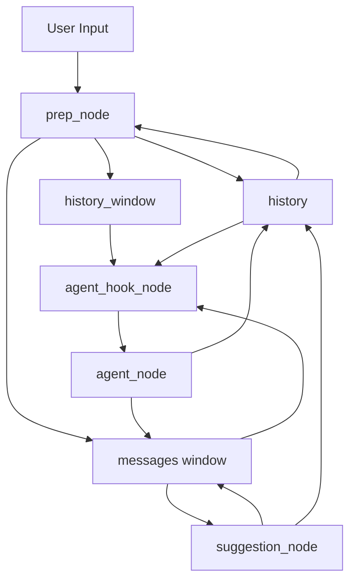
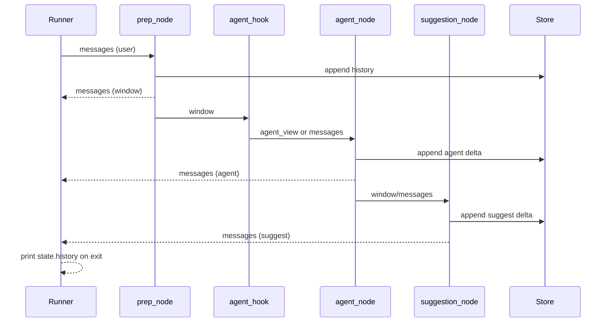

# 上下文工程（Context Engineering）工作流说明

本文档总结了本目录下测试图（ReAct 风格聊天 Demo）对“上下文工程”的整体优化方案：如何在保证可追溯的同时，把传给 LLM 的上下文控制在可控窗口内，并兼顾流式展示与性能。

## 目标与原则

- 可控窗口：传给 LLM/Agent 的上下文始终不超过 `--limit`，并在必要时进行压缩。
- 全量可追溯：完整对话保存在 `history`，便于会后回放与审计。
- 最小侵入：节点间只传递必要增量，避免重复累加与重复打印。
- 流式友好：边跑边打印“当前窗口”，退出后再打印“完整历史”。

## 状态模型（ChatState）

- `messages`：替换聚合（replace）。承载“压缩后的窗口”，直接作为下游 LLM 的输入。
- `history`：追加聚合（operator.add）。跨轮累计完整对话（人类/助手/系统）。
- `history_window`：上一轮提交的“压缩窗口”，用于下一轮作为阈值基准。
- Agent Hook 上下文：当窗口仍然过长时，为 Agent 侧预置一条轻量摘要。

聚合语义：
- `messages` 每轮由 `prep_node` 产出（压缩后的窗口），覆盖旧值。
- `history` 由各节点按“增量”追加；禁止把整段 messages 回写到 `history`。

## 每轮流程（高层）

1) Runner 组装当轮输入（`messages`，通常仅包含当轮人类输入及可选记忆注入）。
2) `prep_node`：
   - 先把当轮 `messages` 以“增量”追加到 `history`（使用拷贝，避免只读引用）。
   - 以 `history_window`（无则回退 `history`）为基准，计算近似 tokens；若超过 `--limit`，对早期部分做压缩：
     - 可选 LLM 摘要：`--no-sum` 关闭；
     - 可选压缩目标：`--target=all|human|ai`。
   - 产出“压缩后窗口”到 `messages`，并更新 `history_window`。
3) `agent_hook_node`（可选）：若窗口仍过长，为 Agent 生成“轻摘要上下文”（不修改窗口）。
4) `agent_node`：调用 ReAct Agent，读取 Hook 提供的上下文或 `messages` 作为输入；把“增量回复”同时写回 `messages` 与追加进 `history`（仅增量）。
5) `suggestion_node`：基于最近上下文产生 2–4 条建议，仅返回“增量”并追加进 `history`（避免重复）。
6) Runner：
   - 过程中打印“压缩窗口”（`messages`）；
   - 退出时从 `state.history` 读取并打印完整历史，闭环呈现。

## 压缩策略（prep_node）

- 触发条件：`approx_tokens(history_window or history) > --limit`。
- 选择范围：早期消息，保留最近 `--keep` 条原文；可通过 `--target` 定向压缩 `human|ai`。
- 压缩产物：在窗口首部插入“摘要”系统消息；窗口=摘要 + 最近 `keep` 条。
- 统计信息：`stats.before / stats.window / stats.compressed / stats.summary`。

## Agent 侧 Hook（agent_hook_node）

- 当窗口近似 tokens 超过 `agent_limit`（默认 `max(400, limit-200)`）时，为 Agent 侧提供“轻摘要上下文”；否则直接沿用窗口。
- 保持“非破坏性”：不修改 `messages`，仅提供给 Agent 消费。

## 建议节点（suggestion_node）

- 仅返回“增量”建议，并把该增量追加进 `history`。
- 避免把整段 `messages` 回写，防止流式更新时重复打印/累加。

## 去重与只读修复

- 去重：节点一律返回“增量”，Runner 负责聚合展示；`suggestion_node` 不再回写整段消息。
- 只读修复：写入 `history` 使用 dict 拷贝，避免对 BaseMessage/只读代理做原地修改导致 `Attempted to assign to readonly property`。

## Runner 展示与收尾

- 轮次中：优先打印 `prep_node` 产生的 `messages`（即压缩后的窗口），显示 tokens 统计与摘要。
- 退出时：从图 `state.history` 拉取并打印完整历史，含条目数与近似 tokens。

## 缓存策略（Agent 节点）

- 使用 `prep_cache_policy(ttl=300)` 按“最近一条用户消息文本”作为 key，对 `agent_node` 启用节点级缓存，可降低重复调用。

## CLI 使用

```bash
python backend/src/application/services/graph/test/run_graph.py \
  --limit 800 \
  --keep 12 \
  --target all|human|ai \
  [--no-sum] \
  [--user-id your_id]
```

- `--limit`：压缩阈值（近似 tokens）。
- `--keep`：压缩后保留的最近原文条数。
- `--target`：压缩目标角色（`all|human|ai`）。
- `--no-sum`：关闭 LLM 摘要，使用静态摘要。
- `--user-id`：长期记忆命名空间，跨线程复用。

建议：将 `--limit` 调小（如 100）更容易观测到压缩发生；`--keep` 控制窗口保留长度。

## 调优建议

- 成本优先：开启 `--no-sum`，使用静态摘要；或提高 `--keep` 呈现更多原文。
- 质量优先：开启 LLM 摘要，对 `--target` 选择性压缩用户或助手历史。
- Agent 稳定：搭配 `agent_hook_node`，即使窗口临界仍能为 Agent 提供轻摘要。

## 常见问题排查

- “为什么没压缩？”每轮图内判断基于 `history_window/history`，不是 CLI 打印的 transcript。确保对话足够长或调小 `--limit`。
- “重复打印/重复累计”：确保节点仅返回增量，避免把整段 `messages` 回写。
- “只读属性报错”：写入 `history` 时用 dict 拷贝，不对 state 内部对象做原地修改。
- “联网失败/模型错误”：`agent_node` 已做容错，打印错误并不中断流程；可用 `--no-sum` 跳过 LLM 摘要。

## 目录与相关文件

- `graph.py`：各节点实现（prep/agent_hook/suggestion 等）与 ReAct Agent 装配。
- `run_graph.py`：CLI Runner，流式展示窗口、会后打印完整历史。
- `README.md`：本文档。

## 生产整合建议

- 保持 `messages=压缩窗口、history=全量追加` 的模式，确保两者语义清晰。
- 在服务层暴露“窗口/全量”两个视图：窗口用于在线推理，全量用于审计导出。
- 结合持久化存储（DB/对象存储）替代内存 Store，确保可恢复与横向扩展。

## 架构图（Mermaid）

上下文数据流（窗口与全量历史）：



每轮时序（流式展示窗口、退出打印全量历史）：


