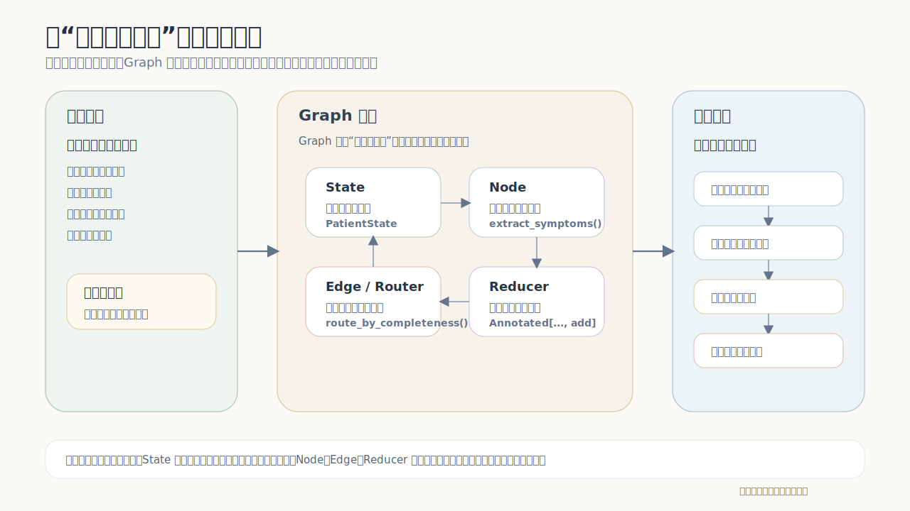

# LG-01：LangGraph 基础与图构建

**适用基础**: 你已经会写 Python 函数，想亲手搭出第一个 LangGraph Agent。

**本节定位**: 这是整套课程的基础。后面的循环、并行、多智能体、持久化，都会继续使用本节的 `State / Node / Edge / Reducer / compile`。

**完成后你能做什么**: 写出一个带状态累积和路由判断的旅行计划助手，并能解释图里每一步的数据流向。

---

## 1. 案例背景：旅行计划助手

先看一个具体业务。你要做一个 `TravelPlannerBot`，用户会连续提出这些需求：

> - “帮我安排一个北京 3 天亲子游”
> - “再来一个上海 2 天美食游”
> - “把我刚才做过的所有计划列出来”

如果只写普通函数，通常会拆成三件事：

- 解析用户意图
- 生成旅行计划
- 查询历史计划

继续往下设计时，会遇到几个关键问题：

1. 多次生成的旅行计划存在哪里？
2. 每次新生成一条计划，怎么追加到总列表？
3. 用户查询历史时，怎么拿到前面多轮产生的数据？
4. 哪些步骤固定顺序执行，哪些步骤需要根据用户意图分叉？

LangGraph 要解决的就是这类业务结构：有共享状态、有固定流程、有条件分支，还有会持续累积的数据。

本节会实现一个最小可运行的 `TravelPlannerBot`，支持三类请求：

- 用户说“帮我规划一次旅行”  
  图会：解析意图 → 提取需求 → 生成旅行计划 → 写入 State 中的计划列表 → 返回本次结果
- 用户说“看看我做过哪些计划”  
  图会：解析意图 → 读取 State 中累计的旅行计划 → 格式化输出
- 用户说的信息不完整  
  图会：解析意图 → 进入澄清分支

先把这个问题放在脑子里：如果不用图，只靠函数和局部变量，新增计划、累计计划、查询历史会很快缠在一起。LangGraph 把这些职责拆成了状态、节点、边和合并规则。

---

## 2. 总览：LangGraph 图里有哪些角色

先看整体流程，再看每个概念对应图里的哪一部分。

```text
用户输入
   │
   ▼
parse_request
   │
   ├── 条件边：create_plan ──► extract_trip_info ──► build_plan ──► save_plan ──► reply_plan
   │
   ├── 条件边：show_history ──► format_history
   │
   └── 条件边：clarify ──► ask_clarification
```

同一套机制换到更严肃的医疗辅助场景，也不是先背 API，而是先看“人怎么自然处理”。例如胰腺癌辅助问诊里，医生会把症状、危险因素、检查线索和缺失信息放在脑中一起判断；Graph 不能这样隐式协作，所以必须把共享病例、处理步骤、分支规则和证据累积显式拆开。



这张图不是让 `TravelPlannerBot` 变成医疗系统，而是帮助你迁移本节的四个基础概念：

- `State`：从“旅行计划列表”迁移成“病例共享工作台”。
- `Node`：从“提取目的地、生成计划”迁移成“提取症状、整理检查线索”。
- `Edge / Router`：从“创建计划 / 查询历史 / 澄清”迁移成“信息完整 / 信息不足 / 高风险提示”。
- `Reducer`：从“累计旅行计划”迁移成“累计证据列表”，防止新证据覆盖旧证据。

五个核心概念分别承担不同职责：

1. **State**：整张图共享的数据池，保存当前输入、当前计划、累计计划和回复内容。
2. **Node**：图里的处理函数，比如识别意图、生成计划、查询历史。
3. **Edge**：确定下一步去哪。普通边表示固定流转，条件边表示根据状态动态选择路径。
4. **Reducer**：多个节点往同一个字段写数据时，定义怎么合并。计划列表、消息列表这类字段会用到它。
5. **compile / invoke / stream**：把图编译成可运行对象，然后执行或观察执行过程。

一句话概括：

> **State 是共享数据，Node 是处理步骤，Edge 是流转规则，Reducer 是合并规则，compile/invoke/stream 是运行方式。**

---

## 3. State：图里的共享记忆

State 可以理解成这张图的共享记忆。旅行计划案例里，关键不是 `destination` 这种临时字段，而是这些会被后续节点或后续轮次继续使用的数据：

- 用户当前这一轮要规划什么
- 已经生成过哪些旅行计划
- 最近一次回复内容是什么

### State 定义

```python
from typing import TypedDict, Annotated
from operator import add
from langchain_core.messages import AnyMessage
from langgraph.graph.message import add_messages


class TravelState(TypedDict):
    messages: Annotated[list[AnyMessage], add_messages]
    intent: str
    destination: str
    days: int
    style: str
    current_plan: dict
    travel_plans: Annotated[list[dict], add]
    response: str
```

这个 State 里重点看三个字段：

- `current_plan`：当前这一轮刚生成的计划，代表本次处理的中间结果。
- `travel_plans`：多轮累积出来的总计划列表，代表这张图的共享记忆。
- `messages`：对话历史，通常使用 `add_messages` 作为 reducer。

### 这个 State 解决的问题

- 每轮只返回临时结果是不够的，因为用户后面还会查询历史。
- 计划要存在 State 里，因为后续节点和后续轮次都要继续使用它。
- 普通局部变量只属于某个函数，State 属于整张图的执行过程。

### 关键点

- 每个节点拿到的是**完整 State**
- 节点返回的是**增量更新**
- `Annotated[..., reducer]` 定义字段如何合并
- 节点里直接修改 `state` 不算正式更新，必须通过返回值交给框架合并

---

## 4. Reducer：`travel_plans` 的累加规则

先看目标效果。第一轮生成北京计划，第二轮生成上海计划，最终 `travel_plans` 应该是：

```python
[
    {"destination": "北京", ...},
    {"destination": "上海", ...},
]
```

LangGraph 不会自动猜字段应该覆盖还是追加。Reducer 用来明确告诉框架：这个字段的多次更新应该怎么合并。

### 1. 默认覆盖

像 `intent`、`destination`、`response` 这种单值字段，不写 `Annotated` 时默认就是后写覆盖先写。

```python
class SimpleState(TypedDict):
    intent: str
    response: str
```

### 2. 列表累加

`travel_plans` 这种字段使用 `operator.add`：

```python
from operator import add


class TravelState(TypedDict):
    travel_plans: Annotated[list[dict], add]
```

它的效果是：

- 第一次节点返回：`{"travel_plans": [plan_a]}`
- 第二次节点返回：`{"travel_plans": [plan_b]}`
- 最终状态里：`travel_plans == [plan_a, plan_b]`

### 3. 消息专用 reducer

```python
class TravelState(TypedDict):
    messages: Annotated[list[AnyMessage], add_messages]
```

`messages` 通常使用 `add_messages`，因为它更符合消息历史的合并需求：

- 自动追加消息
- 支持按消息 ID 去重
- 后续进入 tool calling / message update 场景时更稳

### 4. 用案例看 reducer 的作用

在这个案例里，`reducer` 是主功能的一部分：

- `travel_plans` 的 reducer 决定“旧计划 + 新计划”如何并成总列表
- `messages` 的 reducer 决定“旧消息 + 新消息”如何组成完整对话历史

```python
state_a = {"travel_plans": [{"destination": "北京", "days": 3}]}
state_b = {"travel_plans": [{"destination": "上海", "days": 2}]}

# add 的合并效果
# [{"destination": "北京", "days": 3}, {"destination": "上海", "days": 2}]
```

### `current_plan` 和 `travel_plans` 的区别

> `current_plan` 表示“这次返回哪一个”  
> `travel_plans` 表示“整体累计了哪些”

所以节点只需要返回当前新增的一条计划，最终 State 里仍然能看到整个计划列表。

---

## 5. Node：图里的处理单元

Node 接收 `state`，返回一个 `dict`。这里用“当前生成一条计划，并把它并进总表”的流程来拆节点。

### 示例节点

```python
from langchain_core.messages import HumanMessage


def parse_request(state: TravelState) -> dict:
    msg = state["messages"][-1]
    text = msg.content

    if "看看" in text or "历史" in text or "之前" in text:
        intent = "show_history"
    elif "规划" in text or "旅行" in text or "旅游" in text:
        intent = "create_plan"
    else:
        intent = "clarify"

    return {"intent": intent}


def extract_trip_info(state: TravelState) -> dict:
    text = state["messages"][-1].content

    destination = "北京" if "北京" in text else "上海" if "上海" in text else ""
    days = 3 if "3天" in text else 2 if "2天" in text else 0
    style = "亲子" if "亲子" in text else "美食" if "美食" in text else "轻松"

    return {
        "destination": destination,
        "days": days,
        "style": style,
    }


def build_plan(state: TravelState) -> dict:
    plan = {
        "destination": state["destination"],
        "days": state["days"],
        "style": state["style"],
        "summary": f"{state['destination']}{state['days']}天{state['style']}旅行计划",
    }
    return {"current_plan": plan}


def save_plan(state: TravelState) -> dict:
    return {"travel_plans": [state["current_plan"]]}


def reply_plan(state: TravelState) -> dict:
    plan = state["current_plan"]
    return {"response": f"已为你生成：{plan['summary']}"}


def format_history(state: TravelState) -> dict:
    plans = state.get("travel_plans", [])
    if not plans:
        return {"response": "你目前还没有保存过旅行计划。"}

    lines = [
        f"{idx + 1}. {plan['summary']}"
        for idx, plan in enumerate(plans)
    ]
    return {"response": "你保存过的旅行计划有：\n" + "\n".join(lines)}


def ask_clarification(state: TravelState) -> dict:
    return {"response": "请告诉我目的地、天数和旅行偏好，例如：北京 3 天亲子游。"}
```

### 节点职责

1. `build_plan` 只负责生成当前计划，不关心总列表。
2. `save_plan` 只负责把当前计划写入 `travel_plans`。

这样拆分后，节点职责和 State 合并动作都能在代码里直接看出来。

---

## 6. Edge：普通边与条件边

Edge 可以理解成流程规则。

### 6.1 普通边：固定流水线

当一段流程是确定的，就用普通边。进入“创建计划”分支后，后面几步是固定的：

```text
extract_trip_info → build_plan → save_plan → reply_plan
```

因为这几步没有分歧：

- 先提取需求
- 再生成计划
- 再保存计划
- 最后回复用户

对应代码：

```python
builder.add_edge("extract_trip_info", "build_plan")
builder.add_edge("build_plan", "save_plan")
builder.add_edge("save_plan", "reply_plan")
builder.add_edge("reply_plan", END)
builder.add_edge("format_history", END)
builder.add_edge("ask_clarification", END)
```

普通边用于表达“只要走到这里，下一步就一定是它”的流程。

### 6.2 条件边：根据 State 动态分支

`parse_request` 做完后，下一步并不固定。用户可能在新建旅行计划、查询历史计划，也可能输入了不完整信息。

这里需要读取 `state["intent"]`，再决定去哪个节点：

```python
def route_by_intent(state: TravelState) -> str:
    intent = state["intent"]

    if intent == "create_plan":
        return "extract_trip_info"
    if intent == "show_history":
        return "format_history"
    return "ask_clarification"
```

注册条件边：

```python
builder.add_conditional_edges(
    "parse_request",
    route_by_intent,
    {
        "extract_trip_info": "extract_trip_info",
        "format_history": "format_history",
        "ask_clarification": "ask_clarification",
    },
)
```

对比这两段：

- `parse_request` 后面是**条件边**，因为要根据用户意图分流。
- `extract_trip_info` 后面是**普通边**，因为一旦进入创建计划流程，步骤就是固定的。

### 6.3 再加一个条件边：检查信息完整度

创建计划前，还可以检查目的地和天数是否完整：

```python
def route_after_extract(state: TravelState) -> str:
    if state["destination"] and state["days"] > 0:
        return "build_plan"
    return "ask_clarification"
```

含义是：

- 信息完整：继续生成计划
- 缺目的地或天数：进入澄清节点

同一个案例里出现了两类条件判断：

1. **按用户意图分支**：创建计划 / 查询历史 / 澄清
2. **按状态完整度分支**：信息够不够生成计划

---

## 7. compile / invoke / stream

构建图的五步：

1. 定义 `State`
2. 添加 `Node`
3. 连接普通边
4. 连接条件边
5. `compile()` 编译

```python
from langgraph.graph import StateGraph, START, END


builder = StateGraph(TravelState)

builder.add_node("parse_request", parse_request)
builder.add_node("extract_trip_info", extract_trip_info)
builder.add_node("build_plan", build_plan)
builder.add_node("save_plan", save_plan)
builder.add_node("reply_plan", reply_plan)
builder.add_node("format_history", format_history)
builder.add_node("ask_clarification", ask_clarification)

builder.add_edge(START, "parse_request")
builder.add_edge("build_plan", "save_plan")
builder.add_edge("save_plan", "reply_plan")
builder.add_edge("reply_plan", END)
builder.add_edge("format_history", END)
builder.add_edge("ask_clarification", END)

builder.add_conditional_edges(
    "parse_request",
    route_by_intent,
    {
        "extract_trip_info": "extract_trip_info",
        "format_history": "format_history",
        "ask_clarification": "ask_clarification",
    },
)

builder.add_conditional_edges(
    "extract_trip_info",
    route_after_extract,
    {
        "build_plan": "build_plan",
        "ask_clarification": "ask_clarification",
    },
)

graph = builder.compile()
```

### `invoke`

`invoke` 用于直接拿最终结果。

```python
result = graph.invoke({
    "messages": [HumanMessage(content="帮我规划一个北京3天亲子游")],
    "travel_plans": [],
})

print(result["response"])
print(result["travel_plans"])
```

### `stream`

`stream` 用于观察每个节点执行后的状态变化。

```python
for chunk in graph.stream({
    "messages": [HumanMessage(content="帮我规划一个北京3天亲子游")],
    "travel_plans": [],
}):
    print(chunk)
```

观察 `stream` 输出时，重点看三件事：

1. `build_plan` 返回 `current_plan`
2. `save_plan` 返回 `[current_plan]`
3. 框架通过 reducer 把它合进整个 `travel_plans`

---

## 8. 完整案例：TravelPlannerBot

```python
from typing import TypedDict, Annotated
from operator import add
from langchain_core.messages import HumanMessage, AnyMessage
from langgraph.graph import StateGraph, START, END
from langgraph.graph.message import add_messages


class TravelState(TypedDict):
    messages: Annotated[list[AnyMessage], add_messages]
    intent: str
    destination: str
    days: int
    style: str
    current_plan: dict
    travel_plans: Annotated[list[dict], add]
    response: str


def parse_request(state: TravelState) -> dict:
    text = state["messages"][-1].content
    if "看看" in text or "历史" in text or "之前" in text:
        return {"intent": "show_history"}
    if "规划" in text or "旅行" in text or "旅游" in text:
        return {"intent": "create_plan"}
    return {"intent": "clarify"}


def extract_trip_info(state: TravelState) -> dict:
    text = state["messages"][-1].content
    destination = "北京" if "北京" in text else "上海" if "上海" in text else ""
    days = 3 if "3天" in text else 2 if "2天" in text else 0
    style = "亲子" if "亲子" in text else "美食" if "美食" in text else "轻松"
    return {
        "destination": destination,
        "days": days,
        "style": style,
    }


def route_by_intent(state: TravelState) -> str:
    if state["intent"] == "create_plan":
        return "extract_trip_info"
    if state["intent"] == "show_history":
        return "format_history"
    return "ask_clarification"


def route_after_extract(state: TravelState) -> str:
    if state["destination"] and state["days"] > 0:
        return "build_plan"
    return "ask_clarification"


def build_plan(state: TravelState) -> dict:
    plan = {
        "destination": state["destination"],
        "days": state["days"],
        "style": state["style"],
        "summary": f"{state['destination']}{state['days']}天{state['style']}旅行计划",
    }
    return {"current_plan": plan}


def save_plan(state: TravelState) -> dict:
    return {"travel_plans": [state["current_plan"]]}


def reply_plan(state: TravelState) -> dict:
    return {"response": f"已为你生成：{state['current_plan']['summary']}"}


def format_history(state: TravelState) -> dict:
    plans = state.get("travel_plans", [])
    if not plans:
        return {"response": "你目前还没有保存过旅行计划。"}

    lines = [
        f"{idx + 1}. {plan['summary']}"
        for idx, plan in enumerate(plans)
    ]
    return {"response": "你保存过的旅行计划有：\n" + "\n".join(lines)}


def ask_clarification(state: TravelState) -> dict:
    return {"response": "请告诉我目的地、天数和旅行偏好，例如：北京3天亲子游。"}


builder = StateGraph(TravelState)
builder.add_node("parse_request", parse_request)
builder.add_node("extract_trip_info", extract_trip_info)
builder.add_node("build_plan", build_plan)
builder.add_node("save_plan", save_plan)
builder.add_node("reply_plan", reply_plan)
builder.add_node("format_history", format_history)
builder.add_node("ask_clarification", ask_clarification)

builder.add_edge(START, "parse_request")
builder.add_edge("build_plan", "save_plan")
builder.add_edge("save_plan", "reply_plan")
builder.add_edge("reply_plan", END)
builder.add_edge("format_history", END)
builder.add_edge("ask_clarification", END)

builder.add_conditional_edges(
    "parse_request",
    route_by_intent,
    {
        "extract_trip_info": "extract_trip_info",
        "format_history": "format_history",
        "ask_clarification": "ask_clarification",
    },
)

builder.add_conditional_edges(
    "extract_trip_info",
    route_after_extract,
    {
        "build_plan": "build_plan",
        "ask_clarification": "ask_clarification",
    },
)

graph = builder.compile()


state = {
    "messages": [],
    "travel_plans": [],
}

state = graph.invoke({
    **state,
    "messages": [HumanMessage(content="帮我规划一个北京3天亲子游")],
})

state = graph.invoke({
    **state,
    "messages": [HumanMessage(content="再帮我规划一个上海2天美食游")],
})

state = graph.invoke({
    **state,
    "messages": [HumanMessage(content="看看我之前做过哪些计划")],
})

print(state["response"])
print(state["travel_plans"])
```

### 运行结果里要看什么

- 第 1 轮生成北京计划，`travel_plans` 里有 1 条。
- 第 2 轮生成上海计划，`travel_plans` 自动累加成 2 条。
- 第 3 轮查询历史，图不再新建计划，而是直接读取已有 State。

这说明：

- `State` 不是临时变量，而是共享记忆。
- `Reducer` 是累计数据的关键机制。
- `普通边` 负责稳定流水线。
- `条件边` 负责根据上下文动态分支。

---

## 9. 回到开场问题

现在重新看“旅行计划助手”：

- State 让多次生成的计划留在图里，后续轮次可以继续使用。
- Reducer 让每次新增的一条计划自动合并进总列表。
- 普通边表达创建计划的固定流水线。
- 条件边把“创建计划”“查询历史”“补充信息”分成不同路径。

没有共享 State 时，计划只能是单次返回值。没有 reducer 时，新的计划会覆盖旧的计划。没有条件边时，创建计划和查询历史会挤在一个大 `if/else` 里。

---

## 10. 常见误区

| 坑 | 现象 | 怎么避免 |
|----|------|---------|
| 把 `travel_plans` 写成普通列表字段但没配 reducer | 每次新计划覆盖旧计划 | 用 `Annotated[list[dict], add]` |
| 让 `build_plan` 直接兼做保存 | 节点职责混乱，State 合并动作不清晰 | 拆成 `build_plan` 和 `save_plan` |
| 只看条件边，不看普通边 | 固定流程和动态分支混在一起 | 用“创建计划固定流水线”理解普通边 |
| 节点里直接改 `state` | 更新不生效 | 一律通过 `return {...}` 返回增量 |
| `show_history` 也去走建计划流程 | 案例逻辑混乱 | 用 `parse_request` + 条件边先分流 |

---

## 11. 本节小结

这节课的核心不是多写几个函数，而是把业务拆成一张可执行的图：

- `State` 保存共享数据。
- `Node` 做单步处理。
- `Edge` 定义流程怎么走。
- `Reducer` 定义字段怎么合并。
- `compile / invoke / stream` 让图真正运行起来，并能观察执行过程。

旅行计划案例里，`current_plan` 是本次新增结果，`travel_plans` 是累计结果。看懂这两个字段的关系，就能看懂 LangGraph 里状态流动和 reducer 的价值。
