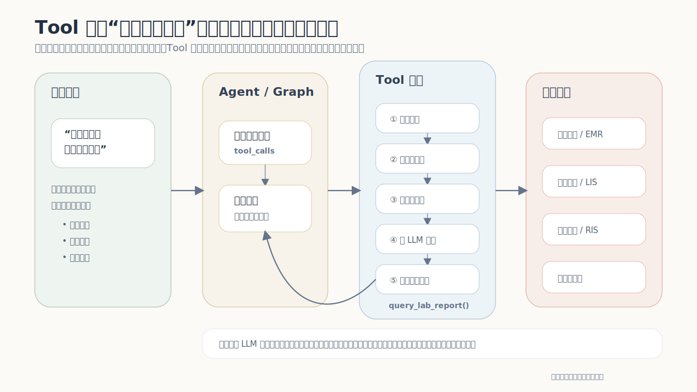

# LG-02: Tools 深度掌握

> **阶段**: LG-02 | **难度**: 中级 | **预计时长**: 3-4 小时

## 学习目标
- 用书房预约助手串起 Tool 定义、调用、执行和复用
- 先用最普通的 Tool 调用跑出上下文爆炸，再引入裁剪和 runtime 旁路透传
- 跑通一次本地 `ToolNode` 调用，看到工具结果如何进入消息流
- 理解 ReAct Agent 与 `bind_tools` 的区别
- 区分 Tool 直接作为节点、`ToolNode`、`create_agent` 的使用边界

```python
# 安装依赖（如未安装请取消注释）
!pip install -U langgraph langchain langchain-core langchain-openai pydantic
```

**输出**

```text
Requirement already satisfied: langgraph in /Volumes/DATABASE/code/learn/langgraph_learn/.venv/lib/python3.14/site-packages (1.2.2)
Collecting langgraph
  Downloading langgraph-1.2.4-py3-none-any.whl.metadata (8.0 kB)
Requirement already satisfied: langchain in /Volumes/DATABASE/code/learn/langgraph_learn/.venv/lib/python3.14/site-packages (1.3.2)
Collecting langchain
  Downloading langchain-1.3.4-py3-none-any.whl.metadata (5.8 kB)
Requirement already satisfied: langchain-core in /Volumes/DATABASE/code/learn/langgraph_learn/.venv/lib/python3.14/site-packages (1.4.0)
Collecting langchain-core
  Downloading langchain_core-1.4.2-py3-none-any.whl.metadata (4.5 kB)
Requirement already satisfied: langchain-openai in /Volumes/DATABASE/code/learn/langgraph_learn/.venv/lib/python3.14/site-packages (1.2.2)
Requirement already satisfied: pydantic in /Volumes/DATABASE/code/learn/langgraph_learn/.venv/lib/python3.14/site-packages (2.13.4)
Requirement already satisfied: langgraph-checkpoint<5.0.0,>=4.1.0 in /Volumes/DATABASE/code/learn/langgraph_learn/.venv/lib/python3.14/site-packages (from langgraph) (4.1.1)
Requirement already satisfied: langgraph-prebuilt<1.2.0,>=1.1.0 in /Volumes/DATABASE/code/learn/langgraph_learn/.venv/lib/python3.14/site-packages (from langgraph) (1.1.0)
Collecting langgraph-sdk<0.5.0,>=0.4.2 (from langgraph)
  Downloading langgraph_sdk-0.4.2-py3-none-any.whl.metadata (3.6 kB)
Requirement already satisfied: xxhash>=3.5.0 in /Volumes/DATABASE/code/learn/langgraph_learn/.venv/lib/python3.14/site-packages (from langgraph) (3.7.0)
Requirement already satisfied: jsonpatch<2.0.0,>=1.33.0 in /Volumes/DATABASE/code/learn/langgraph_learn/.venv/lib/python3.14/site-packages (from langchain-core) (1.33)
Requirement already satisfied: langchain-protocol>=0.0.14 in /Volumes/DATABASE/code/learn/langgraph_learn/.venv/lib/python3.14/site-packages (from langchain-core) (0.0.15)
Requirement already satisfied: langsmith<1.0.0,>=0.3.45 in /Volumes/DATABASE/code/learn/langgraph_learn/.venv/lib/python3.14/site-packages (from langchain-core) (0.8.5)
Requirement already satisfied: packaging>=23.2.0 in /Volumes/DATABASE/code/learn/langgraph_learn/.venv/lib/python3.14/site-packages (from langchain-core) (26.2)
Requirement already satisfied: pyyaml<7.0.0,>=5.3.0 in /Volumes/DATABASE/code/learn/langgraph_learn/.venv/lib/python3.14/site-packages (from langchain-core) (6.0.3)
Requirement already satisfied: tenacity!=8.4.0,<10.0.0,>=8.1.0 in /Volumes/DATABASE/code/learn/langgraph_learn/.venv/lib/python3.14/site-packages (from langchain-core) (9.1.4)
Requirement already satisfied: typing-extensions<5.0.0,>=4.7.0 in /Volumes/DATABASE/code/learn/langgraph_learn/.venv/lib/python3.14/site-packages (from langchain-core) (4.15.0)
Requirement already satisfied: uuid-utils<1.0,>=0.12.0 in /Volumes/DATABASE/code/learn/langgraph_learn/.venv/lib/python3.14/site-packages (from langchain-core) (0.16.0)
Requirement already satisfied: annotated-types>=0.6.0 in /Volumes/DATABASE/code/learn/langgraph_learn/.venv/lib/python3.14/site-packages (from pydantic) (0.7.0)
Requirement already satisfied: pydantic-core==2.46.4 in /Volumes/DATABASE/code/learn/langgraph_learn/.venv/lib/python3.14/site-packages (from pydantic) (2.46.4)
Requirement already satisfied: typing-inspection>=0.4.2 in /Volumes/DATABASE/code/learn/langgraph_learn/.venv/lib/python3.14/site-packages (from pydantic) (0.4.2)
Requirement already satisfied: jsonpointer>=1.9 in /Volumes/DATABASE/code/learn/langgraph_learn/.venv/lib/python3.14/site-packages (from jsonpatch<2.0.0,>=1.33.0->langchain-core) (3.1.1)
Requirement already satisfied: ormsgpack>=1.12.0 in /Volumes/DATABASE/code/learn/langgraph_learn/.venv/lib/python3.14/site-packages (from langgraph-checkpoint<5.0.0,>=4.1.0->langgraph) (1.12.2)
Requirement already satisfied: httpx>=0.25.2 in /Volumes/DATABASE/code/learn/langgraph_learn/.venv/lib/python3.14/site-packages (from langgraph-sdk<0.5.0,>=0.4.2->langgraph) (0.28.1)
Requirement already satisfied: orjson>=3.11.5 in /Volumes/DATABASE/code/learn/langgraph_learn/.venv/lib/python3.14/site-packages (from langgraph-sdk<0.5.0,>=0.4.2->langgraph) (3.11.9)
Collecting websockets<16,>=14 (from langgraph-sdk<0.5.0,>=0.4.2->langgraph)
  Downloading websockets-15.0.1-py3-none-any.whl.metadata (6.8 kB)
Requirement already satisfied: requests-toolbelt>=1.0.0 in /Volumes/DATABASE/code/learn/langgraph_learn/.venv/lib/python3.14/site-packages (from langsmith<1.0.0,>=0.3.45->langchain-core) (1.0.0)
Requirement already satisfied: requests>=2.0.0 in /Volumes/DATABASE/code/learn/langgraph_learn/.venv/lib/python3.14/site-packages (from langsmith<1.0.0,>=0.3.45->langchain-core) (2.34.2)
Requirement already satisfied: zstandard>=0.23.0 in /Volumes/DATABASE/code/learn/langgraph_learn/.venv/lib/python3.14/site-packages (from langsmith<1.0.0,>=0.3.45->langchain-core) (0.25.0)
Requirement already satisfied: anyio in /Volumes/DATABASE/code/learn/langgraph_learn/.venv/lib/python3.14/site-packages (from httpx>=0.25.2->langgraph-sdk<0.5.0,>=0.4.2->langgraph) (4.13.0)
Requirement already satisfied: certifi in /Volumes/DATABASE/code/learn/langgraph_learn/.venv/lib/python3.14/site-packages (from httpx>=0.25.2->langgraph-sdk<0.5.0,>=0.4.2->langgraph) (2026.5.20)
Requirement already satisfied: httpcore==1.* in /Volumes/DATABASE/code/learn/langgraph_learn/.venv/lib/python3.14/site-packages (from httpx>=0.25.2->langgraph-sdk<0.5.0,>=0.4.2->langgraph) (1.0.9)
Requirement already satisfied: idna in /Volumes/DATABASE/code/learn/langgraph_learn/.venv/lib/python3.14/site-packages (from httpx>=0.25.2->langgraph-sdk<0.5.0,>=0.4.2->langgraph) (3.16)
Requirement already satisfied: h11>=0.16 in /Volumes/DATABASE/code/learn/langgraph_learn/.venv/lib/python3.14/site-packages (from httpcore==1.*->httpx>=0.25.2->langgraph-sdk<0.5.0,>=0.4.2->langgraph) (0.16.0)
Requirement already satisfied: openai<3.0.0,>=2.26.0 in /Volumes/DATABASE/code/learn/langgraph_learn/.venv/lib/python3.14/site-packages (from langchain-openai) (2.38.0)
Requirement already satisfied: tiktoken<1.0.0,>=0.7.0 in /Volumes/DATABASE/code/learn/langgraph_learn/.venv/lib/python3.14/site-packages (from langchain-openai) (0.13.0)
Requirement already satisfied: distro<2,>=1.7.0 in /Volumes/DATABASE/code/learn/langgraph_learn/.venv/lib/python3.14/site-packages (from openai<3.0.0,>=2.26.0->langchain-openai) (1.9.0)
Requirement already satisfied: jiter<1,>=0.10.0 in /Volumes/DATABASE/code/learn/langgraph_learn/.venv/lib/python3.14/site-packages (from openai<3.0.0,>=2.26.0->langchain-openai) (0.15.0)
Requirement already satisfied: sniffio in /Volumes/DATABASE/code/learn/langgraph_learn/.venv/lib/python3.14/site-packages (from openai<3.0.0,>=2.26.0->langchain-openai) (1.3.1)
Requirement already satisfied: tqdm>4 in /Volumes/DATABASE/code/learn/langgraph_learn/.venv/lib/python3.14/site-packages (from openai<3.0.0,>=2.26.0->langchain-openai) (4.67.3)
Requirement already satisfied: regex in /Volumes/DATABASE/code/learn/langgraph_learn/.venv/lib/python3.14/site-packages (from tiktoken<1.0.0,>=0.7.0->langchain-openai) (2026.5.9)
Requirement already satisfied: charset_normalizer<4,>=2 in /Volumes/DATABASE/code/learn/langgraph_learn/.venv/lib/python3.14/site-packages (from requests>=2.0.0->langsmith<1.0.0,>=0.3.45->langchain-core) (3.4.7)
Requirement already satisfied: urllib3<3,>=1.26 in /Volumes/DATABASE/code/learn/langgraph_learn/.venv/lib/python3.14/site-packages (from requests>=2.0.0->langsmith<1.0.0,>=0.3.45->langchain-core) (2.7.0)
Downloading langgraph-1.2.4-py3-none-any.whl (245 kB)
Downloading langchain_core-1.4.2-py3-none-any.whl (550 kB)
   ━━━━━━━━━━━━━━━━━━━━━━━━━━━━━━━━━━━━━━━━ 550.1/550.1 kB 390.3 kB/s  0:00:01m-:--:--
[?25hDownloading langgraph_sdk-0.4.2-py3-none-any.whl (160 kB)
Downloading websockets-15.0.1-py3-none-any.whl (169 kB)
Downloading langchain-1.3.4-py3-none-any.whl (125 kB)
Installing collected packages: websockets, langchain-core, langgraph-sdk, langgraph, langchain
  Attempting uninstall: websockets
    Found existing installation: websockets 16.0
    Uninstalling websockets-16.0:
      Successfully uninstalled websockets-16.0
  Attempting uninstall: langchain-core
    Found existing installation: langchain-core 1.4.0
    Uninstalling langchain-core-1.4.0:
      Successfully uninstalled langchain-core-1.4.0
  Attempting uninstall: langgraph-sdk━━━━━━━━━━━━━━━━━━━━━━━━━━━━━ 1/5 [langchain-core]
    Found existing installation: langgraph-sdk 0.3.15━━━━━━━━━ 1/5 [langchain-core]
    Uninstalling langgraph-sdk-0.3.15:━━━━━━━━━━━━━━━━━━━━━━━━ 1/5 [langchain-core]
      Successfully uninstalled langgraph-sdk-0.3.15━━━━━━━━━━━ 1/5 [langchain-core]
  Attempting uninstall: langgraph╺━━━━━━━━━━━━━━━━━━━━━━━ 2/5 [langgraph-sdk]
    Found existing installation: langgraph 1.2.2━━━━━━━━━━━━━━ 2/5 [langgraph-sdk]
    Uninstalling langgraph-1.2.2:m━━━━━━━━━━━━━━━━━━━━━━━ 2/5 [langgraph-sdk]
      Successfully uninstalled langgraph-1.2.2━━━━━━━━━━━━━━━━ 2/5 [langgraph-sdk]
  Attempting uninstall: langchainm━━━━━━━━━━━━━━━━━━━━━━━ 2/5 [langgraph-sdk]
    Found existing installation: langchain 1.3.2m╺━━━━━━━ 4/5 [langchain]
    Uninstalling langchain-1.3.2:━━━╺━━━━━━━ 4/5 [langchain]
      Successfully uninstalled langchain-1.3.2━━━━━━━ 4/5 [langchain]
   ━━━━━━━━━━━━━━━━━━━━━━━━━━━━━━━━━━━━━━━━ 5/5 [langchain]0m [langchain]
Successfully installed langchain-1.3.4 langchain-core-1.4.2 langgraph-1.2.4 langgraph-sdk-0.4.2 websockets-15.0.1

[notice] A new release of pip is available: 26.1.1 -> 26.1.2
[notice] To update, run: pip install --upgrade pip
```

## 1. 核心概念：Tool 是 Agent 连接外部能力的接口

Tool 把数据库、业务系统、本地文件、HTTP API 等外部能力封装成可调用函数，让 Agent 可以在对话过程中读取事实、执行动作，并把结果继续交给后续节点或模型。

本节要区分三件事：

1. `Tool`：定义一个可被调用的外部能力。
2. `ToolNode`：在 LangGraph 图里执行模型发出的 `tool_calls`。
3. `Agent`：决定何时调用工具、如何阅读工具结果、如何继续回复用户。

先思考一个问题：如果查询接口一次返回几万条候选，最直接的做法是把完整 JSON 返回给 Agent。这个做法能跑通第一步，但下一次模型调用会发生什么？

## 2. 案例背景：书房预约助手

本节实现一个 `StudyRoomBookingBot`。用户会连续提出这些请求：

- `帮我查一下明天下午平原轩还有没有空位`
- `把 15:00 之后能约的时段列出来`
- `那就帮我约 16:00-18:00`
- `看看我最近的预约记录`

动手前先判断这条链路需要哪些部分：查询规则、查询空位、缓存、提交预约、查询历史、上下文管理。再进一步想：哪些数据应该给 LLM 看，哪些数据只应该保留在程序内部？

本节使用本地脱敏 JSON 模拟业务后端，再用 Tool、ToolNode 和可选 ReAct Agent 串起来。

## 2.1 迁移图：胰腺癌辅助问诊里的 Tool 边界

换到胰腺癌辅助问诊，Tool 的边界会更明显：模型可以组织语言和追问，但不能凭空编造检验结果、影像报告或指南规则。它必须通过 Tool 去读外部系统，再把可读摘要交给 LLM，把原始结构化数据留在 State 或 runtime 里供下游节点继续判断。



这张图强调三个判断：

- Tool 不是装饰性函数，而是 Graph / Agent 接入外部事实的边界。
- 给 LLM 的结果应该是短摘要，避免把完整病历、检查 JSON 或影像元数据全部塞进消息流。
- 查不到、缺参数、系统异常时，要返回可恢复错误，让图继续追问或转人工，而不是直接中断整条链路。

## 3. 本地 JSON 数据源

真实系统里，Tool 通常会访问数据库、RPC 或 HTTP API。这里先用本地 JSON 代替后端，让所有代码可以在 notebook 里直接运行。

数据已经在进入 JSON 前完成脱敏。案例代码只消费脱敏后的本地数据，不在 notebook 里演示脱敏处理。

```python
from pathlib import Path
import json
import os
from pprint import pprint
from typing import Any, Annotated, Type

from dotenv import load_dotenv
from pydantic import BaseModel, Field
from langchain_core.messages import AIMessage, HumanMessage, ToolMessage
from langchain_core.runnables import RunnableConfig
from langchain_core.tools import BaseTool, StructuredTool, tool

DATA_PATH = Path("study_room_data.json")
if not DATA_PATH.exists():
    DATA_PATH = Path("turtorial/LG-02-tools/study_room_data.json")

BOOKING_DATA = json.loads(DATA_PATH.read_text(encoding="utf-8"))


# 统一输出格式：分隔不同观察结果，避免长输出混在一起。
def print_section(title: str, note: str | None = None) -> None:
    print("\n" + "=" * 72)
    print(title)
    print("=" * 72)


def print_kv(label: str, value: Any) -> None:
    print(f"- {label}: {value}")


def print_preview(title: str, value: str, limit: int = 500) -> None:
    print(f"\n{title}")
    print("-" * 72)
    if len(value) <= limit:
        print(value)
    else:
        print(value[:limit] + "\n...[后面已省略]")


def json_chars(value: Any) -> int:
    """用字符数近似观察 JSON 进入上下文后的压力。"""
    return len(json.dumps(value, ensure_ascii=False))


def collect_availability_candidates(
    room_name: str | None,
    booking_date: str,
    start_after: str | None = None,
) -> list[dict]:
    """模拟后端查询：返回完整候选列表，暂时不做任何裁剪。"""
    items = []
    for room in BOOKING_DATA["rooms"]:
        if room_name and room["room_name"] != room_name:
            continue
        for area in room["areas"]:
            for seat in area["seats"]:
                for slot in seat["slots"]:
                    if start_after and slot[:5] < start_after:
                        continue
                    start_time, end_time = slot.split("-")
                    items.append({
                        "candidate_id": f"{room['room_id']}_{area['area_id']}_{seat['seat_id']}_{start_time}",
                        "room_id": room["room_id"],
                        "room_name": room["room_name"],
                        "campus": room["campus"],
                        "rules": room["rules"],
                        "area_id": area["area_id"],
                        "area_name": area["area_name"],
                        "noise_level": area["noise_level"],
                        "seat_id": seat["seat_id"],
                        "seat_name": seat["seat_name"],
                        "floor": seat["floor"],
                        "near_power": seat["near_power"],
                        "window_side": seat["window_side"],
                        "capacity": seat["capacity"],
                        "booking_date": booking_date,
                        "start_time": start_time,
                        "end_time": end_time,
                        "source": "local_long_json",
                    })
    return items


sample_candidates = collect_availability_candidates(None, "2026-05-30")

print_section("3. 数据源规模")
print_kv("书房数量", len(BOOKING_DATA["rooms"]))
print_kv("历史预约数量", len(BOOKING_DATA["bookings"]))
print_kv("候选数量提示", BOOKING_DATA["meta"]["candidate_count_hint"])
print_kv("本地 JSON 字符数", len(DATA_PATH.read_text(encoding="utf-8")))
print_kv("本次查询候选条数", len(sample_candidates))
print_kv("候选完整 JSON 字符数", json_chars(sample_candidates))

print_section("3. 数据样本")
print("脱敏历史样本:")
pprint(BOOKING_DATA["bookings"][0])
print("\n候选样本:")
pprint(sample_candidates[0])
```

**输出**

```text

========================================================================
3. 数据源规模
========================================================================
- 书房数量: 6
- 历史预约数量: 240
- 候选数量提示: 12960
- 本地 JSON 字符数: 826206
- 本次查询候选条数: 12960
- 候选完整 JSON 字符数: 6391440

========================================================================
3. 数据样本
========================================================================
脱敏历史样本:
{'area_name': '临窗 4 区',
 'booking_id': 'booking_0001',
 'checkin_status': 'checked_in',
 'end_datetime': '2026-05-01 10:00:00',
 'id_card': '4403**********1234',
 'phone': '138****1234',
 'remark': '本地脱敏演示数据，用于模拟长历史记录和上下文压力。',
 'room_name': '平原轩',
 'seat_name': '8 号桌',
 'source': 'local_demo_json',
 'start_datetime': '2026-05-01 09:00:00',
 'status': 'confirmed',
 'user_id': 'user_demo_001',
 'user_name': '演**'}

候选样本:
{'area_id': 'area_01_01',
 'area_name': '沉浸 1 区',
 'booking_date': '2026-05-30',
 'campus': '南山校区',
 'candidate_id': 'room_01_area_01_01_seat_01_01_001_08:00',
 'capacity': 1,
 'end_time': '09:00',
 'floor': '2F',
 'near_power': False,
 'noise_level': 'low',
 'room_id': 'room_01',
 'room_name': '平原轩',
 'rules': '平原轩 每天最多预约 2 小时，最晚需提前 30 分钟预约；同一用户同一时间只能保留一个有效预约，迟到 15 分钟自动释放。',
 'seat_id': 'seat_01_01_001',
 'seat_name': '1 号桌',
 'source': 'local_long_json',
 'start_time': '08:00',
 'window_side': False}
```

## 4. Tool 定义、调用与模型可见 schema

先不做裁剪，也不做 runtime 旁路透传。按照最普通的想法，把业务查询函数包装成 Tool，然后用 `.invoke()` 看返回效果。

这一段同时看三件事：

1. Python 侧：如何定义 Tool，如何直接 `.invoke()`。
2. LangChain 侧：函数 docstring 和 `args_schema` 会如何变成 Tool schema。
3. 模型侧：`bind_tools(...)` / ReAct Agent 最终会把哪些工具说明发给模型。

需要分清两层 description：

- 函数 docstring → Tool 的整体 `description`，说明这个工具做什么。
- Pydantic `Field(description=...)` → 参数字段的 `description`，说明每个参数应该怎么填。

普通 Tool 能返回正确数据；后面再观察它放进 Agent 消息流后会发生什么。

```python
from langchain_core.utils.function_calling import convert_to_openai_tool


@tool
def query_room_rules(room_name: str) -> str:
    """查询书房预约规则。room_name 是书房名称，例如 平原轩 或 兰台。"""
    for room in BOOKING_DATA["rooms"]:
        if room["room_name"] == room_name:
            return f"{room_name} 预约规则：{room['rules']}"
    return f"未找到 {room_name} 的预约规则。"


class NaiveAvailabilityInput(BaseModel):
    room_name: str | None = Field(default=None, description="书房名称，例如 平原轩")
    booking_date: str = Field(description="预约日期，格式 YYYY-MM-DD")
    start_after: str | None = Field(default=None, description="只返回该时间之后的可用时段，格式 HH:MM")


@tool
def query_availability_without_schema(
    room_name: str | None,
    booking_date: str,
    start_after: str | None = None,
) -> str:
    """查询可预约候选。"""
    items = collect_availability_candidates(room_name, booking_date, start_after)
    return json.dumps({"items": items}, ensure_ascii=False)


@tool(args_schema=NaiveAvailabilityInput, return_direct=False)
def query_availability_naive(
    room_name: str | None,
    booking_date: str,
    start_after: str | None = None,
) -> str:
    """坏例子：直接把完整候选 JSON 返回给 Agent。"""
    items = collect_availability_candidates(room_name, booking_date, start_after)
    return json.dumps({"items": items}, ensure_ascii=False)


def model_tool_schema(tool_obj) -> dict[str, Any]:
    """LangChain 发送给支持 tool calling 模型的工具 schema。"""
    return convert_to_openai_tool(tool_obj)


def compact_model_tool_schema(tool_obj) -> dict[str, Any]:
    """只保留最适合观察的字段：工具说明、参数说明、必填参数。"""
    schema = model_tool_schema(tool_obj)["function"]
    parameters = schema["parameters"]
    return {
        "name": schema["name"],
        "description": schema.get("description"),
        "required": parameters.get("required", []),
        "properties": {
            name: {
                "type": spec.get("type") or spec.get("anyOf"),
                "description": spec.get("description"),
                "default": spec.get("default", "<required>"),
            }
            for name, spec in parameters.get("properties", {}).items()
        },
    }


print_section("4. Tool 定义结果")
print_kv("规则 Tool 名称", query_room_rules.name)
print_kv("空位 Tool 名称", query_availability_naive.name)
print_kv("规则 Tool description", query_room_rules.description)

print_section("4. 模型看到的规则 Tool schema")
pprint(compact_model_tool_schema(query_room_rules))

print_section("4. 同一组参数：不写 args_schema")
pprint(compact_model_tool_schema(query_availability_without_schema))

print_section("4. 同一组参数：写 args_schema")
pprint(compact_model_tool_schema(query_availability_naive))

print_section("4. args_schema 的实际区别")
print_kv("工具整体 description 来自", "函数 docstring")
print_kv("参数 description 来自", "Pydantic Field(description=...)")
print_kv("bind_tools / ReAct Agent 会发送", "工具 name、description、parameters 给模型")
print_kv("模型再返回", "AIMessage.tool_calls，里面包含工具名和参数 JSON")

rules_result = query_room_rules.invoke({"room_name": "平原轩"})
naive_payload = query_availability_naive.invoke({
    "room_name": None,
    "booking_date": "2026-05-30",
    "start_after": None,
})

print_section("4. 单独调用 Tool")
print_kv("规则 Tool 返回", rules_result)
print_kv("未裁剪 ToolMessage 字符数", len(naive_payload))
print_kv("未裁剪候选条数", naive_payload.count("candidate_id"))
print_preview("未裁剪返回预览", naive_payload)
```

**输出**

```text

========================================================================
4. Tool 定义结果
========================================================================
- 规则 Tool 名称: query_room_rules
- 空位 Tool 名称: query_availability_naive
- 规则 Tool description: 查询书房预约规则。room_name 是书房名称，例如 平原轩 或 兰台。

========================================================================
4. 模型看到的规则 Tool schema
========================================================================
{'description': '查询书房预约规则。room_name 是书房名称，例如 平原轩 或 兰台。',
 'name': 'query_room_rules',
 'properties': {'room_name': {'default': '<required>',
                              'description': None,
                              'type': 'string'}},
 'required': ['room_name']}

========================================================================
4. 同一组参数：不写 args_schema
========================================================================
{'description': '查询可预约候选。',
 'name': 'query_availability_without_schema',
 'properties': {'booking_date': {'default': '<required>',
                                 'description': None,
                                 'type': 'string'},
                'room_name': {'default': '<required>',
                              'description': None,
                              'type': [{'type': 'string'}, {'type': 'null'}]},
                'start_after': {'default': None,
                                'description': None,
                                'type': [{'type': 'string'},
                                         {'type': 'null'}]}},
 'required': ['room_name', 'booking_date']}

========================================================================
4. 同一组参数：写 args_schema
========================================================================
{'description': '坏例子：直接把完整候选 JSON 返回给 Agent。',
 'name': 'query_availability_naive',
 'properties': {'booking_date': {'default': '<required>',
                                 'description': '预约日期，格式 YYYY-MM-DD',
                                 'type': 'string'},
                'room_name': {'default': None,
                              'description': '书房名称，例如 平原轩',
                              'type': [{'type': 'string'}, {'type': 'null'}]},
                'start_after': {'default': None,
                                'description': '只返回该时间之后的可用时段，格式 HH:MM',
                                'type': [{'type': 'string'},
                                         {'type': 'null'}]}},
 'required': ['booking_date']}

========================================================================
4. args_schema 的实际区别
========================================================================
- 工具整体 description 来自: 函数 docstring
- 参数 description 来自: Pydantic Field(description=...)
- bind_tools / ReAct Agent 会发送: 工具 name、description、parameters 给模型
- 模型再返回: AIMessage.tool_calls，里面包含工具名和参数 JSON

========================================================================
4. 单独调用 Tool
========================================================================
- 规则 Tool 返回: 平原轩 预约规则：平原轩 每天最多预约 2 小时，最晚需提前 30 分钟预约；同一用户同一时间只能保留一个有效预约，迟到 15 分钟自动释放。
- 未裁剪 ToolMessage 字符数: 6391451
- 未裁剪候选条数: 12960

未裁剪返回预览
------------------------------------------------------------------------
{"items": [{"candidate_id": "room_01_area_01_01_seat_01_01_001_08:00", "room_id": "room_01", "room_name": "平原轩", "campus": "南山校区", "rules": "平原轩 每天最多预约 2 小时，最晚需提前 30 分钟预约；同一用户同一时间只能保留一个有效预约，迟到 15 分钟自动释放。", "area_id": "area_01_01", "area_name": "沉浸 1 区", "noise_level": "low", "seat_id": "seat_01_01_001", "seat_name": "1 号桌", "floor": "2F", "near_power": false, "window_side": false, "capacity": 1, "booking_date": "2026-05-30", "start_time": "08:00", "end_time": "09:00", "source": "local_long_json"
...[后面已省略]
```

## 6. 坏例子：普通 Tool 放进 Agent 消息流后撑爆上下文

`query_availability_naive.invoke()` 能返回正确数据，但它把完整候选 JSON 全部放进 `ToolMessage`。单独调用 Tool 时只是输出很长；放进 Agent 循环后，下一次模型调用会携带这段巨大消息。

下面先不修改 Tool，只观察普通 Tool 的返回规模；下一节再把它交给 ReAct Agent，看它如何进入 `messages`。

```python
print_section("6. 坏例子的核心问题", "这一步还没有 Agent，只说明普通 Tool 本身已经返回了超大字符串。")
print_kv("未裁剪 ToolMessage 字符数", len(naive_payload))
print_kv("未裁剪候选条数", naive_payload.count("candidate_id"))
print_kv("结论", "Tool 能返回，不代表适合进入 Agent 消息流。")
print_preview("未裁剪返回预览", naive_payload)
```

**输出**

```text

========================================================================
6. 坏例子的核心问题
========================================================================
- 未裁剪 ToolMessage 字符数: 6391451
- 未裁剪候选条数: 12960
- 结论: Tool 能返回，不代表适合进入 Agent 消息流。

未裁剪返回预览
------------------------------------------------------------------------
{"items": [{"candidate_id": "room_01_area_01_01_seat_01_01_001_08:00", "room_id": "room_01", "room_name": "平原轩", "campus": "南山校区", "rules": "平原轩 每天最多预约 2 小时，最晚需提前 30 分钟预约；同一用户同一时间只能保留一个有效预约，迟到 15 分钟自动释放。", "area_id": "area_01_01", "area_name": "沉浸 1 区", "noise_level": "low", "seat_id": "seat_01_01_001", "seat_name": "1 号桌", "floor": "2F", "near_power": false, "window_side": false, "capacity": 1, "booking_date": "2026-05-30", "start_time": "08:00", "end_time": "09:00", "source": "local_long_json"
...[后面已省略]
```

## 7. 问题观察：用 ReAct Agent 看普通 Tool 如何撑爆消息流

用 `create_agent` 跑一次最小 ReAct 流程：用户消息 → Agent 选择工具 → 工具执行 → Agent 生成最终输出。

为了 notebook 可以离线复现，这里用 fake chat model 固定发起一次 `query_availability_naive` 调用。重点不是模型能力，而是观察 ReAct Agent 返回的 `output`、`messages` 和 runtime 旁路之间的区别：普通 Tool 会把完整 JSON 放进 `ToolMessage`，所以真正进入下一次模型调用前，消息流已经超过字符预算。

```python
from langchain.agents import create_agent
from langchain_core.language_models.fake_chat_models import FakeMessagesListChatModel

AGENT_CONTEXT_BUDGET_CHARS = 500_000


class ToolCallingFakeModel(FakeMessagesListChatModel):
    """离线 fake model：固定先发起 tool_call，再给出最终回复。"""

    def bind_tools(self, tools, *, tool_choice=None, **kwargs):
        return self


def message_content_chars(messages: list) -> int:
    """统计 Agent messages 里 content 的总字符数，用来模拟上下文压力。"""
    return sum(len(getattr(message, "content", "") or "") for message in messages)


def build_availability_tool_args(max_items_for_llm: int | None = None) -> dict[str, Any]:
    """构造模型生成的工具参数；裁剪版工具才需要 max_items_for_llm。"""
    args = {
        "room_name": None,
        "booking_date": "2026-05-30",
        "start_after": None,
    }
    if max_items_for_llm is not None:
        args["max_items_for_llm"] = max_items_for_llm
    return args


def run_react_agent_flow(
    tool_for_agent,
    tool_name: str,
    runtime: dict,
    final_answer: str,
    max_items_for_llm: int | None = None,
) -> dict[str, Any]:
    """运行一个最小 ReAct 流程，并返回消息流观察指标。"""
    responses = [
        # 第一次模型调用：不回答用户，而是决定调用工具。
        AIMessage(
            content="",
            tool_calls=[
                {
                    "name": tool_name,
                    "args": build_availability_tool_args(max_items_for_llm),
                    "id": f"call_{tool_name}",
                }
            ],
        ),
        # 第二次模型调用：读取 ToolMessage 后生成最终输出。
        AIMessage(content=final_answer),
    ]
    fake_model = ToolCallingFakeModel(responses=responses)
    agent = create_agent(
        model=fake_model,
        tools=[tool_for_agent],
        system_prompt="你是书房预约助手。",
    )

    result = agent.invoke(
        {"messages": [{"role": "user", "content": "帮我查 2026-05-30 所有书房有哪些空位，只需要先给我几个可选项。"}]},
        config={"configurable": {"runtime_state": runtime}},
    )
    messages = result["messages"]
    total_chars = message_content_chars(messages)
    tool_messages = [message for message in messages if isinstance(message, ToolMessage)]
    context_exploded = total_chars > AGENT_CONTEXT_BUDGET_CHARS
    output = messages[-1].content
    return {
        "output": output,
        "messages": messages,
        "message_types": [type(message).__name__ for message in messages],
        "message_count": len(messages),
        "tool_message_chars": [len(message.content) for message in tool_messages],
        "total_message_chars": total_chars,
        "context_budget_chars": AGENT_CONTEXT_BUDGET_CHARS,
        "context_exploded": context_exploded,
        "model_called_after_tool": isinstance(messages[-1], AIMessage),
        "runtime_keys": sorted(runtime.keys()),
        "runtime_candidate_count": len(runtime.get("availability_raw", {}).get("items", [])),
    }


def print_react_message_summary(flow: dict[str, Any], runtime: dict, label: str) -> None:
    print_section(f"{label}｜1. 最终 output", "先看用户最终会看到什么；它通常是最后一条 AIMessage。")
    print(flow["output"])

    print_section(f"{label}｜2. messages 里发生了什么", "Agent 的下一轮模型调用会携带 messages，所以这里才是上下文压力来源。")
    print_kv("message_types", flow["message_types"])
    print_kv("message_count", flow["message_count"])
    print_kv("ToolMessage 字符数", flow["tool_message_chars"])
    print_kv("messages content 总字符数", flow["total_message_chars"])
    print_kv("字符预算", flow["context_budget_chars"])
    print_kv("是否超过预算", flow["context_exploded"])
    print_kv("工具后是否回到模型", flow["model_called_after_tool"])

    print_section(f"{label}｜3. runtime 里有什么", "runtime 是程序旁路，不应该被误认为 messages 的一部分。")
    print_kv("runtime_keys", sorted(runtime.keys()))
    print_kv("runtime_candidate_count", flow["runtime_candidate_count"])


naive_agent_runtime = {"user_id": "user_demo_001", "session_id": "session_naive_agent"}
naive_agent_flow = run_react_agent_flow(
    query_availability_naive,
    "query_availability_naive",
    naive_agent_runtime,
    final_answer="工具返回内容过大，真实模型下一步很可能已经超过上下文预算。",
)
print_react_message_summary(naive_agent_flow, naive_agent_runtime, "7. 未裁剪 ReAct Agent")

naive_tool_message = next(message for message in naive_agent_flow["messages"] if isinstance(message, ToolMessage))
print_preview("7. 未裁剪 ToolMessage 预览", naive_tool_message.content)
```

**输出**

```text

========================================================================
7. 未裁剪 ReAct Agent｜1. 最终 output
========================================================================
工具返回内容过大，真实模型下一步很可能已经超过上下文预算。

========================================================================
7. 未裁剪 ReAct Agent｜2. messages 里发生了什么
========================================================================
- message_types: ['HumanMessage', 'AIMessage', 'ToolMessage', 'AIMessage']
- message_count: 4
- ToolMessage 字符数: [6391451]
- messages content 总字符数: 6391517
- 字符预算: 500000
- 是否超过预算: True
- 工具后是否回到模型: True

========================================================================
7. 未裁剪 ReAct Agent｜3. runtime 里有什么
========================================================================
- runtime_keys: ['session_id', 'user_id']
- runtime_candidate_count: 0

7. 未裁剪 ToolMessage 预览
------------------------------------------------------------------------
{"items": [{"candidate_id": "room_01_area_01_01_seat_01_01_001_08:00", "room_id": "room_01", "room_name": "平原轩", "campus": "南山校区", "rules": "平原轩 每天最多预约 2 小时，最晚需提前 30 分钟预约；同一用户同一时间只能保留一个有效预约，迟到 15 分钟自动释放。", "area_id": "area_01_01", "area_name": "沉浸 1 区", "noise_level": "low", "seat_id": "seat_01_01_001", "seat_name": "1 号桌", "floor": "2F", "near_power": false, "window_side": false, "capacity": 1, "booking_date": "2026-05-30", "start_time": "08:00", "end_time": "09:00", "source": "local_long_json"
...[后面已省略]
```

## 8. 处理方案：裁剪返回值 + runtime 旁路透传

普通 ReAct Agent 已经把完整 JSON 塞进 `messages`。现在加入处理：

- `max_items_for_llm`：控制进入 LLM 上下文的候选数量。
- `clip_items_for_llm`：只让 LLM 看到少量摘要。
- `runtime_state_from_config`：完整候选通过运行时旁路保存。
- `build_llm`：从根目录 `.env` 读取 OpenAI 兼容模型配置。

同样使用 ReAct Agent 调用安全 Tool，并打印 `output`、`messages` 和 `runtime_state` 对比。预期结果是：最终输出只来自摘要；`messages` 里只有裁剪后的 `ToolMessage`；完整 12960 条候选只存在 runtime，不会出现在消息流里。

```python
class AvailabilityInput(BaseModel):
    room_name: str | None = Field(default=None, description="书房名称，例如 平原轩")
    booking_date: str = Field(description="预约日期，格式 YYYY-MM-DD")
    start_after: str | None = Field(default=None, description="只返回该时间之后的可用时段，格式 HH:MM")
    max_items_for_llm: int = Field(default=5, ge=1, le=20, description="返回给 LLM 的候选条数上限")


def clip_items_for_llm(items: list[dict], max_items: int = 5) -> tuple[list[dict], dict]:
    """把完整候选拆成两份：给 LLM 的少量摘要 + 用于说明的统计信息。"""
    clipped = items[:max_items]
    return clipped, {
        "total_items": len(items),
        "llm_items": len(clipped),
        "raw_chars": json_chars(items),
        "llm_chars": json_chars(clipped),
        "truncated": len(items) > len(clipped),
    }


def runtime_state_from_config(config: RunnableConfig | None) -> dict:
    """从 RunnableConfig 里取 runtime_state；没有就创建一个空 dict。"""
    configurable = (config or {}).get("configurable", {})
    return configurable.setdefault("runtime_state", {})


load_dotenv(dotenv_path=Path.cwd() / ".env")
LLM_MODEL = os.getenv("OPENAI_MODEL", "deepseek-v4-flash")
LLM_BASE_URL = os.getenv("OPENAI_BASE_URL")
LLM_API_KEY = os.getenv("OPENAI_API_KEY")
LLM_TEMPERATURE = float(os.getenv("OPENAI_TEMPERATURE", "0.7"))
LLM_MAX_TOKENS = int(os.getenv("OPENAI_MAX_TOKENS", "128000"))


def build_llm():
    """真实模型只在后面 bind_tools 示例里使用；本节 ReAct 演示用 fake model。"""
    if not LLM_API_KEY:
        raise RuntimeError("未检测到 OPENAI_API_KEY。请先在项目根目录 .env 中配置模型密钥。")
    from langchain_openai import ChatOpenAI

    kwargs = {
        "model": LLM_MODEL,
        "temperature": LLM_TEMPERATURE,
        "max_tokens": LLM_MAX_TOKENS,
        "api_key": LLM_API_KEY,
    }
    if LLM_BASE_URL:
        kwargs["base_url"] = LLM_BASE_URL
    return ChatOpenAI(**kwargs)


@tool(args_schema=AvailabilityInput, return_direct=False)
def query_availability(
    room_name: str | None,
    booking_date: str,
    config: RunnableConfig,
    start_after: str | None = None,
    max_items_for_llm: int = 5,
) -> str:
    """好例子：ToolMessage 只返回摘要，完整候选写入 runtime_state。"""
    items = collect_availability_candidates(room_name, booking_date, start_after)
    clipped, stats = clip_items_for_llm(items, max_items=max_items_for_llm)

    # 关键点：完整数据走 runtime 旁路，不进入 LLM messages。
    runtime_state = runtime_state_from_config(config)
    runtime_state["availability_raw"] = {
        "query": {
            "room_name": room_name,
            "booking_date": booking_date,
            "start_after": start_after,
        },
        "items": items,
    }
    runtime_state["availability_stats"] = stats

    if not items:
        return f"{room_name or '全部书房'} 在 {booking_date} 没有可预约时段。"

    # 关键点：ToolMessage 只保留适合给 LLM 看的摘要。
    lines = [
        f"{idx + 1}. {item['room_name']} {item['area_name']} {item['seat_name']} {item['start_time']}-{item['end_time']}"
        for idx, item in enumerate(clipped)
    ]
    more = "" if not stats["truncated"] else f"\n已裁剪：只给 LLM {stats['llm_items']} 条，完整 {stats['total_items']} 条已写入 runtime_state。"
    return f"{booking_date} 可预约候选摘要：\n" + "\n".join(lines) + more


runtime_state = {"user_id": "user_demo_001", "session_id": "session_demo_001"}
summary = query_availability.invoke(
    {
        "room_name": None,
        "booking_date": "2026-05-30",
        "start_after": None,
        "max_items_for_llm": 3,
    },
    config={"configurable": {"runtime_state": runtime_state}},
)

print_section("8. 模型配置检查", "这里只确认环境是否配置；本节 ReAct 演示仍然用 fake model，避免依赖网络。")
print_kv("llm_model", LLM_MODEL)
print_kv("llm_base_url_configured", bool(LLM_BASE_URL))
print_kv("llm_api_key_configured", bool(LLM_API_KEY))

print_section("8. 安全 Tool 单独调用", "先看 ToolMessage 是否已经变小，再看完整数据是否进入 runtime。")
print_kv("安全 ToolMessage 字符数", len(summary))
print(summary)
print_kv("runtime_state keys", sorted(runtime_state.keys()))
print("stats:")
pprint(runtime_state["availability_stats"])

safe_agent_runtime = {"user_id": "user_demo_001", "session_id": "session_safe_agent"}
safe_agent_flow = run_react_agent_flow(
    query_availability,
    "query_availability",
    safe_agent_runtime,
    final_answer="我只看到了裁剪后的 3 条候选摘要；完整候选由程序保存在 runtime_state 里。",
    max_items_for_llm=3,
)
print_react_message_summary(safe_agent_flow, safe_agent_runtime, "8. 已裁剪 ReAct Agent")

# 验证：runtime 里有完整候选，但 messages 不应该包含完整 candidate_id 列表。
safe_messages_text = "\n".join(getattr(message, "content", "") or "" for message in safe_agent_flow["messages"])
safe_raw_items = safe_agent_runtime["availability_raw"]["items"]
first_runtime_candidate_id = safe_raw_items[0]["candidate_id"]
last_runtime_candidate_id = safe_raw_items[-1]["candidate_id"]

print_section("8. messages vs runtime 检查", "这一段回答：runtime 的完整内容到底有没有混进 messages？")
print_kv("messages 包含第一条 runtime candidate_id", first_runtime_candidate_id in safe_messages_text)
print_kv("messages 包含最后一条 runtime candidate_id", last_runtime_candidate_id in safe_messages_text)
print_kv("runtime 完整候选条数", len(safe_raw_items))
print_kv("runtime 完整候选 JSON 字符数", json_chars(safe_raw_items))
print_kv("messages 总字符数", safe_agent_flow["total_message_chars"])
print_kv("安全工具是否避免上下文爆炸", not safe_agent_flow["context_exploded"])
```

**输出**

```text

========================================================================
8. 模型配置检查
========================================================================
- llm_model: deepseek-v4-flash
- llm_base_url_configured: True
- llm_api_key_configured: True

========================================================================
8. 安全 Tool 单独调用
========================================================================
- 安全 ToolMessage 字符数: 156
2026-05-30 可预约候选摘要：
1. 平原轩 沉浸 1 区 1 号桌 08:00-09:00
2. 平原轩 沉浸 1 区 1 号桌 09:00-10:00
3. 平原轩 沉浸 1 区 1 号桌 10:00-11:00
已裁剪：只给 LLM 3 条，完整 12960 条已写入 runtime_state。
- runtime_state keys: ['availability_raw', 'availability_stats', 'session_id', 'user_id']
stats:
{'llm_chars': 1476,
 'llm_items': 3,
 'raw_chars': 6391440,
 'total_items': 12960,
 'truncated': True}

========================================================================
8. 已裁剪 ReAct Agent｜1. 最终 output
========================================================================
我只看到了裁剪后的 3 条候选摘要；完整候选由程序保存在 runtime_state 里。

========================================================================
8. 已裁剪 ReAct Agent｜2. messages 里发生了什么
========================================================================
- message_types: ['HumanMessage', 'AIMessage', 'ToolMessage', 'AIMessage']
- message_count: 4
- ToolMessage 字符数: [156]
- messages content 总字符数: 238
- 字符预算: 500000
- 是否超过预算: False
- 工具后是否回到模型: True

========================================================================
8. 已裁剪 ReAct Agent｜3. runtime 里有什么
========================================================================
- runtime_keys: ['availability_raw', 'availability_stats', 'session_id', 'user_id']
- runtime_candidate_count: 12960

========================================================================
8. messages vs runtime 检查
========================================================================
- messages 包含第一条 runtime candidate_id: False
- messages 包含最后一条 runtime candidate_id: False
- runtime 完整候选条数: 12960
- runtime 完整候选 JSON 字符数: 6391440
- messages 总字符数: 238
- 安全工具是否避免上下文爆炸: True
```

## 9. Tool 定义方式 3：`StructuredTool.from_function` 与 `return_direct`

`StructuredTool.from_function` 可以把已有函数包装成 Tool，适合已有业务函数不想改装饰器的场景。

`return_direct` 是 Agent 路由信号，不只是 Tool 的一个属性：

1. `return_direct=False`：工具结果回到模型，模型读取 `ToolMessage` 后继续组织答复。
2. `return_direct=True`：工具结果作为终止信号，Agent 在工具执行后直接结束，不再回到模型。

下面用本地 fake model 构造固定的 `tool_calls`，直接观察 `create_agent` 在两种工具上的消息流差异。

```python
def calculate_booking_duration(start_time: str, end_time: str) -> str:
    """计算预约时长。"""
    start_hour = int(start_time.split(":")[0])
    end_hour = int(end_time.split(":")[0])
    return f"预约时长 {end_hour - start_hour} 小时"


# return_direct=True：工具结果直接作为 Agent 最终结果。
duration_tool = StructuredTool.from_function(
    func=calculate_booking_duration,
    name="calculate_booking_duration",
    description="计算预约时长",
    return_direct=True,
    handle_tool_error=True,
)


def summarize_duration(start_time: str, end_time: str) -> str:
    """计算预约时长，结果交回模型继续总结。"""
    return calculate_booking_duration(start_time, end_time)


# return_direct=False：工具结果先进入 ToolMessage，再交给模型继续组织语言。
summary_duration_tool = StructuredTool.from_function(
    func=summarize_duration,
    name="summarize_duration",
    description="计算预约时长，结果回到模型继续总结",
    return_direct=False,
    handle_tool_error=True,
)


@tool(return_direct=True)
def calculate_booking_duration_direct(start_time: str, end_time: str) -> str:
    """计算预约时长，结果直接返回。"""
    return calculate_booking_duration(start_time, end_time)


print_section("9. return_direct 配置", "先确认三个工具的 return_direct 标记，后面再看 Agent 路由差异。")
print_kv("duration_tool.invoke", duration_tool.invoke({"start_time": "16:00", "end_time": "18:00"}))
print_kv("query_availability.return_direct", query_availability.return_direct)
print_kv("summary_duration_tool.return_direct", summary_duration_tool.return_direct)
print_kv("duration_tool.return_direct", duration_tool.return_direct)
print_kv("calculate_booking_duration_direct.return_direct", calculate_booking_duration_direct.return_direct)

from langchain.agents import create_agent
from langchain_core.language_models.fake_chat_models import FakeMessagesListChatModel


class ToolCallingFakeModel(FakeMessagesListChatModel):
    def bind_tools(self, tools, *, tool_choice=None, **kwargs):
        return self


def run_return_direct_agent_case(tool_for_agent, tool_name: str, direct: bool) -> dict[str, Any]:
    """用固定 tool_call 对比 return_direct 对消息流的影响。"""
    responses = [
        AIMessage(
            content="",
            tool_calls=[
                {
                    "name": tool_name,
                    "args": {"start_time": "16:00", "end_time": "18:00"},
                    "id": f"call_{tool_name}",
                }
            ],
        ),
        AIMessage(content="模型读取工具结果后生成：预约 2 小时，已继续整理成自然语言。"),
    ]
    fake_model = ToolCallingFakeModel(responses=responses)
    agent = create_agent(
        model=fake_model,
        tools=[tool_for_agent],
        system_prompt="你是书房预约助手。",
    )
    result = agent.invoke({"messages": [{"role": "user", "content": "帮我算 16:00 到 18:00 要预约多久"}]})
    messages = result["messages"]
    return {
        "tool_name": tool_name,
        "return_direct": direct,
        "message_types": [type(message).__name__ for message in messages],
        "message_count": len(messages),
        "last_message_type": type(messages[-1]).__name__,
        "last_message_content": messages[-1].content,
        "model_called_after_tool": isinstance(messages[-1], AIMessage),
    }


return_direct_results = {
    "false": run_return_direct_agent_case(summary_duration_tool, "summarize_duration", direct=False),
    "true": run_return_direct_agent_case(duration_tool, "calculate_booking_duration", direct=True),
}

print_section("9. return_direct=False", "工具结果回到模型，所以最后一条消息仍然是 AIMessage。")
pprint(return_direct_results["false"])
print_section("9. return_direct=True", "工具执行后直接结束，所以最后一条消息是 ToolMessage。")
pprint(return_direct_results["true"])
```

**输出**

```text

========================================================================
9. return_direct 配置
========================================================================
- duration_tool.invoke: 预约时长 2 小时
- query_availability.return_direct: False
- summary_duration_tool.return_direct: False
- duration_tool.return_direct: True
- calculate_booking_duration_direct.return_direct: True

========================================================================
9. return_direct=False
========================================================================
{'last_message_content': '模型读取工具结果后生成：预约 2 小时，已继续整理成自然语言。',
 'last_message_type': 'AIMessage',
 'message_count': 4,
 'message_types': ['HumanMessage', 'AIMessage', 'ToolMessage', 'AIMessage'],
 'model_called_after_tool': True,
 'return_direct': False,
 'tool_name': 'summarize_duration'}

========================================================================
9. return_direct=True
========================================================================
{'last_message_content': '预约时长 2 小时',
 'last_message_type': 'ToolMessage',
 'message_count': 3,
 'message_types': ['HumanMessage', 'AIMessage', 'ToolMessage'],
 'model_called_after_tool': False,
 'return_direct': True,
 'tool_name': 'calculate_booking_duration'}
```

## 10. Tool 定义方式 4：继承 `BaseTool`

工具需要独立类、复用内部方法、挂载更多元数据时，可以继承 `BaseTool`。下面的历史查询直接读取本地 JSON 里的脱敏记录，再裁剪返回给 LLM。

```python
class BookingHistoryInput(BaseModel):
    user_id: str = Field(description="用户 ID")
    max_items_for_llm: int = Field(default=3, ge=1, le=20, description="返回给 LLM 的历史记录条数上限")


class QueryBookingHistoryTool(BaseTool):
    name: str = "query_booking_history"
    description: str = "查询指定用户最近的书房预约记录，返回脱敏摘要，并把完整脱敏记录写入 runtime_state"
    args_schema: Type[BaseModel] = BookingHistoryInput

    def _run(
        self,
        user_id: str,
        config: RunnableConfig,
        max_items_for_llm: int = 3,
    ) -> str:
        """BaseTool 写法：工具类内部仍然执行“摘要 + runtime 旁路”策略。"""
        records = [item for item in BOOKING_DATA["bookings"] if item["user_id"] == user_id]
        clipped, stats = clip_items_for_llm(records, max_items=max_items_for_llm)

        runtime_state = runtime_state_from_config(config)
        runtime_state["booking_history_redacted"] = records
        runtime_state["booking_history_stats"] = stats

        if not clipped:
            return "没有查到最近预约记录。"
        lines = [
            f"{idx + 1}. {item['room_name']} {item['area_name']} {item['seat_name']} {item['start_datetime']} - {item['status']}"
            for idx, item in enumerate(clipped)
        ]
        return "最近预约记录（已脱敏）：\n" + "\n".join(lines)


history_tool = QueryBookingHistoryTool()
history_runtime = {}
history_message = history_tool.invoke(
    {"user_id": "user_demo_001", "max_items_for_llm": 1},
    config={"configurable": {"runtime_state": history_runtime}},
)
history_records = history_runtime["booking_history_redacted"]

print_section("10. BaseTool 历史查询", "展示继承 BaseTool 时也可以使用同样的摘要 + runtime 旁路模式。")
print(history_message)
print_kv("ToolMessage 字符数", len(history_message))
print_kv("runtime 完整脱敏记录条数", len(history_records))
print_kv("runtime 完整脱敏记录字符数", json_chars(history_records))
print_section("10. runtime 历史样本", "只展示前 2 条，确认完整记录没有进入 ToolMessage。")
pprint(history_records[:2])
```

## 11. Tool 定义方式 5：运行时注入

生产项目里，用户 ID、会话 ID、权限、Store 等运行时数据不应该由 LLM 生成。LangGraph 可以用 `InjectedState / InjectedStore` 注入；本 notebook 用 `RunnableConfig.configurable.runtime_state` 演示同一类思路。

```python
from langgraph.prebuilt import InjectedState, InjectedStore
from langgraph.store.base import BaseStore


@tool
async def query_recent_preferences(
    room_name: str,
    state: Annotated[dict, InjectedState()],
    store: Annotated[BaseStore, InjectedStore()],
) -> str:
    """查询用户过去的预约偏好。state 和 store 由运行时注入，不由 LLM 传参。"""
    user_id = state.get("user_id", "unknown")
    memories = await store.asearch(("booking_preferences", user_id), query=room_name)
    return f"找到 {len(memories)} 条和 {room_name} 相关的预约偏好。"


print("InjectedState / InjectedStore 工具已定义。真实运行时由 LangGraph 注入 state 和 store。")
```

## 12. ToolNode：本地可运行的工具执行链路

正常 ReAct 流程中，LLM 会先产出 `tool_calls`，然后 `ToolNode` 负责真正执行工具。为了让本地环境不依赖 API key，这里手工构造一个带 `tool_calls` 的 `AIMessage`，再交给 `ToolNode` 执行。

```python
from langgraph.graph import END, START, MessagesState, StateGraph
from langgraph.prebuilt import ToolNode

booking_tools = [
    query_room_rules,
    query_availability,
    duration_tool,
    history_tool,
]

# ToolNode 只负责执行上一条 AIMessage 里的 tool_calls。
tool_node = ToolNode(booking_tools)

tool_graph_builder = StateGraph(MessagesState)
tool_graph_builder.add_node("tools", tool_node)
tool_graph_builder.add_edge(START, "tools")
tool_graph_builder.add_edge("tools", END)
tool_graph = tool_graph_builder.compile()

runtime_state = {"user_id": "user_demo_001", "session_id": "session_demo_001"}
manual_tool_call = AIMessage(
    content="",
    tool_calls=[
        {
            "name": "query_availability",
            "args": {
                "room_name": None,
                "booking_date": "2026-05-30",
                "start_after": None,
                "max_items_for_llm": 3,
            },
            "id": "call_availability_1",
        }
    ],
)

result = tool_graph.invoke(
    {"messages": [HumanMessage(content="查平原轩 15:00 之后的空位"), manual_tool_call]},
    config={"configurable": {"runtime_state": runtime_state}},
)

tool_message = next(message for message in result["messages"] if isinstance(message, ToolMessage))

print_section("12. ToolNode 执行结果", "ToolNode 会把工具返回值放进 ToolMessage；这里应该只有摘要。")
print(tool_message.content)
print_kv("ToolMessage 字符数", len(tool_message.content))

print_section("12. ToolNode 的 runtime 旁路", "完整候选没有进入 ToolMessage，但已经写入 runtime_state，后续节点可以继续用。")
pprint(runtime_state["availability_stats"])
print_kv("完整候选条数", len(runtime_state["availability_raw"]["items"]))
```

## 13. 提交预约 Tool：用 runtime 中的候选继续执行

上一步没有把完整候选塞进 LLM 上下文，但候选已经进入 `runtime_state`。提交预约时，Tool 可以继续读取这份旁路数据做校验。

```python
class CreateBookingInput(BaseModel):
    candidate_id: str = Field(description="候选时段 ID，来自查询可预约时段的结果")


@tool(args_schema=CreateBookingInput, return_direct=False)
def create_booking(candidate_id: str, config: RunnableConfig) -> str:
    """根据候选 ID 提交预约；候选详情从 runtime_state 读取。"""
    runtime_state = runtime_state_from_config(config)
    availability = runtime_state.get("availability_raw") or {}
    items = availability.get("items") or []
    selected = next((item for item in items if item["candidate_id"] == candidate_id), None)
    if selected is None:
        return "没有找到这个候选时段。请先重新查询可预约时段，再选择候选。"

    # LLM 只需要传 candidate_id；完整 seat/room/time 详情由程序从 runtime 找回。
    booking = {
        "booking_id": "booking_demo_003",
        "user_id": runtime_state.get("user_id", "unknown"),
        "room_name": selected["room_name"],
        "area_name": selected["area_name"],
        "seat_name": selected["seat_name"],
        "start_datetime": f"{selected['booking_date']} {selected['start_time']}:00",
        "end_datetime": f"{selected['booking_date']} {selected['end_time']}:00",
        "status": "submitted",
    }
    runtime_state["latest_booking"] = booking
    return (
        "预约已提交："
        f"{booking['room_name']} {booking['area_name']} {booking['seat_name']} "
        f"{booking['start_datetime']} - {booking['end_datetime']}。"
    )


booking_tool_graph_builder = StateGraph(MessagesState)
booking_tool_graph_builder.add_node("tools", ToolNode([create_booking]))
booking_tool_graph_builder.add_edge(START, "tools")
booking_tool_graph_builder.add_edge("tools", END)
booking_tool_graph = booking_tool_graph_builder.compile()

first_candidate = runtime_state["availability_raw"]["items"][0]
booking_call = AIMessage(
    content="",
    tool_calls=[
        {
            "name": "create_booking",
            "args": {"candidate_id": first_candidate["candidate_id"]},
            "id": "call_booking_1",
        }
    ],
)
booking_result = booking_tool_graph.invoke(
    {"messages": [booking_call]},
    config={"configurable": {"runtime_state": runtime_state}},
)

booking_tool_message = next(message for message in booking_result["messages"] if isinstance(message, ToolMessage))

print_section("13. 提交预约", "LLM 只传 candidate_id；工具从 runtime 找回完整候选并生成预约。")
print_kv("传入的 candidate_id", first_candidate["candidate_id"])
print(booking_tool_message.content)

print_section("13. latest_booking", "提交结果也写回 runtime，给后续确认、支付或通知节点继续使用。")
pprint(runtime_state["latest_booking"])
```

## 14. Agent 运行链路：对比 output、messages 与 runtime

第 7 节和第 8 节已经分别跑过未裁剪和已裁剪的 ReAct Agent。这里集中对比三件事：

1. `output`：最终给用户看的回答。
2. `messages`：Agent 循环里会继续传给模型的消息流。
3. `runtime_state`：程序旁路保存的完整业务数据，不应该被塞进 `messages`。

```python
agent_results: dict[str, Any] = {
    "naive": {key: value for key, value in naive_agent_flow.items() if key != "messages"},
    "safe": {key: value for key, value in safe_agent_flow.items() if key != "messages"},
}

print_section("14. 对比 1：最终 output", "output 是用户看到的答案；它不代表 messages 里没有巨大 ToolMessage。")
print_kv("未裁剪 output", agent_results["naive"]["output"])
print_kv("已裁剪 output", agent_results["safe"]["output"])

print_section("14. 对比 2：messages 规模", "messages 会进入下一轮模型调用，所以这里决定是否有上下文风险。")
print_kv("未裁剪 ToolMessage 字符数", agent_results["naive"]["tool_message_chars"])
print_kv("已裁剪 ToolMessage 字符数", agent_results["safe"]["tool_message_chars"])
print_kv("未裁剪 messages 总字符数", agent_results["naive"]["total_message_chars"])
print_kv("已裁剪 messages 总字符数", agent_results["safe"]["total_message_chars"])
print_kv("未裁剪是否超过预算", agent_results["naive"]["context_exploded"])
print_kv("已裁剪是否超过预算", agent_results["safe"]["context_exploded"])

print_section("14. 对比 3：runtime 旁路", "只有安全工具把完整候选放进 runtime，普通工具只是把完整 JSON 塞进 messages。")
print_kv("未裁剪 runtime keys", sorted(naive_agent_runtime.keys()))
print_kv("已裁剪 runtime keys", sorted(safe_agent_runtime.keys()))
print_kv("已裁剪 runtime 候选条数", len(safe_agent_runtime["availability_raw"]["items"]))
```

## 15. `llm.bind_tools`：只绑定，不执行

`bind_tools` 让模型知道有哪些工具，并输出 `tool_calls`。它不会替你执行工具。执行环节仍然需要 `ToolNode`、`create_agent` 或自己写编排逻辑。

```python
if LLM_API_KEY:
    llm = build_llm()
    llm_with_tools = llm.bind_tools([query_room_rules, query_availability, history_tool])
    ai_message = llm_with_tools.invoke("查一下平原轩 2026-05-30 15:00 之后有哪些空位")
    print("model content:", ai_message.content)
    print("tool_calls:")
    pprint(ai_message.tool_calls)
else:
    print("未检测到 OPENAI_API_KEY，跳过 bind_tools 调用。")
```

## 16. 缓存：哪些数据可以缓存

书房规则变化不频繁，可以缓存。实时预约提交结果不能缓存。当天空位可以短 TTL 缓存，但提交前还要重新校验。

```python
from functools import lru_cache


@lru_cache(maxsize=128)
def query_room_rules_cached_plain(room_name: str) -> str:
    """书房规则变化不频繁，适合做简单缓存。"""
    for room in BOOKING_DATA["rooms"]:
        if room["room_name"] == room_name:
            return room["rules"]
    return "未找到规则"


query_room_rules_cached_plain.cache_clear()
first_rules = query_room_rules_cached_plain("平原轩")
first_cache_info = query_room_rules_cached_plain.cache_info()
second_rules = query_room_rules_cached_plain("平原轩")
second_cache_info = query_room_rules_cached_plain.cache_info()
cache_delta = second_cache_info.hits - first_cache_info.hits

print_section("16. 缓存命中观察", "规则查询适合缓存；这里看第二次查询同一书房是否命中缓存。")
print_kv("第一次查规则", first_rules)
print_kv("第一次 cache_info", first_cache_info)
print_kv("第二次查同一个书房", second_rules)
print_kv("第二次 cache_info", second_cache_info)
print_kv("缓存命中次数变化", cache_delta)
print_kv("第二次是否命中缓存", cache_delta == 1)
```

**输出**

```text

========================================================================
16. 缓存命中观察
========================================================================
- 第一次查规则: 平原轩 每天最多预约 2 小时，最晚需提前 30 分钟预约；同一用户同一时间只能保留一个有效预约，迟到 15 分钟自动释放。
- 第一次 cache_info: CacheInfo(hits=0, misses=1, maxsize=128, currsize=1)
- 第二次查同一个书房: 平原轩 每天最多预约 2 小时，最晚需提前 30 分钟预约；同一用户同一时间只能保留一个有效预约，迟到 15 分钟自动释放。
- 第二次 cache_info: CacheInfo(hits=1, misses=1, maxsize=128, currsize=1)
- 缓存命中次数变化: 1
- 第二次是否命中缓存: True
```

## 17. 上下文管理：最终规则

Tool 返回给 LLM 的内容遵守三条规则：

1. 只返回摘要、前几条候选和下一步引导。
2. 数据在进入本地 JSON 前完成脱敏，案例代码只消费脱敏后的数据。
3. 完整结构化数据写入 runtime、State 或 Store，给后续节点继续使用。

最终演示会同时展示三层差异：ToolMessage 的规模差异，真实 Agent 消息流在“未裁剪 / 已裁剪”下的运行差异，以及 `return_direct` 对 Agent 是否回到模型的影响。

```python
raw_items = runtime_state["availability_raw"]["items"]
history_records = history_runtime["booking_history_redacted"]
history_summary = history_tool.invoke(
    {"user_id": "user_demo_001", "max_items_for_llm": 1},
    config={"configurable": {"runtime_state": {}}},
)
cache_delta = second_cache_info.hits - first_cache_info.hits

print_section("17. 最终复盘 1：为什么会爆上下文", "同一份候选数据，普通 Tool 直接进入 ToolMessage，安全 Tool 只让摘要进入 ToolMessage。")
print_kv("未裁剪 ToolMessage 字符数", len(naive_payload))
print_kv("安全 ToolMessage 字符数", len(tool_message.content))
print_kv("安全裁剪比例", f"{len(tool_message.content) / len(naive_payload):.4%}")

print_section("17. 最终复盘 2：ReAct Agent 对比", "看 output 不够，必须看 messages；messages 才是模型下一步要读的内容。")
naive_agent_result = agent_results["naive"]
safe_agent_result = agent_results["safe"]
print_kv("未裁剪 output", naive_agent_result["output"])
print_kv("已裁剪 output", safe_agent_result["output"])
print_kv("未裁剪是否超过预算", naive_agent_result["context_exploded"])
print_kv("已裁剪是否超过预算", safe_agent_result["context_exploded"])
print_kv("未裁剪 messages 总字符数", naive_agent_result["total_message_chars"])
print_kv("已裁剪 messages 总字符数", safe_agent_result["total_message_chars"])

print_section("17. 最终复盘 3：runtime 有没有混进 messages", "这个检查用 candidate_id 证明：完整候选在 runtime，不在 messages。")
safe_messages_text = "\n".join(getattr(message, "content", "") or "" for message in safe_agent_flow["messages"])
first_runtime_candidate_id = safe_agent_runtime["availability_raw"]["items"][0]["candidate_id"]
last_runtime_candidate_id = safe_agent_runtime["availability_raw"]["items"][-1]["candidate_id"]
print_kv("messages 包含第一条 runtime candidate_id", first_runtime_candidate_id in safe_messages_text)
print_kv("messages 包含最后一条 runtime candidate_id", last_runtime_candidate_id in safe_messages_text)
print_kv("runtime 完整候选条数", len(safe_agent_runtime["availability_raw"]["items"]))
print_kv("runtime 完整候选 JSON 字符数", json_chars(safe_agent_runtime["availability_raw"]["items"]))

print_section("17. 最终复盘 4：runtime 的后续价值", "完整数据虽然不进 LLM，但后续工具仍然可以读取它继续执行业务。")
print_kv("提交预约是否读到 availability_raw", "availability_raw" in runtime_state)
print("latest_booking:")
pprint(runtime_state["latest_booking"])
print_kv("历史 ToolMessage 字符数", len(history_summary))
print_kv("runtime 完整历史条数", len(history_records))

print_section("17. 最终复盘 5：其他路由信号", "return_direct 和缓存不是上下文裁剪核心，但会影响 Agent 是否继续调用模型、是否重复查数据。")
print_kv("return_direct=False 最后一条消息", return_direct_results["false"]["last_message_type"])
print_kv("return_direct=True 最后一条消息", return_direct_results["true"]["last_message_type"])
print_kv("第二次查规则是否命中缓存", cache_delta == 1)
```

**输出**

```text
---------------------------------------------------------------------------
NameError                                 Traceback (most recent call last)
Cell In[29], line 2
      1 raw_items = runtime_state["availability_raw"]["items"]
----> 2 history_records = history_runtime["booking_history_redacted"]
      3 history_summary = history_tool.invoke(
      4     {"user_id": "user_demo_001", "max_items_for_llm": 1},
      5     config={"configurable": {"runtime_state": {}}},

NameError: name 'history_runtime' is not defined
```

## 18. 练习

1. 把 `query_availability` 的裁剪策略从固定条数改成按字符数裁剪。
2. 给可预约时段增加短 TTL 缓存，并在提交预约前重新校验。
3. 增加一个 `cancel_booking` Tool，要求返回可恢复错误。
4. 用 `create_agent` 跑一次完整对话：查询空位 → 选择候选 → 提交预约。
5. 把 `runtime_state` 换成 `InjectedStore`，模拟跨会话复用。

---
**下一节**: LG-03 Human-in-the-loop
