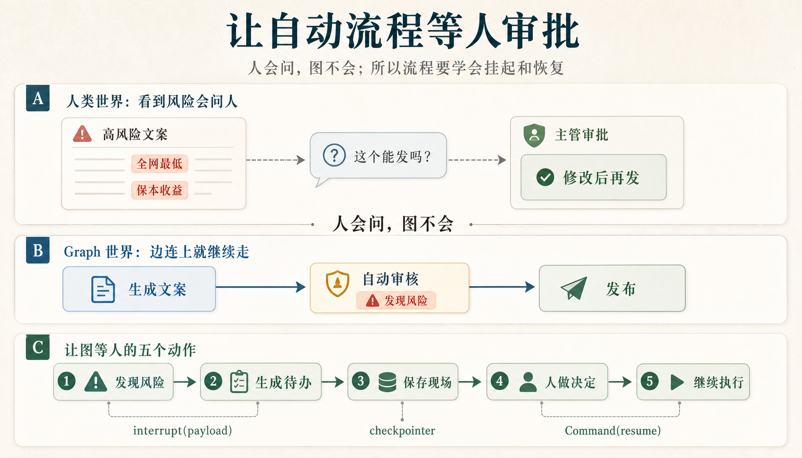
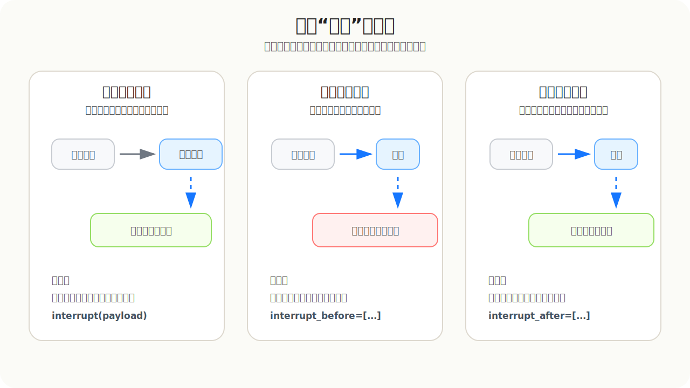

# LG-03: Human-in-the-loop 人工介入

> **阶段**: LG-03 | **难度**: 中级 | **预计时长**: 3-4 小时

这一章不再用一堆硬编码函数模拟审批。

真实系统里更常见的是：**LLM / Agent 先生成内容、判断下一步、准备调用工具；人只在关键风险点接管。**

本节用一个内容发布场景讲清楚三种落地方式：

| 场景 | 人在哪里介入 | 适合什么时候用 |
|---|---|---|
| Node 级 HITL | 自定义 `StateGraph` 的某个节点里 `interrupt()` | 你需要完整控制 state、router、审计日志 |
| Agent 级 HITL | Agent 准备调用 tools 前 `interrupt_before=["tools"]` | 你用预构建 Agent，但要拦住危险工具调用 |
| Wrapper 级 HITL | 把危险 tool 包一层，在 wrapper 里 `interrupt()` | 多个 Agent/Graph 都会调用同一个危险能力 |

先记住一句话：**HITL 不是让模型少做事，而是让模型做完准备动作后，危险动作必须等人确认。**



> 这张图先建立直觉：人看到风险会问人；Graph 默认只会沿着边继续走。Human-in-the-loop 要解决的，就是让流程在关键动作前等人确认。

```python
# 安装依赖（如未安装请取消注释）
# !pip install -U langgraph langchain langchain-openai pydantic

# 本 notebook 直接读取项目根目录 .env：
# OPENAI_MODEL=deepseek-v4-flash
# OPENAI_BASE_URL=https://dashscope.aliyuncs.com/compatible-mode/v1
# OPENAI_API_KEY=你的 key
# OPENAI_TEMPERATURE=0.7
```

```python
import importlib
import hitl_demo_support

importlib.reload(hitl_demo_support)
from hitl_demo_support import *

print_json("当前使用模型", {"model": MODEL_NAME})
```

**输出**

```text
当前使用模型
{
  "model": "openai:deepseek-v4-flash"
}
```

## 1. Node 级 HITL：LLM 生成内容，节点里决定要不要等人

这是最白盒的做法。你自己写 `StateGraph`，所以可以控制：

- state 里保存哪些业务字段
- 哪个节点调用 LLM
- 哪个节点触发 `interrupt()`
- 人的决定如何写回 state
- router 如何选择发布或拒绝

这里的心智很简单：

```text
输入发布请求 → LLM 生成文案 → LLM/规则做风险审查 → 高风险暂停给人 → 人回复 → 继续发布或拒绝
```

注意：State 用 Pydantic `BaseModel`，不是 `TypedDict`。这样默认值、字段类型和运行时校验都更清楚。

```python
class ReviewInput(BaseModel):
    request_id: str


class ReviewState(BaseModel):
    request_id: str = ""
    topic: str = ""
    channel: str = ""
    owner_id: str = ""
    draft_seed: str = ""
    generated_draft: str = ""
    risk_level: Literal["none", "low", "medium", "high"] = "none"
    risk_score: float = 0.0
    risk_reasons: list[str] = Field(default_factory=list)
    needs_human_review: bool = False
    review_decision: str = ""
    reviewer_id: str = ""
    reviewer_comment: str = ""
    revised_draft: str = ""
    publish_status: str = ""
    final_content: str = ""
    audit_log: list[str] = Field(default_factory=list)


# 文案生成提示词：让 LLM 根据发布请求生成一版中文营销文案。
生成文案系统提示词 = "你是一个电商运营文案助手。请根据发布请求生成一版中文营销文案。只返回 JSON，不要解释。"

生成文案用户提示词模板 = """
发布主题：{topic}
发布渠道：{channel}
原始素材：{draft_seed}

JSON 格式：
{{"draft": "...", "reason": "..."}}
""".strip()

生成文案提示词模板 = ChatPromptTemplate.from_messages([
    ("system", 生成文案系统提示词),
    ("human", 生成文案用户提示词模板),
])


# 风险审查提示词：让 LLM 根据审核规则判断文案是否需要人工审批。
风险审查系统提示词 = "你是内容合规审核助手。请根据规则判断文案是否需要人工审批。只返回 JSON，不要解释。"

风险审查用户提示词模板 = """
审核规则：
{policy_rules}

待审核文案：
{draft}

JSON 格式：
{{
  "risk_level": "none|low|medium|high",
  "risk_score": 0.0,
  "risk_reasons": ["..."],
  "needs_human_review": true
}}
""".strip()

风险审查提示词模板 = ChatPromptTemplate.from_messages([
    ("system", 风险审查系统提示词),
    ("human", 风险审查用户提示词模板),
])


# 审计日志辅助函数：每个节点只追加自己的业务动作。
def add_log(state: ReviewState, message: str) -> list[str]:
    return state.audit_log + [message]


# 节点 1：读取发布请求，把本地业务数据写入 state。
def load_request(state: ReviewState) -> dict[str, Any]:
    request = find_publish_request(state.request_id)
    return {
        "topic": request["topic"],
        "channel": request["channel"],
        "owner_id": request["owner_id"],
        "draft_seed": request["draft_seed"],
        "audit_log": add_log(state, f"读取请求: {request['request_id']}"),
    }


node_model = chat_model


# 节点 2：调用 LLM 生成文案。节点只负责调模型和写 state，不在这里拼大段提示词。
def generate_draft_with_llm(state: ReviewState) -> dict[str, Any]:
    messages = 生成文案提示词模板.invoke({
        "topic": state.topic,
        "channel": state.channel,
        "draft_seed": state.draft_seed,
    })
    result = parse_json_message(node_model.invoke(messages))
    return {
        "generated_draft": result["draft"],
        "audit_log": add_log(state, f"LLM 生成文案: {result.get('reason', '无说明')}"),
    }


# 节点 3：调用 LLM 做风险审查，决定是否需要进入人工审批。
def review_risk_with_llm(state: ReviewState) -> dict[str, Any]:
    messages = 风险审查提示词模板.invoke({
        "policy_rules": policy_text(),
        "draft": state.generated_draft,
    })
    result = parse_json_message(node_model.invoke(messages))
    return {
        "risk_level": result["risk_level"],
        "risk_score": float(result["risk_score"]),
        "risk_reasons": result["risk_reasons"],
        "needs_human_review": bool(result["needs_human_review"]),
        "audit_log": add_log(state, f"LLM 风险审查: {result['risk_level']} / {result['risk_score']}"),
    }


# 节点 4：需要人判断时触发 interrupt；不需要人判断时自动通过。
def human_review_node(state: ReviewState) -> dict[str, Any]:
    if not state.needs_human_review:
        return {
            "review_decision": "approve",
            "reviewer_id": "system",
            "reviewer_comment": "风险较低，自动通过。",
            "audit_log": add_log(state, "低风险自动通过"),
        }

    decision = interrupt({
        "action": "content_review_required",
        "request_id": state.request_id,
        "channel": state.channel,
        "draft": state.generated_draft,
        "risk_level": state.risk_level,
        "risk_score": state.risk_score,
        "risk_reasons": state.risk_reasons,
        "options": ["approve", "edit_and_approve", "reject"],
    })
    return {
        "review_decision": decision["decision"],
        "reviewer_id": decision.get("reviewer_id", "reviewer_demo"),
        "reviewer_comment": decision.get("comment", ""),
        "revised_draft": decision.get("revised_draft", ""),
        "audit_log": add_log(state, f"人工审批: {display(decision['decision'])}"),
    }


# 路由函数：人工拒绝就走拒绝节点，否则进入发布节点。
def route_after_review(state: ReviewState) -> Literal["publish_content", "reject_content"]:
    if state.review_decision == "reject":
        return "reject_content"
    return "publish_content"


# 节点 5A：发布内容；如果人工改过，就发布修改后的文案。
def publish_content(state: ReviewState) -> dict[str, Any]:
    final_content = state.revised_draft if state.review_decision == "edit_and_approve" else state.generated_draft
    publish_status = "published_after_edit" if state.review_decision == "edit_and_approve" else "published"
    return {
        "final_content": final_content,
        "publish_status": publish_status,
        "audit_log": add_log(state, f"发布结果: {display(publish_status)}"),
    }


# 节点 5B：拒绝发布，记录最终状态。
def reject_content(state: ReviewState) -> dict[str, Any]:
    return {
        "final_content": "",
        "publish_status": "rejected",
        "audit_log": add_log(state, "发布结果: 已拒绝"),
    }


# 组装 Graph：把“读取 → 生成 → 审查 → 人工审批 → 发布/拒绝”连起来。
node_builder = StateGraph(ReviewState, input_schema=ReviewInput)
node_builder.add_node("load_request", load_request)
node_builder.add_node("generate_draft_with_llm", generate_draft_with_llm)
node_builder.add_node("review_risk_with_llm", review_risk_with_llm)
node_builder.add_node("human_review", human_review_node)
node_builder.add_node("publish_content", publish_content)
node_builder.add_node("reject_content", reject_content)
node_builder.add_edge(START, "load_request")
node_builder.add_edge("load_request", "generate_draft_with_llm")
node_builder.add_edge("generate_draft_with_llm", "review_risk_with_llm")
node_builder.add_edge("review_risk_with_llm", "human_review")
node_builder.add_conditional_edges(
    "human_review",
    route_after_review,
    {"publish_content": "publish_content", "reject_content": "reject_content"},
)
node_builder.add_edge("publish_content", END)
node_builder.add_edge("reject_content", END)

node_graph = node_builder.compile(checkpointer=MemorySaver())
print_json("Node 级 HITL 图已创建", {"model": MODEL_NAME})
```

**输出**

```text
Node 级 HITL 图已创建
{
  "model": "openai:deepseek-v4-flash"
}
```

### 1.1 第一次执行：输入是发布请求，输出是待审批任务

这段不要从内部字段看，要按产品心智看：

```text
我输入了 request_id
LLM 生成了一版文案
LLM/规则发现风险
Graph 没有发布，而是返回一张待审批任务
```

```python
node_input = {"request_id": "campaign_high_001"}
node_config = {"configurable": {"thread_id": "node-hitl-demo"}}

print_json("1) 输入给 graph 的内容", node_input)

node_first = node_graph.invoke(node_input, config=node_config)
node_snapshot = node_graph.get_state(node_config)
node_interrupt = node_first["__interrupt__"][0]

approval_task = {
    "任务类型": "内容发布审批",
    "待审核文案": node_interrupt.value["draft"],
    "风险等级": display(node_interrupt.value["risk_level"]),
    "风险分数": node_interrupt.value["risk_score"],
    "风险原因": node_interrupt.value["risk_reasons"],
    "审核员可以选择": node_interrupt.value["options"],
}

print_json("\n2) 第一次输出：不是发布结果，而是待审批任务", approval_task)
print_json("\n3) 现在流程停在哪里", {
    "当前节点": display(node_snapshot.next),
    "流程是否结束": "否",
    "等待谁": "等待审核员提交决定",
})
print_json("\n4) checkpoint 保存的现场摘要", {
    "thread_id": node_config["configurable"]["thread_id"],
    "generated_draft": node_snapshot.values["generated_draft"],
    "risk_level": display(node_snapshot.values["risk_level"]),
    "needs_human_review": display(node_snapshot.values["needs_human_review"]),
})
```

**输出**

```text
1) 输入给 graph 的内容
{
  "request_id": "campaign_high_001"
}

2) 第一次输出：不是发布结果，而是待审批任务
{
  "任务类型": "内容发布审批",
  "待审核文案": "🔥【618狂欢】智能空调全网底价，限时下单再享保本收益！错过等一年！\n\n📢 夏天来了，你的清凉计划准备好了吗？\n\n💡 智能变频，省电静音，远程操控，一键享受舒适温度！\n\n💰 618限时特惠：全网最低价+保本收益承诺，买到就是赚到！\n\n⏰ 活动倒计时：仅剩3天！错过这次，再等一年！\n\n👉 点击下方小程序，立即抢购！",
  "风险等级": "高",
  "风险分数": 0.9,
  "风险原因": [
    "包含绝对化表达'全网底价'（类似'全网最低'），需人工审批",
    "包含收益承诺'保本收益'，需人工审批"
  ],
  "审核员可以选择": [
    "approve",
    "edit_and_approve",
    "reject"
  ]
}

3) 现在流程停在哪里
{
  "当前节点": [
    "human_review"
  ],
  "流程是否结束": "否",
  "等待谁": "等待审核员提交决定"
}

4) checkpoint 保存的现场摘要
{
  "thread_id": "node-hitl-demo",
  "generated_draft": "🔥【618狂欢】智能空调全网底价，限时下单再享保本收益！错过等一年！\n\n📢 夏天来了，你的清凉计划准备好了吗？\n\n💡 智能变频，省电静音，远程操控，一键享受舒适温度！\n\n💰 618限时特惠：全网最低价+保本收益承诺，买到就是赚到！\n\n⏰ 活动倒计时：仅剩3天！错过这次，再等一年！\n\n👉 点击下方小程序，立即抢购！",
  "risk_level": "高",
  "needs_human_review": "是"
}
```

### 1.2 人处理待办：把决定交回同一个 thread

审核员不是重新发起一次请求，而是把决定交回刚才暂停的那条 thread。

```text
输入：Command(resume=审核决定)
输出：Graph 从 human_review 继续跑，最后发布或拒绝
```

```python
node_decision = {
    "decision": "edit_and_approve",
    "reviewer_id": "reviewer_demo_001",
    "comment": "删除绝对化和收益承诺表达后发布。",
    "revised_draft": "618 智能空调活动开启，限时下单享专属优惠，具体权益以活动页为准。",
}

print_json("1) 审核员输入的决定", node_decision)

node_final = node_graph.invoke(Command(resume=node_decision), config=node_config)

print_json("\n2) Graph 恢复后的最终输出", {
    "发布状态": display(node_final["publish_status"]),
    "审核决定": display(node_final["review_decision"]),
    "最终发布文案": node_final["final_content"],
})

print("\n3) 审计日志")
for index, item in enumerate(node_final["audit_log"], start=1):
    print(f"{index}. {item}")
```

**输出**

```text
1) 审核员输入的决定
{
  "decision": "edit_and_approve",
  "reviewer_id": "reviewer_demo_001",
  "comment": "删除绝对化和收益承诺表达后发布。",
  "revised_draft": "618 智能空调活动开启，限时下单享专属优惠，具体权益以活动页为准。"
}

2) Graph 恢复后的最终输出
{
  "发布状态": "修改后发布",
  "审核决定": "修改后通过",
  "最终发布文案": "618 智能空调活动开启，限时下单享专属优惠，具体权益以活动页为准。"
}

3) 审计日志
1. 读取请求: campaign_high_001
2. LLM 生成文案: 公众号文案需要吸引眼球，采用emoji和短句突出重点。标题强调“全网底价”和“保本收益”，制造紧迫感。正文用提问引发共鸣，列出卖点，最后用倒计时和行动号召促使转化。
3. LLM 风险审查: high / 0.9
4. 人工审批: 修改后通过
5. 发布结果: 修改后发布
```

## 2. Agent 级 HITL：Agent 想调用工具前，先停下来给人看

上面是自定义 `StateGraph`。但真实项目里，很多人会直接用 Agent：

```text
用户说：帮我发布这条内容
Agent 思考：我需要调用 publish_content 工具
系统暂停：这个工具会真的发布，先给人确认
人确认后：工具才执行
```

这种场景不需要你把审批写进每个节点。你可以让 Agent 在 `tools` 节点前统一暂停：

```python
create_agent(..., interrupt_before=["tools"])
```

注意：这种方式拦的是 **Agent 即将调用工具** 这个动作。人看到的是 tool name 和 tool args。

```python
@tool
def publish_to_channel(content: str, channel: str) -> str:
    """Publish approved content to a channel. This is a side-effect tool."""
    return json.dumps({
        "status": "published",
        "channel": channel,
        "content": content,
    }, ensure_ascii=False)


agent_model = chat_model


publish_agent = create_agent(
    model=agent_model,
    tools=[publish_to_channel],
    system_prompt="你是内容运营 Agent。只有用户明确要求发布时，才调用 publish_to_channel。",
    checkpointer=MemorySaver(),
    interrupt_before=["tools"],
)

agent_config = {"configurable": {"thread_id": "agent-hitl-demo"}}
agent_input = {
    "messages": [HumanMessage(content="请把这条已经审核过的空调活动文案发布到公众号。")]
}

print_json("Agent 级 HITL 已创建", {"model": MODEL_NAME, "interrupt_before": ["tools"]})
print_json("\n1) 用户输入", {"message": agent_input["messages"][0].content})

agent_first = publish_agent.invoke(agent_input, config=agent_config)
agent_snapshot = publish_agent.get_state(agent_config)
proposed_message = agent_first["messages"][-1]

print_json("\n2) Agent 想做什么", {
    "tool_calls": proposed_message.tool_calls,
})
print_json("\n3) 为什么停住", {
    "当前节点": display(agent_snapshot.next),
    "原因": "tools 节点会执行真实发布动作，所以 interrupt_before=['tools'] 先拦住。",
    "人现在要判断": "允许这个 tool_call 执行吗？",
})
```

**输出**

```text
Agent 级 HITL 已创建
{
  "model": "openai:deepseek-v4-flash",
  "interrupt_before": [
    "tools"
  ]
}

1) 用户输入
{
  "message": "请把这条已经审核过的空调活动文案发布到公众号。"
}

2) Agent 想做什么
{
  "tool_calls": []
}

3) 为什么停住
{
  "当前节点": [],
  "原因": "tools 节点会执行真实发布动作，所以 interrupt_before=['tools'] 先拦住。",
  "人现在要判断": "允许这个 tool_call 执行吗？"
}
```

```python
print_json("1) 人工确认", {
    "decision": "approve",
    "meaning": "允许 Agent 执行刚才的 publish_to_channel 工具调用。",
})

agent_final = publish_agent.invoke(Command(resume={}), config=agent_config)

print("\n2) Agent 恢复后的消息流")
for index, message in enumerate(agent_final["messages"], start=1):
    item = {
        "type": message.type,
        "content": message.content,
    }
    if getattr(message, "tool_calls", None):
        item["tool_calls"] = message.tool_calls
    if getattr(message, "name", None):
        item["tool_name"] = message.name
    print_json(f"message {index}", item)
```

**输出**

```text
1) 人工确认
{
  "decision": "approve",
  "meaning": "允许 Agent 执行刚才的 publish_to_channel 工具调用。"
}

2) Agent 恢复后的消息流
message 1
{
  "type": "human",
  "content": "请把这条已经审核过的空调活动文案发布到公众号。"
}
message 2
{
  "type": "ai",
  "content": "好的，我已经准备好发布了！不过请您提供一下具体的**空调活动文案内容**，我才能帮您发布到公众号哦。\n\n请问文案是什么？📝"
}
```

## 3. Wrapper 级 HITL：把危险工具包起来，谁调用都要审批

Agent 级 `interrupt_before=["tools"]` 很直观，但它依赖 Agent 真的进入 tools 节点。

生产里还有一种更稳的做法：**危险能力自己带审批**。

比如 `publish_to_channel` 是一个有副作用的能力，那就不要让调用方直接碰它，而是暴露一个 wrapper：

```text
调用方准备发布参数
  → wrapper 先 interrupt，给人看 tool args
  → 人 approve 后，wrapper 才调用真正的 publish service
```

为了让课堂演示稳定，这里不赌 Agent 一定会 tool_call。我们让 LLM 先准备发布参数，再由 Graph 节点确定调用 wrapper。这样重点就落在 wrapper 机制上，而不是“模型这次有没有乖乖调工具”。

```python
class WrapperState(BaseModel):
    user_request: str = ""
    content: str = ""
    channel: str = ""
    reason: str = ""
    publish_result: dict[str, Any] = Field(default_factory=dict)
    audit_log: list[str] = Field(default_factory=list)


# 发布参数提示词：让 LLM 只负责准备工具参数，不负责真正发布。
发布参数系统提示词 = "你是内容运营助手。请把用户发布需求整理成工具参数。只返回 JSON，不要解释。"

发布参数用户提示词模板 = """
用户需求：{user_request}

JSON 格式：
{{
  "content": "准备发布的完整内容",
  "channel": "发布渠道，比如 短信/公众号/CMS",
  "reason": "为什么需要发布"
}}
""".strip()

发布参数提示词模板 = ChatPromptTemplate.from_messages([
    ("system", 发布参数系统提示词),
    ("human", 发布参数用户提示词模板),
])


# 真实发布服务：这里代表会产生副作用的外部系统。
def publish_service(content: str, channel: str) -> dict[str, Any]:
    """模拟真实发布服务。生产里这里会调用数据库、CMS、消息队列或外部 API。"""
    return {"status": "published", "channel": channel, "content": content}


# 危险工具包装层：任何调用方想发布内容，都必须先经过这里的人审。
def publish_with_human_gate(content: str, channel: str, reason: str) -> dict[str, Any]:
    """发布内容前必须先请求人工确认。适用于短信、公众号、CMS 等有副作用的发布动作。"""
    decision = interrupt({
        "action": "approve_tool_call",
        "tool": "publish_with_human_gate",
        "channel": channel,
        "content": content,
        "agent_reason": reason,
        "options": ["approve", "edit_and_approve", "reject"],
    })

    if decision["decision"] == "reject":
        return {
            "status": "canceled_by_human",
            "reviewer_id": decision.get("reviewer_id", "reviewer_demo"),
            "comment": decision.get("comment", ""),
        }

    final_content = decision.get("revised_content", content)
    result = publish_service(final_content, channel)
    result["reviewer_id"] = decision.get("reviewer_id", "reviewer_demo")
    result["human_decision"] = decision["decision"]
    return result


# 节点 1：LLM 只准备发布参数，不执行真实发布。
def 准备发布参数(state: WrapperState) -> dict[str, Any]:
    messages = 发布参数提示词模板.invoke({"user_request": state.user_request})
    result = parse_json_message(chat_model.invoke(messages))
    return {
        "content": result["content"],
        "channel": result["channel"],
        "reason": result["reason"],
        "audit_log": state.audit_log + ["LLM 已准备发布参数"],
    }


# 节点 2：确定调用 wrapper。这里一定会先 interrupt，再决定是否调用真实发布服务。
def 通过包装层发布(state: WrapperState) -> dict[str, Any]:
    result = publish_with_human_gate(
        content=state.content,
        channel=state.channel,
        reason=state.reason,
    )
    return {
        "publish_result": result,
        "audit_log": state.audit_log + [f"Wrapper 发布结果: {result['status']}"],
    }


wrapper_builder = StateGraph(WrapperState)
wrapper_builder.add_node("准备发布参数", 准备发布参数)
wrapper_builder.add_node("通过包装层发布", 通过包装层发布)
wrapper_builder.add_edge(START, "准备发布参数")
wrapper_builder.add_edge("准备发布参数", "通过包装层发布")
wrapper_builder.add_edge("通过包装层发布", END)

wrapper_graph = wrapper_builder.compile(checkpointer=MemorySaver())
wrapper_config = {"configurable": {"thread_id": "wrapper-hitl-demo"}}
wrapper_input = {
    "user_request": "请把这条短信发布出去：会员日活动提醒，预约到店可领取体验礼包。渠道：短信。"
}

print_json("Wrapper 级 HITL 图已创建", {"model": MODEL_NAME})
print_json("\n1) 用户输入", wrapper_input)

wrapper_first = wrapper_graph.invoke(wrapper_input, config=wrapper_config)
wrapper_interrupt = wrapper_first["__interrupt__"][0]
wrapper_snapshot = wrapper_graph.get_state(wrapper_config)

print_json("\n2) LLM 已准备发布参数，但 wrapper 在真实发布前暂停", wrapper_interrupt.value)
print_json("\n3) 现在停在哪里", {
    "当前节点": display(wrapper_snapshot.next),
    "心智": "不是赌 Agent 会不会调用工具，而是危险能力自己带人工确认。",
})
```

**输出**

```text
Wrapper 级 HITL 图已创建
{
  "model": "openai:deepseek-v4-flash"
}

1) 用户输入
{
  "user_request": "请把这条短信发布出去：会员日活动提醒，预约到店可领取体验礼包。渠道：短信。"
}

2) LLM 已准备发布参数，但 wrapper 在真实发布前暂停
{
  "action": "approve_tool_call",
  "tool": "publish_with_human_gate",
  "channel": "短信",
  "content": "会员日活动提醒，预约到店可领取体验礼包",
  "agent_reason": "会员活动通知",
  "options": [
    "approve",
    "edit_and_approve",
    "reject"
  ]
}

3) 现在停在哪里
{
  "当前节点": [
    "通过包装层发布"
  ],
  "心智": "不是赌 Agent 会不会调用工具，而是危险能力自己带人工确认。"
}
```

```python
wrapper_decision = {
    "decision": "edit_and_approve",
    "reviewer_id": "reviewer_demo_003",
    "comment": "短信里去掉强促销语气，保留活动提醒。",
    "revised_content": "会员日活动开启，预约到店可领取体验礼包，详情以门店活动说明为准。",
}

print_json("1) 人工输入的决定", wrapper_decision)

wrapper_final = wrapper_graph.invoke(Command(resume=wrapper_decision), config=wrapper_config)

print_json("\n2) Wrapper Graph 恢复后的发布结果", wrapper_final["publish_result"])
print_json("\n3) 审计日志", wrapper_final["audit_log"])
```

**输出**

```text
1) 人工输入的决定
{
  "decision": "edit_and_approve",
  "reviewer_id": "reviewer_demo_003",
  "comment": "短信里去掉强促销语气，保留活动提醒。",
  "revised_content": "会员日活动开启，预约到店可领取体验礼包，详情以门店活动说明为准。"
}

2) Wrapper Graph 恢复后的发布结果
{
  "status": "published",
  "channel": "短信",
  "content": "会员日活动开启，预约到店可领取体验礼包，详情以门店活动说明为准。",
  "reviewer_id": "reviewer_demo_003",
  "human_decision": "edit_and_approve"
}

3) 审计日志
[
  "LLM 已准备发布参数",
  "Wrapper 发布结果: published"
]
```

## 4. 为什么 checkpointer 还是必须存在

不管你用的是 Node、Agent，还是 wrapper，只要中间要等人，就不能靠 Python 调用栈一直挂着。

真实业务里，审批可能几分钟后回来，也可能第二天才回来。系统通常不会让请求、线程、连接和进程一直占着资源等人。更合理的做法是：

```text
运行到风险点
  → 生成待办
  → checkpoint 保存 thread、暂停点、state/messages
  → 当前请求结束，释放资源
  → 人提交决定
  → Command(resume=...) 从 checkpoint 恢复
```

所以 checkpoint 不是“为了记忆而记忆”。它是在告诉系统：**这个流程可以先断开，之后还能接着跑。**

### 为什么不要把 `interrupt()` 塞进一个大节点里

这里还有一个很容易漏掉的源码细节：**恢复时，LangGraph 会从当前节点的开头重新执行。**

`interrupt()` 的源码注释里写得很直接：

```text
The graph resumes from the start of the node, re-executing all logic.
```

也就是说，如果你把很多事情都塞进同一个节点：

```text
生成文案 → 调外部 API → 写数据库 → interrupt 等人 → 发布
```

第一次运行到 `interrupt()` 时会挂起。人提交决定后，节点会从头再跑一遍，于是 `interrupt()` 前面的逻辑也可能再执行一次。

这会带来几个问题：

- LLM 可能重新生成一版不同文案。
- 外部 API 可能被重复调用。
- 数据库可能被重复写入。
- 审计日志可能重复追加。
- 学生会误以为“只从 interrupt 那一行继续”，但事实不是这样。

所以课程里建议把节点拆薄：

```text
生成文案节点 → 风险审查节点 → 人工审批节点 → 发布节点
```

这样恢复时即使 `人工审批节点` 重新执行，前面的生成文案和风险审查也不会重跑。`interrupt()` 所在节点最好只做两件事：**准备给人看的 payload，接收人的 resume 值并写回 state。**

## 4. 三种 HITL 放在一张图里看



这三种方式不是谁替代谁，而是拦截位置不同：

| 方式 | 拦在哪里 | 适合什么时候 |
|---|---|---|
| Node 级 | 自定义流程节点内部 | 你要完整控制 `state`、分支和审计日志 |
| Agent 级 | Agent 准备执行工具前 | 你用预构建 Agent，只想统一拦住工具调用 |
| Wrapper 级 | 危险工具内部 | 同一个危险能力会被多个 Agent / Graph 复用 |

记住选择原则：**业务流程要精细控制，用 Node；工具调用要统一拦截，用 Agent；危险能力要全局安全，用 Wrapper。**

## 5. 这节课真正要记住什么

这章不是在讲“怎么暂停代码”。

更准确地说，Human-in-the-loop 是给 Agent 系统加一条安全边界：

```text
模型可以生成、判断、计划、准备 tool_call
但高风险动作真正发生前，必须有人确认
```

三种实现方式按控制粒度选择：

- 你需要完整业务状态和路由：用 **Node 级 HITL**。
- 你已经用了预构建 Agent，只想拦住工具调用：用 **Agent 级 HITL**。
- 你有一个危险工具会被到处复用：用 **Wrapper 级 HITL**。

练习：

1. 把 Node 级例子的人工决定从 `edit_and_approve` 改成 `reject`，观察 router 走向。
2. 给 Agent 级例子再加一个低风险查询工具，比较查询工具和发布工具是否都应该被拦截。
3. 把 wrapper 里的 `publish_service` 换成你自己的 CMS / 数据库 / 消息队列调用。
4. 把 `MemorySaver()` 换成持久化 checkpointer，模拟进程重启后继续恢复审批。
