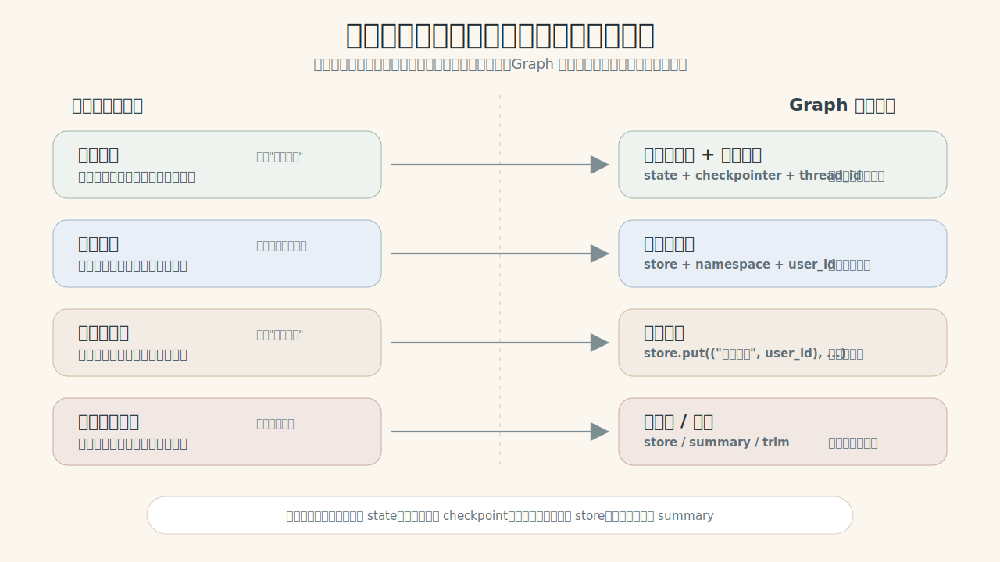
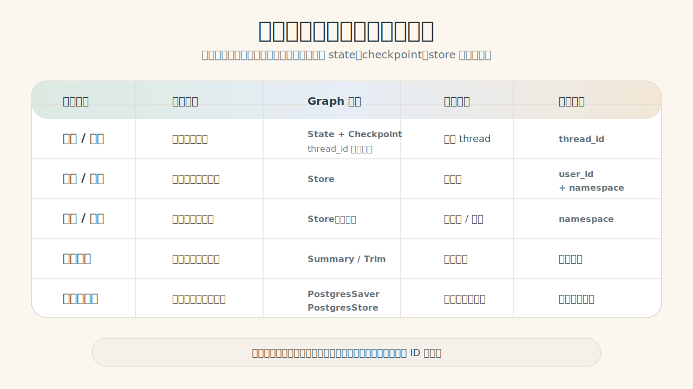

# LG-04：让图记住该记住的
> **阶段**: LG-04 | **难度**: 中级 | **预计时长**: 2-3 小时 | **依赖**: LG-01, LG-02, LG-03

## 这节课先解决一个问题：为什么记忆要分不同类型

你问公司的 HR 助教五个问题：

1. "我叫张伟。"（**短期事实**——当前对话才需要）
2. "请以后用表格回答。"（**偏好**——影响未来所有回答）
3. "我今年36岁。"（**长期事实**——换了话题也应该记住）
4. "上次会议有哪三个待办？"（**会话上下文**——同一次对话的记录）
5. "你还记得我的偏好吗？"（**跨会话回忆**——关了窗口再开也能想起来）

人类助教会自然把每句话放到不同的"记忆位置"：
- 短期记住：刚才说过的上下文
- 长期记住：你的个人信息和偏好
- 习惯记住：你喜欢什么格式

但图不会。图每次运行时，只看这一次输入和显式传进来的 state。

> **核心冲突句：人自然会把信息分层记忆，但图把所有东西都当作"这一次输入"。你需要在图里显式设计"哪些记在哪、用什么 ID 找回、能记多久"。**

<div style="max-width: 860px; margin: 1rem auto;">
  
</div>

这节课的目标不是让你学会 API，而是让你形成一个心智模型：

- 同一窗口的上下文该存哪？→ **短期记忆**：State + Checkpoint
- 换窗口还想读到的信息该存哪？→ **长期记忆**：Store
- 进程重启后怎么恢复？→ **持久化**：PostgresSaver
- 聊得太长怎么办？→ **整理**：Summary / Trim

学完后你应该能不用 API 名解释上面的每一行。

```python
# 安装依赖（如未安装请取消注释）
# !pip install -U langgraph langchain langchain-openai langgraph-checkpoint-postgres "psycopg[binary]" pydantic

# 本 notebook 直接读取项目根目录 .env：
# OPENAI_MODEL=deepseek-v4-flash
# OPENAI_BASE_URL=https://dashscope.aliyuncs.com/compatible-mode/v1
# OPENAI_API_KEY=你的 key
# OPENAI_TEMPERATURE=0
#
# 第 6 节 pgvector 语义检索还需要 embedding 配置：
# OPENAI_EMBEDDING_MODEL=text-embedding-v3
# OPENAI_EMBEDDING_DIMS=1024
```

```python
import importlib
from typing import Annotated, TypedDict
from operator import add

from langchain_core.prompts import ChatPromptTemplate

import memory_demo_support

importlib.reload(memory_demo_support)
from memory_demo_support import *

print_json("当前使用模型", {"model": MODEL_NAME})
```

**输出**

```text
当前使用模型
{
  "model": "openai:deepseek-v4-flash"
}
```

---

## 1. 先看"没有存档"的图为什么会失忆

先不要急着讲保存机制。我们先写一个最小图，让它像临时助教：你这次给它什么，它就只能看到什么。

这里的"失忆"，丢掉的其实是**短期记忆**——上次运行时的状态。

注意：下面不是用字符串规则模拟回复，而是用真实 LLM 生成回复和判断证据。这样学生看到的是 Graph 的状态问题，不是硬编码出来的假助教。

```python
# 这个提示词是教学材料：它要求模型只根据当前工作台回答，并返回 JSON 证据。
memory_demo_system_prompt = """
你是一个 HR 助教。你只能根据下面传入的"当前工作台"回答，不能假设自己看过别的历史。

请返回严格 JSON，不要输出 markdown，不要解释 JSON 外的内容。
字段：
- assistant_reply: 给用户看的中文回复
- knows_name: 布尔值，当前工作台里是否能看出用户叫张伟
- evidence: 一句话说明你依据当前工作台里的哪些内容判断
""".strip()

memory_demo_user_prompt_template = """
当前工作台里的历史消息：
{history_text}

用户这次输入：
{user_input}

JSON 格式：
{{
  "assistant_reply": "...",
  "knows_name": true,
  "evidence": "..."
}}
""".strip()

memory_demo_prompt = ChatPromptTemplate.from_messages([
    ("system", memory_demo_system_prompt),
    ("human", memory_demo_user_prompt_template),
])


# 这张工作台保存当前输入、消息历史、本轮回复和证据字段。
class AssistantState(TypedDict):
    user_input: str
    messages: Annotated[list[tuple[str, str]], add]
    assistant_reply: str
    knows_name: bool
    evidence: str


def format_history_for_prompt(messages: list[tuple[str, str]]) -> str:
    if not messages:
        return "（空，没有任何上一轮消息）"
    return "\n".join(f"{role}: {content}" for role, content in messages)


node_model = chat_model


# 节点调用真实 LLM，让模型只根据当前 state 里的工作台作答。
def generate_temporary_reply(state: AssistantState) -> dict:
    messages = memory_demo_prompt.invoke({
        "history_text": format_history_for_prompt(state.get("messages", [])),
        "user_input": state["user_input"],
    })
    result = parse_json_message(node_model.invoke(messages))
    reply = result["assistant_reply"]

    return {
        "messages": [("用户", state["user_input"]), ("助教", reply)],
        "assistant_reply": reply,
        "knows_name": bool(result["knows_name"]),
        "evidence": result["evidence"],
    }


# 编译一个不保存现场的最小图。
temporary_graph_builder = StateGraph(AssistantState)
temporary_graph_builder.add_node("generate_temporary_reply", generate_temporary_reply)
temporary_graph_builder.add_edge(START, "generate_temporary_reply")
temporary_graph_builder.add_edge("generate_temporary_reply", END)
temporary_graph = temporary_graph_builder.compile()

# 第一轮：告诉图我叫张伟。
first_turn = temporary_graph.invoke({
    "user_input": "我叫张伟",
    "messages": [],
    "assistant_reply": "",
    "knows_name": False,
    "evidence": "",
})

# 第二轮：问"我是谁？"，但没把第一轮的消息带过来。
second_turn = temporary_graph.invoke({
    "user_input": "我是谁？",
    "messages": [],
    "assistant_reply": "",
    "knows_name": False,
    "evidence": "",
})

print_json("第一轮输出", {
    "回复": first_turn["assistant_reply"],
    "是否知道姓名": display(first_turn["knows_name"]),
    "判断依据": first_turn["evidence"],
})
print_json("第二轮输出", {
    "回复": second_turn["assistant_reply"],
    "是否知道姓名": display(second_turn["knows_name"]),
    "判断依据": second_turn["evidence"],
    "原因": "第二轮没有拿到第一轮的消息——短期上下文丢失了。",
})
```

**输出**

```text
第一轮输出
{
  "回复": "你好张伟，很高兴认识你！",
  "是否知道姓名": "是",
  "判断依据": "用户当前输入 '我叫张伟' 表明姓名是张伟"
}
第二轮输出
{
  "回复": "您好，目前没有历史消息记录，我无法确定您的身份。请问您有什么需要帮助的吗？",
  "是否知道姓名": "否",
  "判断依据": "当前工作台历史消息为空，无法获取用户姓名信息。",
  "原因": "第二轮没有拿到第一轮的消息——短期上下文丢失了。"
}
```

刚才不是模型"笨"，而是我们没有把第一轮的现场交给第二轮。

人类会自然记住。Graph 不会。Graph 只读当前传进去的 state。如果上一轮的消息没进 state，它就看不到。

这就是短期记忆的问题：运行结束，现场蒸发。

---

## 2. State：当前这一轮的工作台

在解决"怎么保存"之前，先理解"图能看到什么"。

`state` 是图节点之间共享的工作台。节点只能读工作台上摆着的东西，然后返回要写回工作台的新内容。

刚才我们手动把上一轮消息放回工作台：

```python
# 这一轮手动把上一轮消息放回工作台。
second_turn_with_history = temporary_graph.invoke(
    {
        "user_input": "我是谁？",
        "messages": first_turn["messages"],
        "assistant_reply": "",
        "knows_name": False,
        "evidence": "",
    }
)
print(second_turn_with_history)
print("当前工作台里的消息数:", len(second_turn_with_history["messages"]))
print("第二轮回复:", second_turn_with_history["assistant_reply"])
print("第二轮是否知道姓名:", "是" if second_turn_with_history["knows_name"] else "否")
print("")
print("这次图能回答，因为我们手动把第一轮的消息搬进了 state。")
print("但真实聊天里，我们不希望每次都手动搬历史。")
```

**输出**

```text
{'user_input': '我是谁？', 'messages': [('用户', '我叫张伟'), ('助教', '你好张伟，很高兴认识你！'), ('用户', '我是谁？'), ('助教', '你是张伟，之前你告诉我你叫张伟。')], 'assistant_reply': '你是张伟，之前你告诉我你叫张伟。', 'knows_name': True, 'evidence': '当前工作台中用户说“我叫张伟”，助教回复“你好张伟”，表明已得知用户姓名。'}
当前工作台里的消息数: 4
第二轮回复: 你是张伟，之前你告诉我你叫张伟。
第二轮是否知道姓名: 是

这次图能回答，因为我们手动把第一轮的消息搬进了 state。
但真实聊天里，我们不希望每次都手动搬历史。
```

State 教给我们第一件事：

> 图能看到什么，完全取决于 state 里有什么。短期记忆依赖 state 显式携带上下文。

---

## 3. Checkpoint：同一个聊天窗口的自动存档

聊天软件里，同一个窗口会保留上文。你第二次发消息时，窗口里还在显示前面的消息。

Graph 需要两个东西才能做到类似效果：

1. 一个自动存档本：`checkpointer`
2. 一个聊天窗口 ID：`thread_id`

课堂里先用 `MemorySaver()`。它是内存版存档本，适合演示；进程重启后会丢失。

```python
# 给同一个聊天窗口加上自动存档。
checkpointer = MemorySaver()
persisted_graph = temporary_graph_builder.compile(checkpointer=checkpointer)

window_a_config = {"configurable": {"thread_id": "窗口A"}}

# 第一轮：在"窗口A"中告诉图我叫张伟。
window_a_first = persisted_graph.invoke(
    {"user_input": "我叫张伟", "messages": [], "assistant_reply": "", "knows_name": False, "evidence": ""},
    config=window_a_config,
)

# 第二轮：同一个"窗口A"问"我是谁？"——什么都不用额外带。
window_a_second = persisted_graph.invoke(
    {"user_input": "我是谁？"},
    config=window_a_config,
)

print("同一个窗口第二轮回复:", window_a_second["assistant_reply"])
print("同一个窗口消息数:", len(window_a_second["messages"]))
print("同一个窗口是否记得姓名:", "是" if window_a_second["knows_name"] else "否")
print("")
print("这里发生的事：")
print("  第一次运行结束 → 图把现场存进'窗口A'")
print("  第二次运行开始 → 图先找回'窗口A'的现场，再处理新输入")
```

**输出**

```text
同一个窗口第二轮回复: 您好，您之前告诉过我您叫张伟。
同一个窗口消息数: 4
同一个窗口是否记得姓名: 是

这里发生的事：
  第一次运行结束 → 图把现场存进'窗口A'
  第二次运行开始 → 图先找回'窗口A'的现场，再处理新输入
```

现在可以贴 API 名了：

- `checkpointer` 负责自动保存现场。
- `thread_id` 告诉图去哪一个窗口找存档。

到这里，我们解决了**短期记忆的自动保存和恢复**——同一个窗口，能续接。

---

## 4. `thread_id` 是聊天窗口 ID，不是用户 ID

换一个聊天窗口，图就不应该自动看到窗口A的历史。

这一步专门观察一个行为：同一个图、同一个程序，只要 `thread_id` 不同，就是另一段会话线。

```python
# 换一个 thread_id，就是另一段会话线。
window_b_config = {"configurable": {"thread_id": "窗口B"}}

window_b_first = persisted_graph.invoke(
    {"user_input": "我是谁？", "messages": [], "assistant_reply": "", "knows_name": False, "evidence": ""},
    config=window_b_config,
)

print("窗口A 是否记得姓名:", "是" if window_a_second["knows_name"] else "否")
print("窗口B 是否记得姓名:", "是" if window_b_first["knows_name"] else "否")
print("")
print("结论: thread_id 像聊天窗口 ID，不是用户身份认证。")
print("两个用户共用同一个 thread_id，就会看到同一个窗口的内容。")
```

**输出**

```text
窗口A 是否记得姓名: 是
窗口B 是否记得姓名: 否

结论: thread_id 像聊天窗口 ID，不是用户身份认证。
两个用户共用同一个 thread_id，就会看到同一个窗口的内容。
```

所以：

```text
thread_id：管理一段会话的续接 —— 我开的这个窗口
user_id：管理资料属于谁 —— 我是张伟
```

下一步要解决的是：换了新窗口，短期记忆（Checkpoint）自然没了，但长期记忆（用户偏好）怎么保留？

---

## 5. Store：换了窗口还能记住偏好

Checkpoint 像“聊天窗口存档”：只要 `thread_id` 相同，它会自动保存和恢复这段窗口聊到哪。

Store 更像“用户笔记本”：它保存跨窗口、跨任务仍然有价值的信息。但 Store **不会自己偷听整段对话并自动判断该记什么**。你必须设计一个写入时机：

1. 用户明确说“以后都……”时，立即写入 Store。
2. 一段会话结束时，用总结器抽取稳定偏好和长期事实，再写入 Store。
3. Agent 需要回答前，先从 Store 检索相关记忆，再把这些记忆放进回答上下文。

这就是 Store 这层最容易被误解的地方：

> **Store 解决“长期资料放哪、怎么找回”；不解决“哪些话值得长期记住”。后者要靠你设计写入触发器。**

下面用四段证据补完整条链路：手动写入 → 会话结束自动沉淀 → ReAct Agent 读取长期记忆 → 用向量检索找相关记忆。

```python
# Store 像跨聊天窗口的用户笔记本。
user_profile_store = InMemoryStore()


# namespace 里必须带上 user_id，避免不同用户读到同一份长期资料。
def preference_namespace(user_id: str) -> tuple[str, str]:
    return ("用户偏好", user_id)


def long_term_memory_namespace(user_id: str) -> tuple[str, str]:
    return ("长期记忆", user_id)


user_id = "用户-张伟"

# 第一种写入时机：用户明确提出长期偏好时，直接写入 Store。
user_profile_store.put(
    preference_namespace(user_id),
    key="回答风格",
    value={
        "memory": "用户偏好：以后请用表格回答，语气要简洁。",
        "kind": "preference",
        "source": "用户显式要求",
    },
)

# 张伟换了一个新窗口。
new_window_config = {"configurable": {"thread_id": "窗口C", "user_id": user_id}}

# 新窗口运行图——短期记忆（Checkpoint）是空的。
window_c_result = persisted_graph.invoke(
    {"user_input": "我是谁？", "messages": [], "assistant_reply": "", "knows_name": False, "evidence": ""},
    config=new_window_config,
)

# 但长期记忆（Store）还在。
stored_preference = user_profile_store.get(preference_namespace(user_id), "回答风格")

print("新窗口是否记得聊天姓名（Checkpoint）:", "是" if window_c_result["knows_name"] else "否 — 短期记忆不跨窗口")
print("新窗口是否读到回答风格（Store）:", "是" if stored_preference else "否 — 长期记忆跨窗口保存")
print("长期记忆内容:", stored_preference.value["memory"])
print("")
print("Checkpoint 跟着 thread_id 走 —— 新窗口不共享。")
print("Store 跟着 user_id 走 —— 同一个用户，所有窗口都能读到。")
```

### 5.1 “自动加记忆”到底自动在哪里？

Store 的 `put()` 仍然是一次明确写入。所谓“自动加”，通常不是 Store 自动做，而是系统在某个生命周期点帮你调用写入逻辑。

最常见的触发点是：**一段会话结束后，后台任务读取这段窗口的消息，抽取稳定事实和长期偏好，再写入 Store。**

白话流程是：

```text
同一窗口聊天 → checkpoint 保存现场 → 会话结束 hook 读取消息 → LLM 抽取长期记忆 → store.put 写入用户笔记本
```

这一步可以放在 Web 后端的“关闭会话”事件、定时任务、队列消费者，或 LangGraph 的 summary / hook 节点里。课堂里先用一个函数模拟这个会话结束 hook。

```python
# 会话结束时使用的总结提示词：只抽取跨窗口仍然有价值的信息。
session_memory_system_prompt = """
你是长期记忆整理器。请从一段聊天记录中抽取值得跨会话保存的用户记忆。

只保存稳定事实、长期偏好、持续目标。不要保存临时问题、寒暄、一次性任务。
请返回严格 JSON，不要输出 markdown，不要解释 JSON 外的内容。
字段：
- memories: 数组，每项包含 key、memory、kind、reason
""".strip()

session_memory_user_prompt_template = """
聊天记录：
{history_text}

JSON 格式：
{{
  "memories": [
    {{
      "key": "简短稳定的记忆键",
      "memory": "要保存的中文记忆",
      "kind": "profile | preference | goal",
      "reason": "为什么这条值得跨会话保存"
    }}
  ]
}}
""".strip()

session_memory_prompt = ChatPromptTemplate.from_messages([
    ("system", session_memory_system_prompt),
    ("human", session_memory_user_prompt_template),
])


def archive_session_memories(user_id: str, thread_id: str, messages: list[tuple[str, str]]) -> list[dict]:
    history_text = format_history_for_prompt(messages)
    prompt_messages = session_memory_prompt.invoke({"history_text": history_text})
    result = parse_json_message(chat_model.invoke(prompt_messages))

    saved_memories = []
    for memory_item in result.get("memories", []):
        value = {
            "memory": memory_item["memory"],
            "kind": memory_item["kind"],
            "source": f"会话结束自动总结:{thread_id}",
            "reason": memory_item["reason"],
        }
        user_profile_store.put(
            long_term_memory_namespace(user_id),
            key=memory_item["key"],
            value=value,
        )
        saved_memories.append({"key": memory_item["key"], **value})
    return saved_memories


session_to_archive = [
    ("用户", "我叫张伟，是 HR 负责人。"),
    ("助教", "记住了，你是 HR 负责人张伟。"),
    ("用户", "以后解释技术概念时，请先给业务场景，再给 API 名。"),
    ("助教", "好的，我会先讲业务场景，再补 API。"),
    ("用户", "今天先帮我理解 LangGraph 的 store。"),
]

saved_memories = archive_session_memories(
    user_id=user_id,
    thread_id="窗口D",
    messages=session_to_archive,
)

print_json("会话结束 hook 写入的长期记忆", saved_memories)
print("写入位置:", long_term_memory_namespace(user_id))
```

### 5.2 让 ReAct Agent 在回答前读 Store

现在 Store 里已经有用户长期记忆。下一步不是让模型“凭感觉记得”，而是给 Agent 一个工具：回答前先查用户笔记本。

这段只借用 `create_react_agent` 做一个最小实践。它的内部循环会在 LG-06 系统讲；这里先观察一个行为：

> Agent 不直接拥有长期记忆，它通过工具把 Store 里的记忆取出来，再基于这些记忆回答。

```python
from langchain_core.tools import tool
from langgraph.prebuilt import create_react_agent


def format_store_items(store_items) -> str:
    if not store_items:
        return "没有找到长期记忆。"
    lines = []
    for item in store_items:
        value = item.value
        lines.append(f"- {item.key}: {value['memory']}（来源：{value['source']}）")
    return "\n".join(lines)


@tool
def read_zhangwei_memories() -> str:
    """读取张伟的长期记忆。回答用户偏好、身份、目标相关问题前必须调用。"""
    preference_items = user_profile_store.search(preference_namespace(user_id), limit=5)
    long_term_items = user_profile_store.search(long_term_memory_namespace(user_id), limit=5)
    return "\n".join([
        "用户偏好：",
        format_store_items(preference_items),
        "",
        "长期记忆：",
        format_store_items(long_term_items),
    ])


memory_agent_system_prompt = """
你是 LangGraph 课程助教。
回答用户问题前，必须先调用 read_zhangwei_memories 工具读取用户长期记忆。
如果工具里有回答风格或学习偏好，回答时要遵守它。
""".strip()

memory_agent = create_react_agent(
    chat_model,
    tools=[read_zhangwei_memories],
    prompt=memory_agent_system_prompt,
)

agent_result = memory_agent.invoke({
    "messages": [("user", "下次给我解释 Store 时，应该用什么方式回答更合适？")]
})

tool_messages = [
    message for message in agent_result["messages"]
    if getattr(message, "type", "") == "tool"
]

print("是否调用长期记忆工具:", "是" if tool_messages else "否")
if tool_messages:
    print("工具读到的记忆:")
    print(tool_messages[-1].content)
print("")
print("Agent 最终回答:")
print(agent_result["messages"][-1].content)
```

### 5.3 Store 能不能用向量检索？

可以。按 key 读取适合“我明确知道要找回答风格”。但真实对话里，用户常常不会用同一个词。

例如用户问：

```text
“后面解释技术概念时怎么更符合我的习惯？”
```

这句话没有出现“回答风格”这个 key。更自然的做法是：把长期记忆写入带向量索引的 Store，然后用语义相似度检索相关记忆。

第 6 节会用本地 Postgres 实跑这件事：创建 `vector` 扩展，写入带 namespace 的长期记忆，再用 `PostgresStore + pgvector` 检索相关记忆。

短期记忆和长期记忆的核心差异：

| 问题 | 放哪里 | 谁负责写入 | 隔离方式 | 检索方式 |
|---|---|---|---|---|
| 当前窗口聊到哪了 | Checkpoint | LangGraph 自动保存 | thread_id | 同一 thread_id 恢复 |
| 用户长期喜欢什么 | Store | 你设计触发器写入 | user_id + namespace | key / search / vector search |
| 当前节点正在处理什么 | State | 节点返回更新 | 单次运行 | 当前运行内读取 |

Store 的 namespace 必须带上 `user_id`。否则不同用户可能读到同一份长期资料。

Store 的“自动”也要说清楚：自动的是你设计的 hook / 后台任务 / Agent 工具调用；Store 本身只是长期资料的读写和检索层。

---

## 6. 把记忆存进数据库：让图重启后也不失忆

前面用的 `MemorySaver` 和 `InMemoryStore` 存在 Python 进程内存里。一旦 Jupyter 重启、服务重启，短期记忆和长期记忆全部丢失。

真实产品需要持久化到数据库。LangGraph 的设计是：**图的定义不变，把保存现场和保存资料的后端换掉。**

> **关键思想：持久化不是重写图，而是把“内存里的存档本”换成“数据库里的存档本”。**

### 6.1 LangGraph 现在支持哪些持久化后端？

课堂里先不要把它理解成“只有 Postgres 能存记忆”。更准确的说法是：LangGraph 把持久化能力拆成两类后端。

| 后端 | 支持类型 | 课堂里怎么理解 | 参考 |
|---|---|---|---|
| 内存 | checkpoint + store | 临时草稿本，Jupyter 关掉就没了 | [Persistence 总览](https://docs.langchain.com/oss/python/langgraph/persistence) |
| SQLite | checkpoint | 本地文件级存档，适合单机实验 | [langgraph-checkpoint-sqlite](https://pypi.org/project/langgraph-checkpoint-sqlite/) |
| Postgres | checkpoint + store | 生产常用，重启、多进程、长期记忆都能放进同一套数据库 | [langgraph-checkpoint-postgres](https://pypi.org/project/langgraph-checkpoint-postgres/) |
| MongoDB | checkpoint + store | 文档数据库风格，适合已有 MongoDB 基础设施的团队 | [checkpoint](https://pypi.org/project/langgraph-checkpoint-mongodb/) / [store](https://pypi.org/project/langgraph-store-mongodb/) |
| Redis | checkpoint + store | 更偏高速读写和缓存式基础设施，适合已有 Redis 生态的团队 | [langgraph-checkpoint-redis](https://pypi.org/project/langgraph-checkpoint-redis/) |

真正选型时先看你要保存的是 **checkpoint** 还是 **store**，再看对应包是否支持你的数据库和部署方式。

### 6.2 为什么这节课选择 Postgres？

因为这节课不是只演示“能不能存下来”，而是要让学生看到生产里的记忆系统怎么长出来。

| 选择 Postgres 的原因 | 对记忆系统的意义 |
|---|---|
| 同时承载 checkpoint 和 store | 短期会话现场、长期用户资料可以用同一个数据库管理 |
| 支持 `pgvector` | 长期记忆不只能按 key 读，还能做相似度检索 |
| 生态成熟 | 连接池、备份、迁移、监控、权限控制都有现成方案 |
| 可接 `PgBouncer` | Agent 请求多、并发高时，连接数更容易管理 |
| 一个数据库多种用途 | 对教学和小团队都方便，不必一上来拆很多基础设施 |

所以本课选 PG，不是因为其他后端没价值，而是因为它最容易把这几件事连成一条线：

```text
同一窗口续接 → 进程重启恢复 → 多进程共享 → 长期记忆检索 → 生产连接管理
```

先看一张对比图：

| 场景 | MemorySaver + InMemoryStore | PostgresSaver + PostgresStore |
|---|---|---|
| 进程内运行 | ✅ 正常 | ✅ 正常 |
| Jupyter 内核重启后 | ❌ 所有记忆丢失 | ✅ 同一 thread_id 仍能恢复 |
| 多进程共享 | ❌ 不互通 | ✅ 同一数据库，所有进程都能读 |
| 长期记忆检索 | ⚠️ 只适合课堂演示 | ✅ 可结合 pgvector 做语义检索 |
| 适合场景 | 课堂演示、快速实验 | 生产环境、需要持久化的场景 |

动手试试：

```python
# 检查 Postgres 连接配置。
POSTGRES_URL = os.environ.get("POSTGRES_URL")

if POSTGRES_URL:
    print("检测到 POSTGRES_URL，可以使用 PostgresSaver / PostgresStore。")
else:
    pg_host = os.environ.get("POSTGRES_HOST", "localhost")
    pg_port = os.environ.get("POSTGRES_PORT", "5432")
    pg_user = os.environ.get("POSTGRES_USER", "langgraph")
    pg_password = os.environ.get("POSTGRES_PASSWORD", "langgraph")
    pg_db = os.environ.get("POSTGRES_DB", "langgraph")
    POSTGRES_URL = f"postgresql://{pg_user}:{pg_password}@{pg_host}:{pg_port}/{pg_db}"
    print(f"尝试拼接 POSTGRES_URL: postgresql://{pg_user}:***@{pg_host}:{pg_port}/{pg_db}")

try:
    from psycopg import connect

    with connect(POSTGRES_URL, autocommit=True) as conn:
        conn.execute("SELECT 1")
        conn.execute("CREATE EXTENSION IF NOT EXISTS vector")
        vector_version = conn.execute("SELECT extversion FROM pg_extension WHERE extname = 'vector'").fetchone()[0]

    postgres_available = True
    pgvector_available = True
    print("Postgres 连接成功。")
    print("pgvector 扩展版本:", vector_version)
except Exception as error:
    postgres_available = False
    pgvector_available = False
    print(f"Postgres 或 pgvector 不可用: {error}")
    print("\n提示: 本课需要带 pgvector 的 Postgres 镜像，可以运行:")
    print("  docker compose -f docker-compose.minimal.yml up -d postgres")
    print("如果你之前已经用 postgres:16-alpine 创建过容器，需要删除旧容器并重新创建。")
```

```python
# 即使没有 Postgres，也先展示 PostgresSaver / PostgresStore 的切换位置。
# 有 Postgres 时，这一段会真实导入后续示例需要的类。

if postgres_available:
    from langgraph.checkpoint.postgres import PostgresSaver
    from langgraph.store.postgres import PostgresStore

    print("langgraph-checkpoint-postgres 可用。")
    print("")
    print("切换 checkpointer 只需要一行代码的变化：")
    print("  课堂: builder.compile(checkpointer=MemorySaver())")
    print("  生产: builder.compile(checkpointer=PostgresSaver(conn))")
    print("")
    print("长期记忆也可以换成 PostgresStore，并继续使用 namespace 隔离。")
else:
    print("未检测到可用的 Postgres + pgvector。")
    print("以下展示代码结构；启动带 pgvector 的 Postgres 后可以真实运行。")
```

```python
# 用 PostgresSaver 编译同一张图，跑相同的逻辑。
if postgres_available:
    # 创建 PostgresSaver 实例。
    postgres_checkpointer = PostgresSaver(conn=connect(POSTGRES_URL, autocommit=True))
    # 首次使用需要创建表。
    postgres_checkpointer.setup()
    pg_graph = temporary_graph_builder.compile(checkpointer=postgres_checkpointer)
    print("已编译使用 PostgresSaver 的图。")
else:
    pg_graph = None
    print("跳过: Postgres 不可用。")
    print("以下代码逻辑不变，可以阅读理解。")
```

```python
# 证据1：PostgresSaver 和 MemorySaver 行为相同。
if postgres_available:
    pg_window_config = {"configurable": {"thread_id": "Postgres窗口A"}}

    # 第一轮：告诉图姓名。
    pg_first = pg_graph.invoke(
        {"user_input": "我叫张伟", "messages": [], "assistant_reply": "", "knows_name": False, "evidence": ""},
        config=pg_window_config,
    )
    print("PostgresSaver 第一轮:", pg_first["assistant_reply"])

    # 第二轮：同一窗口续接。
    pg_second = pg_graph.invoke(
        {"user_input": "我是谁？"},
        config=pg_window_config,
    )
    print("PostgresSaver 第二轮:", pg_second["assistant_reply"])
    print("同一窗口是否记得姓名:", "是" if pg_second["knows_name"] else "否")
    print("行为与 MemorySaver 一致。")
else:
    print("跳过: Postgres 不可用。")
```

```python
# 证据2（核心证据）：模拟进程重启——创建新图实例，同一 thread_id 恢复。
if postgres_available:
    # 当前现场：窗口A 已经有两次运行（告诉姓名 + 问"我是谁"）。
    print("当前窗口已有两轮对话，checkpoint 已持久化到数据库。")

    # 模拟进程重启：创建全新的 PostgresSaver 和图实例。
    new_postgres_checkpointer = PostgresSaver(conn=connect(POSTGRES_URL, autocommit=True))
    new_pg_graph = temporary_graph_builder.compile(checkpointer=new_postgres_checkpointer)

    # 用同一个 thread_id 继续运行。
    pg_third = new_pg_graph.invoke(
        {"user_input": "总结一下当前会话里关于我的信息。"},
        config={"configurable": {"thread_id": "Postgres窗口A"}},
    )
    print("进程重启后，同一 thread_id 的第三轮回复:")
    print(pg_third["assistant_reply"])
    print("同一 thread_id 是否仍记得姓名:", "是" if pg_third["knows_name"] else "否")
    print("消息数:", len(pg_third["messages"]))
    print("")
    print("结论: 进程重启后，PostgresSaver 仍能从数据库恢复现场。")
else:
    print("跳过: Postgres 不可用。")
```

```python
# 证据3（对比证据）：MemorySaver 进程重启后无法恢复。
# 创建一个新的 MemorySaver 实例（模拟进程重启）。
new_memory_checkpointer = MemorySaver()
new_memory_graph = temporary_graph_builder.compile(checkpointer=new_memory_checkpointer)

new_memory_result = new_memory_graph.invoke(
    {"user_input": "我是谁？", "messages": [], "assistant_reply": "", "knows_name": False, "evidence": ""},
    config={"configurable": {"thread_id": "窗口A"}},
)

print("MemorySaver 新实例是否记得姓名:", "是" if new_memory_result["knows_name"] else "否")
print("原因: 新的 MemorySaver 实例内存为空，没有之前的存档。")
print("")
if postgres_available:
    print("对比：PostgresSaver 在同一 thread_id 下恢复了所有记忆。")
    print("这就是持久化的意义——记忆不跟着进程生命周期走。")
```

### 6.3 在数据库里看见 checkpoint

只看程序输出还不够有说服力。我们直接查 Postgres：

- 是否创建了 checkpoint 相关表。
- `Postgres窗口A` 这个 `thread_id` 是否真的写进了数据库。
- 同一个 `thread_id` 下是否有多条 checkpoint 记录。

```python
if postgres_available:
    with connect(POSTGRES_URL, autocommit=True) as conn:
        checkpoint_tables = conn.execute("""
            SELECT table_name
            FROM information_schema.tables
            WHERE table_schema = 'public' AND table_name LIKE 'checkpoint%'
            ORDER BY table_name
        """).fetchall()

        checkpoint_count = conn.execute(
            "SELECT count(*) FROM checkpoints WHERE thread_id = %s",
            ("Postgres窗口A",),
        ).fetchone()[0]

        recent_checkpoints = conn.execute(
            """
            SELECT thread_id, checkpoint_ns, checkpoint_id
            FROM checkpoints
            WHERE thread_id = %s
            ORDER BY checkpoint_id DESC
            LIMIT 3
            """,
            ("Postgres窗口A",),
        ).fetchall()

    print_json("数据库里的 checkpoint 证据", {
        "checkpoint相关表": [row[0] for row in checkpoint_tables],
        "Postgres窗口A的checkpoint数量": checkpoint_count,
        "最近checkpoint": [
            {"thread_id": row[0], "checkpoint_ns": row[1], "checkpoint_id": row[2]}
            for row in recent_checkpoints
        ],
    })
else:
    print("跳过: Postgres 不可用。")
```

### 6.4 用 PostgresStore 看见 namespace 和 pgvector 检索

Checkpoint 证明“同一个窗口的现场”进了数据库。长期记忆还要证明三件事：

1. Store 里的记忆按 namespace 隔离，例如 `("长期记忆", "用户-张伟")`。
2. 同一个用户可以跨窗口读取这些长期记忆。
3. 不只按 key 精确读取，还能用 pgvector 做语义检索。

这一步会真实写入 PostgresStore，并让数据库创建向量索引相关结构。

```python
OPENAI_EMBEDDING_MODEL = os.environ.get("OPENAI_EMBEDDING_MODEL", "text-embedding-v3")
OPENAI_EMBEDDING_DIMS = int(os.environ.get("OPENAI_EMBEDDING_DIMS", "1024"))


def display_search_results(items) -> list[dict]:
    results = []
    for item in items:
        score = getattr(item, "score", None)
        results.append({
            "key": item.key,
            "相似度": None if score is None else round(float(score), 3),
            "memory": item.value["memory"],
            "kind": item.value.get("kind"),
        })
    return results


if postgres_available and pgvector_available:
    try:
        from langchain_openai import OpenAIEmbeddings

        memory_embeddings = OpenAIEmbeddings(
            model=OPENAI_EMBEDDING_MODEL,
            base_url=OPENAI_BASE_URL,
            api_key=OPENAI_API_KEY,
            dimensions=OPENAI_EMBEDDING_DIMS,
        )

        store_index_config = {
            "embed": memory_embeddings,
            "dims": OPENAI_EMBEDDING_DIMS,
            "fields": ["memory"],
        }

        zhangwei_preference_ns = preference_namespace(user_id)
        zhangwei_memory_ns = long_term_memory_namespace(user_id)
        lilei_memory_ns = long_term_memory_namespace("用户-李雷")

        with PostgresStore.from_conn_string(POSTGRES_URL, index=store_index_config) as pg_memory_store:
            pg_memory_store.setup()

            pg_memory_store.put(
                zhangwei_preference_ns,
                key="回答风格",
                value={
                    "memory": "用户偏好：以后请用表格回答，语气要简洁。",
                    "kind": "preference",
                    "source": "PostgresStore 示例",
                },
            )
            pg_memory_store.put(
                zhangwei_memory_ns,
                key="技术解释顺序",
                value={
                    "memory": "用户学习偏好：解释技术概念时，先给业务场景，再解释机制，最后再给 API 名。",
                    "kind": "preference",
                    "source": "PostgresStore 示例",
                },
            )
            pg_memory_store.put(
                zhangwei_memory_ns,
                key="用户身份",
                value={
                    "memory": "用户长期事实：张伟是 HR 负责人。",
                    "kind": "profile",
                    "source": "PostgresStore 示例",
                },
            )
            pg_memory_store.put(
                lilei_memory_ns,
                key="回答风格",
                value={
                    "memory": "用户偏好：李雷喜欢项目计划式回答，先列里程碑。",
                    "kind": "preference",
                    "source": "隔离性对照样本",
                },
            )

            exact_preference = pg_memory_store.get(zhangwei_preference_ns, "回答风格")
            semantic_matches = pg_memory_store.search(
                zhangwei_memory_ns,
                query="以后讲技术概念时，应该先讲业务场景还是先讲 API？",
                limit=3,
            )
            other_user_matches = pg_memory_store.search(
                lilei_memory_ns,
                query="以后讲技术概念时，应该先讲业务场景还是先讲 API？",
                limit=3,
            )

        with connect(POSTGRES_URL, autocommit=True) as conn:
            vector_columns = conn.execute("""
                SELECT table_name, column_name, udt_name
                FROM information_schema.columns
                WHERE table_schema = 'public' AND udt_name = 'vector'
                ORDER BY table_name, column_name
            """).fetchall()

            store_tables = conn.execute("""
                SELECT table_name
                FROM information_schema.tables
                WHERE table_schema = 'public' AND table_name LIKE 'store%'
                ORDER BY table_name
            """).fetchall()

        print_json("PostgresStore + pgvector 证据", {
            "embedding模型": OPENAI_EMBEDDING_MODEL,
            "embedding维度": OPENAI_EMBEDDING_DIMS,
            "写入namespace": {
                "张伟偏好": zhangwei_preference_ns,
                "张伟长期记忆": zhangwei_memory_ns,
                "李雷长期记忆": lilei_memory_ns,
            },
            "按key精确读取": exact_preference.value["memory"],
            "张伟namespace语义检索": display_search_results(semantic_matches),
            "李雷namespace对照检索": display_search_results(other_user_matches),
            "store相关表": [row[0] for row in store_tables],
            "vector列": [
                {"table": row[0], "column": row[1], "type": row[2]}
                for row in vector_columns
            ],
        })
    except Exception as error:
        print("PostgresStore + pgvector 示例运行失败:", error)
        print("请检查: langgraph-checkpoint-postgres、langchain-openai、OPENAI_EMBEDDING_MODEL、OPENAI_EMBEDDING_DIMS。")
else:
    print("跳过: 需要可用的 Postgres + pgvector。")
```

---

## 7. 长历史需要整理：不是越多越好

前面解决了"记忆存在哪、怎么找回"。还有一个现实问题：如果短期记忆太多了怎么办？

人类不会逐字记住一整天的对话，而是记住要点。Graph 也一样。消息越来越多时，模型输入会越来越长，成本越来越高，也更容易忽略关键信息。

最好把早期内容压成摘要，只保留最近几轮原文。

```python
# 长历史通常先压成摘要，再保留最近几轮原文。
def summarize_long_history(messages: list[tuple[str, str]], keep_recent: int = 4) -> list[tuple[str, str]]:
    if len(messages) <= keep_recent:
        return messages

    earlier_messages = messages[:-keep_recent]
    recent_messages = messages[-keep_recent:]
    summary = f"历史摘要：前面共有 {len(earlier_messages)} 条消息，用户姓名和长期偏好如果出现，需要继续保留。"
    return [("系统", summary), *recent_messages]


long_history = [
    ("用户", "我叫张伟"),
    ("助教", "记住了张伟。"),
    ("用户", "以后请用表格回答"),
    ("助教", "好的，我会用表格。"),
    ("用户", "先解释 state"),
    ("助教", "state 是工作台。"),
    ("用户", "再解释 checkpoint"),
    ("助教", "checkpoint 是窗口存档。"),
    ("用户", "最后解释 store"),
    ("助教", "store 是用户笔记本。"),
]

summarized = summarize_long_history(long_history, keep_recent=4)

print("整理前消息数:", len(long_history))
print("整理后消息数:", len(summarized))
print("是否生成历史摘要:", "是" if summarized[0][0] == "系统" else "否")
print("是否保留最近问题:", "是" if "最后解释 store" in summarized[-2][1] else "否")
print("摘要内容:", summarized[0][1])
```

**输出**

```text
整理前消息数: 10
整理后消息数: 5
是否生成历史摘要: 是
是否保留最近问题: 是
摘要内容: 历史摘要：前面共有 6 条消息，用户姓名和长期偏好如果出现，需要继续保留。
```

这里的关键心智模型：

> 长期运行的图不能把所有原文无限塞进上下文。早期历史要整理成更短、更稳定的记忆，但关键事实（姓名、偏好）不能丢。

生产环境中可以用 `trim_messages`、summary node、`pre_model_hook` 等更完善的工具，但它们解决的是同一个问题。

---

## 8. 本节小结：记忆全景图

人的记忆有不同类型，图的记忆也要分开存放。

- 短期记忆（同一窗口的上下文）→ `State + Checkpoint + thread_id`
- 长期记忆（跨窗口的用户资料）→ `Store + namespace + user_id`
- 持久化（进程重启后恢复）→ `PostgresSaver + PostgresStore`
- 长历史整理（太多时压缩）→ `Summary / Trim`

这类全景图不适合只用代码 `print()`，也不优先用生成图。它需要术语、中文标签和表格列名都稳定，所以这里用 SVG：可精确改字、可版本管理、notebook 里也能直接引用。

<div style="max-width: 980px; margin: 1rem auto;">
  
</div>

一张表格收束：

一句话收束：

> **人自然会在不同记忆位置存放不同类型的信息；Graph 需要你显式设计"写在哪里、用什么 ID 找回、能记多久"。**

---

## 9. 课后练习

1. 把第二轮换成新的 `thread_id`，观察图为什么不记得姓名。
2. 故意让两个"用户"共用同一个 `thread_id`，观察为什么会串话。
3. 把"请用表格回答"保存到 Store，然后开新窗口读取偏好。
4. 给 Store namespace 去掉 `user_id`，观察不同用户为什么会读到同一份偏好。
5. 把 12 条历史消息压缩成摘要，只保留最近 4 条原文。
6. 把用户偏好"语言=中文"也存进 Store，验证新窗口读取两个偏好。
7. **进阶**：启动 Postgres（运行 `docker compose -f docker-compose.minimal.yml up -d postgres`），用 PostgresSaver 跑完整流程，验证数据库里确实有 checkpoint 记录。
8. **进阶**：把 `MemorySaver` 换成 `PostgresSaver`，重启 Jupyter 内核后验证同一个 `thread_id` 仍能续接。

**下一节**: LG-05 并行执行与子图。当 Agent 需要同时做多件事时，图如何分工、汇总和复用。
