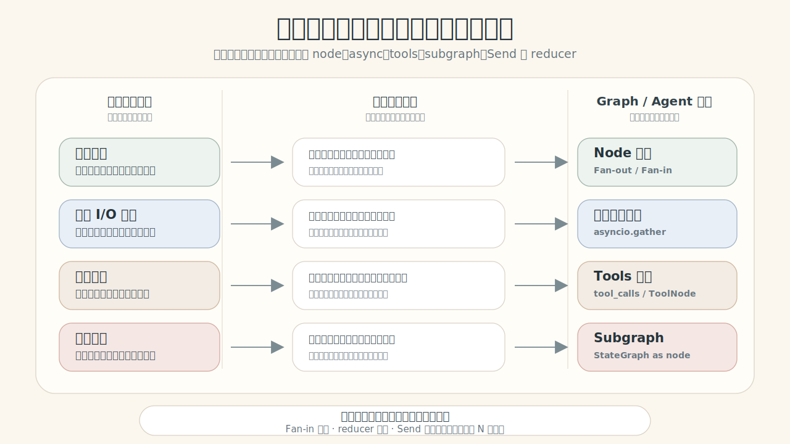
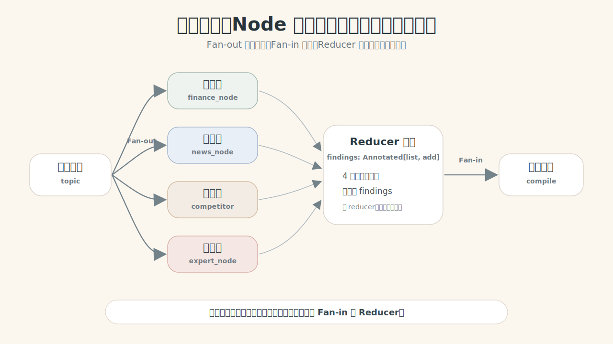
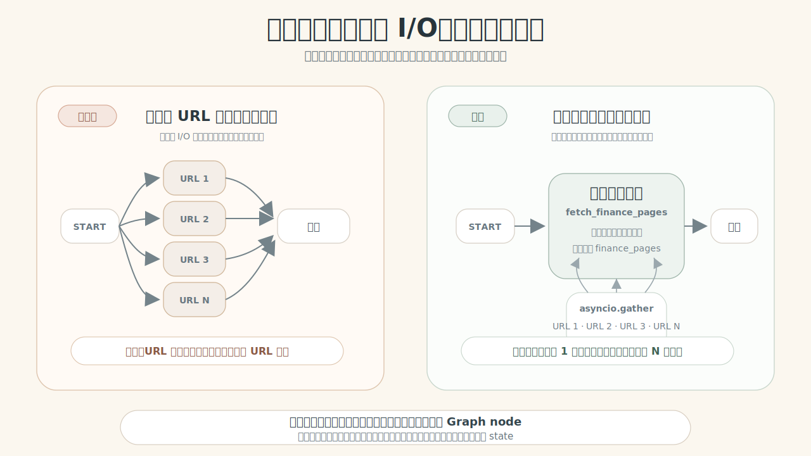
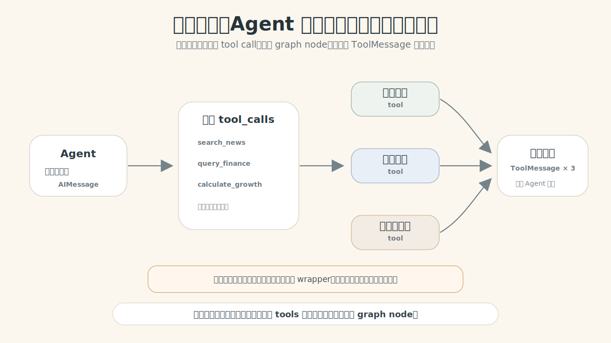
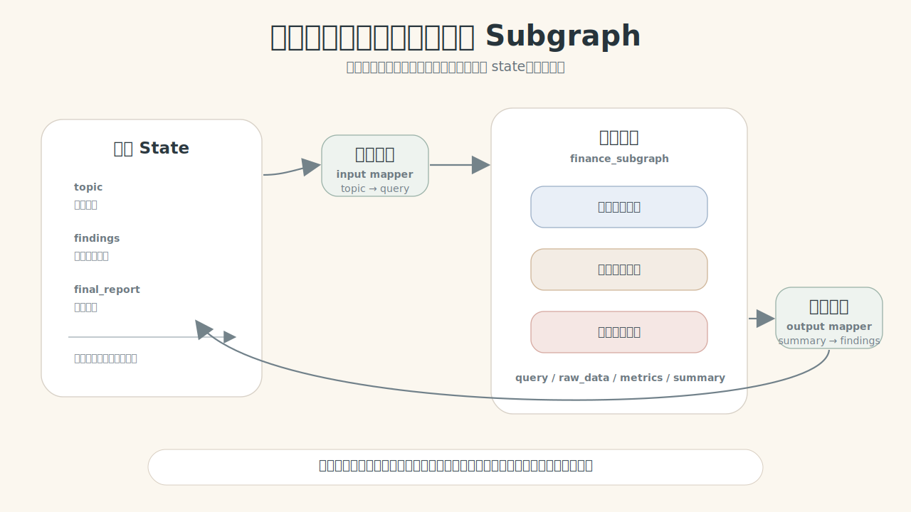

# LG-05：复杂任务的分层解构

> **核心冲突句：人类会自然把复杂任务拆成层次，但图不会；图只知道哪些职责被拆成节点、哪些重复工作被批量执行、哪些工具能一起调用、哪些内部流程要封装成子图。**

这节课从一个真实 Agent 产品场景开始：你要做一个 **ResearchForge 行业研究助手**。用户只给一句话：

> “请快速判断新能源汽车供应链公司 Q2 是否值得继续跟踪。”

人类研究团队会自然拆开这件事：有人看财务，有人看新闻，有人看竞品，有人看专家观点；财经研究员自己还会同时翻多个页面；Agent 可能一次调用搜索、数据库、计算器；财经研究内部如果越来越复杂，就会升级成一个可复用的研究小组。

Graph / Agent 不会自然这样做。本节课要训练的判断不是“哪个 API 更高级”，而是：**复杂任务应该在哪一层拆，拆开后如何提速、合并、复用、扩展。**

## 0. 为什么会需要并行、tools、subgraph / subagent？

ResearchForge 会同时遇到四类压力：

| 压力 | 如果不拆会怎样 | 需要的机制 |
|---|---|---|
| 速度 | 财务、新闻、竞品、专家依次等，用户等很久 | node 并行 |
| 效率 | 一个财经节点内部要查多段材料，逐条等很慢 | 节点内部并发 |
| 能力 | Agent 临场发现要搜索、查库、计算，固定边写不完 | tools 并行 |
| 结构与拓展 | 财经研究内部越来越复杂，父图越来越乱，能力也难复用 | subgraph；更进一步是 subagent |

注意：`tools`、`subgraph` 和 `subagent` 都是在做“复杂能力的原子化”。工具把外部能力原子化，方便被不同 Agent 复用；子图把稳定流程原子化，方便被不同父图复用；subagent 则把更自治的专家角色原子化。

<div style="max-width: 980px; margin: 1rem auto;">
  
</div>

## 1. 模型配置：本节用真实 LLM，不用假研究员

这一课讲的是 Agent / Graph 如何拆解真实 LLM 工作流，所以后面所有研究、摘要、工具选择都走真实模型。

需要在项目根目录 `.env` 或当前环境中配置：

```bash
OPENAI_MODEL=deepseek-v4-flash
OPENAI_BASE_URL=https://dashscope.aliyuncs.com/compatible-mode/v1
OPENAI_API_KEY=你的 key
OPENAI_TEMPERATURE=0
```

缺配置时直接报错，不做 fake fallback。这样学生不用同时理解“假模拟器”和“真实机制”。

```python
from typing import Annotated, TypedDict
from operator import add
import asyncio
import json
import sys
import time
from pathlib import Path

from langchain_core.messages import HumanMessage, SystemMessage, ToolMessage
from langchain_core.prompts import ChatPromptTemplate
from langchain_core.tools import tool
from langgraph.graph import END, START, StateGraph
from langgraph.types import Send

chapter_dir = Path.cwd()
if not (chapter_dir / "subgraphs_demo_support.py").exists():
    chapter_dir = Path("turtorial/LG-05-subgraphs")
sys.path.append(str(chapter_dir.resolve()))

from subgraphs_demo_support import chat_model, display_bool, parse_json_message, print_json

research_topic = "新能源汽车供应链公司 Q2 是否值得继续跟踪"
print("模型已加载:", chat_model.__class__.__name__)
print("研究主题:", research_topic)
```

## 2. 先写 Prompt：让模型输出可合并的研究 JSON

Prompt 是教学材料，不能藏在函数里。我们先把“研究员”节点要用的系统提示词和用户提示词写清楚。

每个研究员只负责一个角度，并返回结构化 JSON。这样后面的 Reducer 才能把多个发现合并成一个列表。

```python
research_system_prompt = """
你是 ResearchForge 的一个专业研究员。
你只负责自己的研究角度，不要写完整报告。
请只返回 JSON，不要 Markdown，不要代码块。
JSON 字段：
- role: 你的研究角色
- finding: 一句话核心发现
- evidence: 2 条简短证据列表
- risk: 一个需要继续核实的风险
- next_question: 下一步应该追问的问题
""".strip()

research_user_prompt_template = """
研究主题：{topic}
你的角色：{role}
研究重点：{focus}

请基于常识和行业研究视角，给出可被汇总节点使用的研究发现。
""".strip()

research_prompt = ChatPromptTemplate.from_messages([
    ("system", research_system_prompt),
    ("human", research_user_prompt_template),
])

research_roles = [
    ("财经研究员", "收入增长、利润率、现金流、费用压力"),
    ("新闻研究员", "近期舆情、政策变化、市场情绪"),
    ("竞品研究员", "主要竞争对手、份额变化、差异化优势"),
    ("专家观点研究员", "机构观点、产业专家担忧、长期趋势"),
]

print("研究员数量:", len(research_roles))
print("Prompt 是否要求 JSON:", "是")
print("研究角度:", [role for role, _ in research_roles])
```

## 3. Baseline：一个 Agent 串行做完所有研究

先不要上 Graph。我们让同一个程序依次调用四次 LLM，模拟一个人按顺序做四类研究。

这个 baseline 要证明两个问题：

1. **速度问题**：四个独立研究角度依次等待。
2. **结构问题**：虽然能完成，但职责边界只是藏在 for-loop 里，图看不见，也无法单独调度。

```python
def run_research_role(topic: str, role: str, focus: str) -> dict:
    prompt_value = research_prompt.invoke({"topic": topic, "role": role, "focus": focus})
    response = chat_model.invoke(prompt_value)
    return parse_json_message(response)

serial_start = time.perf_counter()
serial_findings = [
    run_research_role(research_topic, role, focus)
    for role, focus in research_roles
]
serial_elapsed = time.perf_counter() - serial_start

print("串行 LLM 研究次数:", len(serial_findings))
print("串行执行耗时:", f"{serial_elapsed:.2f} 秒")
print("是否能看到 Graph 职责边界:", "否 — 职责只藏在 for-loop 里")
print_json("串行研究样例:", serial_findings[0])
```

串行 baseline 能得到答案，但它没有把“财经、新闻、竞品、专家”变成图里的结构。后面如果要加审批、缓存、重试、替换某个研究模块，都会变得困难。

所以我们不是为了炫技才并行，而是因为：**职责已经独立，图应该把这个独立性显式表达出来。**

## 4. Node 并行：把独立职责拆成 Graph 节点

四个研究角度互不依赖，适合拆成四个 node 并行执行。

<div style="max-width: 980px; margin: 1rem auto;">
  
</div>

这里的并行发生在 **Graph 调度层**：开发者明确画出四条分支，汇总节点等齐所有发现后再生成报告。

```python
class ResearchState(TypedDict):
    topic: str
    findings: Annotated[list[dict], add]
    report: str


async def run_research_role_async(topic: str, role: str, focus: str) -> dict:
    prompt_value = research_prompt.invoke({"topic": topic, "role": role, "focus": focus})
    response = await chat_model.ainvoke(prompt_value)
    return parse_json_message(response)


async def finance_node(state: ResearchState) -> dict:
    finding = await run_research_role_async(state["topic"], "财经研究员", "收入增长、利润率、现金流、费用压力")
    return {"findings": [finding]}


async def news_node(state: ResearchState) -> dict:
    finding = await run_research_role_async(state["topic"], "新闻研究员", "近期舆情、政策变化、市场情绪")
    return {"findings": [finding]}


async def competitor_node(state: ResearchState) -> dict:
    finding = await run_research_role_async(state["topic"], "竞品研究员", "主要竞争对手、份额变化、差异化优势")
    return {"findings": [finding]}


async def expert_node(state: ResearchState) -> dict:
    finding = await run_research_role_async(state["topic"], "专家观点研究员", "机构观点、产业专家担忧、长期趋势")
    return {"findings": [finding]}


report_system_prompt = """
你是 ResearchForge 的主笔。
请根据多位研究员的 JSON 发现，写一个简短结论。
只返回 JSON，字段：decision, summary, key_reasons, open_risks。
""".strip()

report_user_prompt_template = """
研究主题：{topic}
研究员发现：{findings_json}
""".strip()

report_prompt = ChatPromptTemplate.from_messages([
    ("system", report_system_prompt),
    ("human", report_user_prompt_template),
])


async def compile_report_node(state: ResearchState) -> dict:
    prompt_value = report_prompt.invoke({
        "topic": state["topic"],
        "findings_json": json.dumps(state["findings"], ensure_ascii=False),
    })
    response = await chat_model.ainvoke(prompt_value)
    report = parse_json_message(response)
    return {"report": json.dumps(report, ensure_ascii=False, indent=2)}


parallel_builder = StateGraph(ResearchState)
parallel_builder.add_node("finance", finance_node)
parallel_builder.add_node("news", news_node)
parallel_builder.add_node("competitor", competitor_node)
parallel_builder.add_node("expert", expert_node)
parallel_builder.add_node("compile_report", compile_report_node)

for node_name in ["finance", "news", "competitor", "expert"]:
    parallel_builder.add_edge(START, node_name)
    parallel_builder.add_edge(node_name, "compile_report")

parallel_builder.add_edge("compile_report", END)
parallel_graph = parallel_builder.compile()

parallel_start = time.perf_counter()
parallel_result = await parallel_graph.ainvoke({
    "topic": research_topic,
    "findings": [],
    "report": "",
})
parallel_elapsed = time.perf_counter() - parallel_start

print("并行 LLM 研究节点数:", len(parallel_result["findings"]))
print("并行执行耗时:", f"{parallel_elapsed:.2f} 秒")
print("是否等齐四类发现后生成报告:", display_bool(bool(parallel_result["report"])))
print("Reducer 是否保留全部发现:", display_bool(len(parallel_result["findings"]) == 4))
print("\n汇总报告 JSON:")
print(parallel_result["report"])
```

现在 Graph 能看见四个职责节点了。速度只是收益之一，更重要的是结构变清晰：后面你可以单独替换财经节点、给新闻节点加缓存、给专家节点加人工审批，而不用重写整条流程。

## 5. Reducer：并行 LLM 结果必须有合并协议

四个 LLM 节点都返回 `findings`。如果没有 reducer，Graph 不知道多个并行更新怎么合并。

Reducer 的作用不是“更快”，而是让拆开的并行结果能安全回到同一个 state 字段。

```python
class BadMergeState(TypedDict):
    topic: str
    findings: list[dict]


async def bad_a_node(state: BadMergeState) -> dict:
    return {"findings": [{"role": "A", "finding": "发现 A"}]}


async def bad_b_node(state: BadMergeState) -> dict:
    return {"findings": [{"role": "B", "finding": "发现 B"}]}


bad_builder = StateGraph(BadMergeState)
bad_builder.add_node("bad_a", bad_a_node)
bad_builder.add_node("bad_b", bad_b_node)
bad_builder.add_edge(START, "bad_a")
bad_builder.add_edge(START, "bad_b")
bad_builder.add_edge("bad_a", END)
bad_builder.add_edge("bad_b", END)
bad_graph = bad_builder.compile()

try:
    await bad_graph.ainvoke({"topic": research_topic, "findings": []})
except Exception as error:
    print("是否触发并行写入冲突:", "是")
    print("错误类型:", type(error).__name__)
    print("原因:", "多个并行节点写同一字段，但没有 reducer")

print("\n正确做法:", "findings: Annotated[list[dict], add]")
print("并行发现数:", len(parallel_result["findings"]))
print("是否有结果丢失:", display_bool(len(parallel_result["findings"]) == 4))
```

## 6. 节点内部并发：同一职责里的多个 LLM 子任务不要打碎父图

财经节点内部可能还要读多段材料：收入、利润率、现金流、费用。它们都是“财经研究”这个职责内部的材料，不一定要拆成父图里的四个节点。

<div style="max-width: 980px; margin: 1rem auto;">
  
</div>

判断：如果只是同一职责内部的批量等待，就留在节点内部并发；如果每个子任务后面有不同路由、审批、恢复，才升级成 Graph node。

```python
finance_snippets = [
    "收入材料：公司 Q2 收入同比增长 25%，主要来自动力电池结构件订单。",
    "利润材料：毛利率提升到 18%，但原材料价格波动仍然影响净利率。",
    "现金流材料：经营现金流转正，应收账款周转略有改善。",
    "费用材料：研发费用继续增加，短期压低利润，但支持新客户导入。",
]

snippet_system_prompt = """
你是财经研究员。请把一段财经材料压缩成一个 JSON。
只返回 JSON，字段：metric, signal, implication。
""".strip()

snippet_user_prompt_template = """
研究主题：{topic}
材料：{snippet}
""".strip()

snippet_prompt = ChatPromptTemplate.from_messages([
    ("system", snippet_system_prompt),
    ("human", snippet_user_prompt_template),
])


async def summarize_finance_snippet(snippet: str) -> dict:
    prompt_value = snippet_prompt.invoke({"topic": research_topic, "snippet": snippet})
    response = await chat_model.ainvoke(prompt_value)
    return parse_json_message(response)


inside_node_start = time.perf_counter()
finance_snippet_summaries = await asyncio.gather(
    *[summarize_finance_snippet(snippet) for snippet in finance_snippets]
)
inside_node_elapsed = time.perf_counter() - inside_node_start

print("父图看到的财经节点数量:", 1)
print("财经节点内部 LLM 子任务数:", len(finance_snippet_summaries))
print("是否节点内部并发:", "是 — asyncio.gather")
print("返回摘要数:", len(finance_snippet_summaries))
print("节点内部并发耗时:", f"{inside_node_elapsed:.2f} 秒")
print_json("财经内部摘要样例:", finance_snippet_summaries[0])
```

这里仍然用了真实 LLM，但并行层级不同：父图只知道“财经研究”这一个职责；财经节点内部自己并发处理多段材料。

## 7. Tools 并行：Agent 临场决定要调用多个外部能力

有些拆解不是开发者提前画边，而是模型在运行时决定：这个问题需要搜索、查库、计算。

<div style="max-width: 980px; margin: 1rem auto;">
  
</div>

这里要观察真实模型如何一次性规划多个工具调用，然后由工具执行层并发运行这些工具。工具的另一个价值是能力原子化：`search_news`、`query_finance`、`calculate_growth` 一旦成为工具，就能被不同 Agent、不同图、不同业务流程复用。不同模型提供商对原生 `bind_tools` / `tool_calls` 的支持不完全一样，所以课堂里先让模型输出明确的工具调用计划 JSON，再把它转换成工具执行。真实项目可以替换成当前模型支持的原生 tool-calling 协议。

如果工具有副作用，不能因为可以并行就直接执行，必须接 LG-03 的审批 wrapper。

```python
@tool
def search_news(company: str) -> str:
    """搜索公司的近期新闻舆情。"""
    return f"{company} 近期新闻：订单增长、政策支持，但市场担心价格战。"


@tool
def query_finance(company: str) -> str:
    """查询公司的财务摘要。"""
    return f"{company} 财务摘要：Q2 收入同比增长 25%，毛利率 18%，经营现金流转正。"


@tool
def calculate_growth(company: str) -> str:
    """计算公司的关键增长指标。"""
    return f"{company} 指标计算：收入增长率 25%，毛利率提升 2 个百分点。"


tool_planning_system_prompt = """
你是 ResearchForge 的工具调度 Agent。
用户要快速判断一家公司的跟踪价值。
可用工具：
- search_news(company): 搜索近期新闻舆情
- query_finance(company): 查询财务摘要
- calculate_growth(company): 计算增长指标

请只返回 JSON，不要 Markdown，不要代码块。
JSON 字段：tool_calls。
tool_calls 是数组，每一项包含：id, name, args。
你必须一次性规划这三个互不依赖的工具调用。
""".strip()

tool_planning_user_prompt = "请分析：某科技公司是否值得继续跟踪？"

tool_plan_response = chat_model.invoke([
    SystemMessage(content=tool_planning_system_prompt),
    HumanMessage(content=tool_planning_user_prompt),
])
tool_plan = parse_json_message(tool_plan_response)
tool_calls = tool_plan["tool_calls"]

available_tools = {
    "search_news": search_news,
    "query_finance": query_finance,
    "calculate_growth": calculate_growth,
}


async def execute_one_tool_call(tool_call: dict) -> ToolMessage:
    tool = available_tools[tool_call["name"]]
    content = await asyncio.to_thread(tool.invoke, tool_call["args"])
    return ToolMessage(
        content=content,
        name=tool_call["name"],
        tool_call_id=tool_call["id"],
    )


tool_messages = await asyncio.gather(
    *[execute_one_tool_call(tool_call) for tool_call in tool_calls]
)

print("模型本轮规划工具调用数:", len(tool_calls))
print("工具名称:", ", ".join(tool_call["name"] for tool_call in tool_calls))
print("工具结果返回数:", len(tool_messages))
for message in tool_messages:
    print(f"- {message.name}: {message.content}")
```

Tools 并行和 Node 并行的关键区别：

| 对比项 | Node 并行 | Tools 并行 |
|---|---|---|
| 谁决定并行任务 | 开发者通过 graph edge 设计 | 模型规划要调用哪些工具 |
| 并行单位 | Graph node | Tool call |
| 合并位置 | State + Reducer / Fan-in 节点 | ToolMessage / 工具结果 + 后续 Agent 节点 |
| 适合场景 | 固定职责流程 | Agent 临场决定外部能力 |

## 8. Send：运行时才知道要拆多少份

固定四个研究职责适合普通 Fan-out。但如果用户上传 N 篇材料，N 是运行时才知道的，就不能提前画死 N 条边。

`Send` 解决的是：**运行时动态派发 N 个子任务。** 这里每个文档摘要仍然用真实 LLM。

```python
class DocumentMapState(TypedDict):
    documents: list[str]
    summaries: Annotated[list[dict], add]
    final_summary: str


document_system_prompt = """
你是研究材料整理员。请把输入材料压缩成 JSON。
只返回 JSON，字段：document_type, key_point, relevance。
""".strip()

document_user_prompt_template = """
研究主题：{topic}
材料：{document}
""".strip()

document_prompt = ChatPromptTemplate.from_messages([
    ("system", document_system_prompt),
    ("human", document_user_prompt_template),
])


def dispatch_documents(state: DocumentMapState) -> list[Send]:
    return [
        Send("summarize_document", {"document": document})
        for document in state["documents"]
    ]


async def summarize_document(state: dict) -> dict:
    prompt_value = document_prompt.invoke({"topic": research_topic, "document": state["document"]})
    response = await chat_model.ainvoke(prompt_value)
    return {"summaries": [parse_json_message(response)]}


async def reduce_document_summaries(state: DocumentMapState) -> dict:
    prompt_value = report_prompt.invoke({
        "topic": research_topic,
        "findings_json": json.dumps(state["summaries"], ensure_ascii=False),
    })
    response = await chat_model.ainvoke(prompt_value)
    return {"final_summary": json.dumps(parse_json_message(response), ensure_ascii=False, indent=2)}


document_builder = StateGraph(DocumentMapState)
document_builder.add_node("summarize_document", summarize_document)
document_builder.add_node("reduce_document_summaries", reduce_document_summaries)
document_builder.add_conditional_edges(START, dispatch_documents, ["summarize_document"])
document_builder.add_edge("summarize_document", "reduce_document_summaries")
document_builder.add_edge("reduce_document_summaries", END)
document_graph = document_builder.compile()

data_path = Path("map_reduce_documents.json")
if not data_path.exists():
    data_path = Path("turtorial/LG-05-subgraphs/map_reduce_documents.json")

documents = json.loads(data_path.read_text(encoding="utf-8"))["documents"][:4]
document_result = await document_graph.ainvoke({
    "documents": documents,
    "summaries": [],
    "final_summary": "",
})

print("输入文档数:", len(documents))
print("Send 分发任务数:", len(documents))
print("LLM 摘要结果数:", len(document_result["summaries"]))
print("最终摘要是否包含所有文档:", display_bool(len(document_result["summaries"]) == len(documents)))
print("\n动态文档汇总结论:")
print(document_result["final_summary"])
```

`Send` 不是 subgraph 的专属机制。它回答的是“任务数量运行时才知道怎么办”。目标可以是普通 node，也可以是 subgraph node。

## 9. Subgraph：一个职责内部也有稳定流程

当财经研究越来越复杂，它不再只是一个函数，而是一个稳定流程。把它做成 subgraph 的好处不只是让父图清爽，还能把“财经研究能力”原子化，未来被研报、风控、投后跟踪等多个父图复用：

```text
整理财经材料 → 评估关键指标 → 写财经摘要
```

这时把它升级成 `finance_subgraph`，父图只看见一个“财经分析”节点，子图内部自己维护状态、节点和边。

<div style="max-width: 980px; margin: 1rem auto;">
  
</div>

```python
class FinanceSubgraphState(TypedDict):
    query: str
    snippets: list[str]
    metric_review: dict
    summary: str


async def prepare_finance_context(state: FinanceSubgraphState) -> dict:
    return {"snippets": finance_snippets}


metric_system_prompt = """
你是财经指标分析员。请根据多段财经材料判断公司质量。
只返回 JSON，字段：growth_signal, margin_signal, cashflow_signal, concern。
""".strip()

metric_user_prompt_template = """
研究主题：{query}
财经材料：{snippets_json}
""".strip()

metric_prompt = ChatPromptTemplate.from_messages([
    ("system", metric_system_prompt),
    ("human", metric_user_prompt_template),
])


async def evaluate_finance_metrics(state: FinanceSubgraphState) -> dict:
    prompt_value = metric_prompt.invoke({
        "query": state["query"],
        "snippets_json": json.dumps(state["snippets"], ensure_ascii=False),
    })
    response = await chat_model.ainvoke(prompt_value)
    return {"metric_review": parse_json_message(response)}


finance_summary_system_prompt = """
你是财经研究小组负责人。请根据指标分析写一个可交给父图的发现。
只返回 JSON，字段：role, finding, evidence, risk, next_question。
""".strip()

finance_summary_user_prompt_template = """
研究主题：{query}
指标分析：{metric_review_json}
""".strip()

finance_summary_prompt = ChatPromptTemplate.from_messages([
    ("system", finance_summary_system_prompt),
    ("human", finance_summary_user_prompt_template),
])


async def write_finance_summary(state: FinanceSubgraphState) -> dict:
    prompt_value = finance_summary_prompt.invoke({
        "query": state["query"],
        "metric_review_json": json.dumps(state["metric_review"], ensure_ascii=False),
    })
    response = await chat_model.ainvoke(prompt_value)
    summary = parse_json_message(response)
    return {"summary": json.dumps(summary, ensure_ascii=False)}


finance_subgraph_builder = StateGraph(FinanceSubgraphState)
finance_subgraph_builder.add_node("prepare_context", prepare_finance_context)
finance_subgraph_builder.add_node("evaluate_metrics", evaluate_finance_metrics)
finance_subgraph_builder.add_node("write_summary", write_finance_summary)
finance_subgraph_builder.add_edge(START, "prepare_context")
finance_subgraph_builder.add_edge("prepare_context", "evaluate_metrics")
finance_subgraph_builder.add_edge("evaluate_metrics", "write_summary")
finance_subgraph_builder.add_edge("write_summary", END)
finance_subgraph = finance_subgraph_builder.compile()

finance_subgraph_result = await finance_subgraph.ainvoke({
    "query": research_topic,
    "snippets": [],
    "metric_review": {},
    "summary": "",
})

print("财经子图内部节点数:", 3)
print("子图是否可独立运行:", "是")
print("子图是否使用真实 LLM:", "是 — evaluate_metrics / write_summary")
print("子图输出摘要:", finance_subgraph_result["summary"])
```

## 10. 父子图状态边界：mapper 是翻译器

子图隔离不是障碍，而是好事。父图不用知道财经子图内部的 `snippets`、`metric_review` 等临时字段。

边界处只做两件事：

```text
父图 topic → input mapper → 子图 query
子图 summary → output mapper → 父图 findings
```

```python
class ParentResearchState(TypedDict):
    topic: str
    findings: Annotated[list[dict], add]
    final_report: str


def input_mapper(parent_state: ParentResearchState) -> FinanceSubgraphState:
    return {
        "query": parent_state["topic"],
        "snippets": [],
        "metric_review": {},
        "summary": "",
    }


def output_mapper(child_state: FinanceSubgraphState) -> dict:
    return {"findings": [json.loads(child_state["summary"])]}


async def run_finance_subgraph(parent_state: ParentResearchState) -> dict:
    child_input = input_mapper(parent_state)
    child_output = await finance_subgraph.ainvoke(child_input)
    return output_mapper(child_output)


async def parent_compile_report(state: ParentResearchState) -> dict:
    prompt_value = report_prompt.invoke({
        "topic": state["topic"],
        "findings_json": json.dumps(state["findings"], ensure_ascii=False),
    })
    response = await chat_model.ainvoke(prompt_value)
    report = parse_json_message(response)
    return {"final_report": json.dumps(report, ensure_ascii=False, indent=2)}


parent_builder = StateGraph(ParentResearchState)
parent_builder.add_node("finance_analysis", run_finance_subgraph)
parent_builder.add_node("compile_report", parent_compile_report)
parent_builder.add_edge(START, "finance_analysis")
parent_builder.add_edge("finance_analysis", "compile_report")
parent_builder.add_edge("compile_report", END)
parent_graph = parent_builder.compile()

parent_result = await parent_graph.ainvoke({"topic": research_topic, "findings": [], "final_report": ""})

print("父图字段:", "topic / findings / final_report")
print("子图字段:", "query / snippets / metric_review / summary")
print("input mapper 是否完成翻译:", "是")
print("output mapper 是否只返回父图需要的结果:", "是")
print("父图是否包含 metric_review:", display_bool("metric_review" in parent_result))
print("\n父图最终报告:")
print(parent_result["final_report"])
```

这里可以顺便建立和下一课的边界：

- `subgraph`：把稳定流程封装成可复用图，内部节点和状态仍由开发者明确设计。
- `subagent`：把一个复杂职责交给“有模型、有工具、有自主循环”的专家 Agent，角色更独立，决策空间更大。

所以它们都属于“复杂任务解构”，只是自治程度不同。

## 11. ResearchForge 全景：不是为了并行而并行

回到开头的产品压力：

| 压力 | 本节机制 | 这层解决什么 |
|---|---|---|
| 用户不想等 | node 并行 | 四个独立研究职责同时推进 |
| 节点内部还有很多等待 | 节点内部并发 | 同一职责里的多段材料并发处理 |
| Agent 临场需要外部能力 | tools 并行 | 模型一次提出多个工具调用 |
| 某个职责越来越复杂 | subgraph | 把稳定流程封装成可复用能力，并隔离 state |
| 输入数量运行时变化 | Send | 动态分发 N 个任务 |
| 多分支都写结果 | Reducer | 保证合并不丢、不冲突 |

一句话：**并行是表象，分层解构才是主线。**

## 12. 常见误区

| 误区 | 现象 | 正确说法 |
|---|---|---|
| 只把并行理解成提速 | 代码变快了，但结构仍然混乱 | 先判断复杂度来自哪一层 |
| 把所有慢任务都拆成 graph node | 父图巨大，职责边界模糊 | 不同职责才拆 node |
| 把同一职责里的 URL 请求拆成很多节点 | I/O 细节污染父图 | 批量 I/O 留在节点内部并发 |
| 忘记 Reducer | 多个 LLM 节点写 `findings` 报错 | 并行写同一字段必须有合并协议 |
| 把 tools 并行写成固定 edge | 模型临场能力选择被写死 | 工具调用由模型通过 `tool_calls` 提出 |
| 子图复制整个父图 state | 子图不可复用，字段互相污染 | 子图 state 最小化，边界处用 mapper |
| 把 subgraph 和 subagent 混为一谈 | 不知道什么时候需要 Agent 自治 | subgraph 是流程封装；subagent 是角色自治 |

## 13. 本节小结：先判断在哪一层拆

```text
不同职责 → node 并行
同一职责里的批量请求 → 节点内部 async 并发
模型临场选择多个外部能力 → tools 并行
一个职责内部有稳定多步流程 → subgraph
复杂职责需要自治模型和工具循环 → subagent（下一阶段）
多个并行结果写同一字段 → reducer
运行时才知道 N 个任务 → Send
```

学生应该能不用 API 名解释机制：

> ResearchForge 不是把一个大 Agent 写得更长，而是把复杂任务按层拆开：职责交给图节点，重复等待留在节点内部，外部能力原子化成 tools，稳定流程原子化成 subgraph。拆开以后，再显式设计等齐、合并、边界翻译和复用方式。

## 14. 课后练习

1. 给 ResearchForge 增加“政策研究员”节点，观察 Reducer 是否仍然保留所有 findings。
2. 把财经节点内部的 4 段材料改成 8 段，比较串行摘要和 `asyncio.gather` 的耗时差异。
3. 让模型一次调用 `search_news`、`query_finance`、`calculate_growth` 之外的第四个工具，并解释为什么这是 tools 层的扩展。
4. 把“新闻研究员”也升级成 subgraph：收集新闻 → 判断情绪 → 输出风险。
5. 用 Send 动态处理 6 家公司，验证输出数量等于输入数量。
6. 判断题：给 5 个场景，让学生选择 node / async inside node / tools / subgraph / subagent / Send / reducer。
