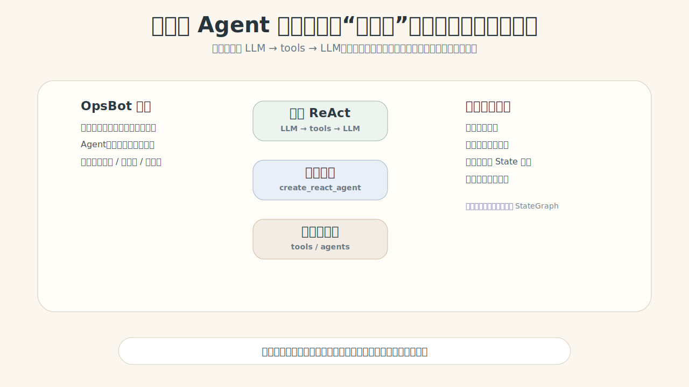
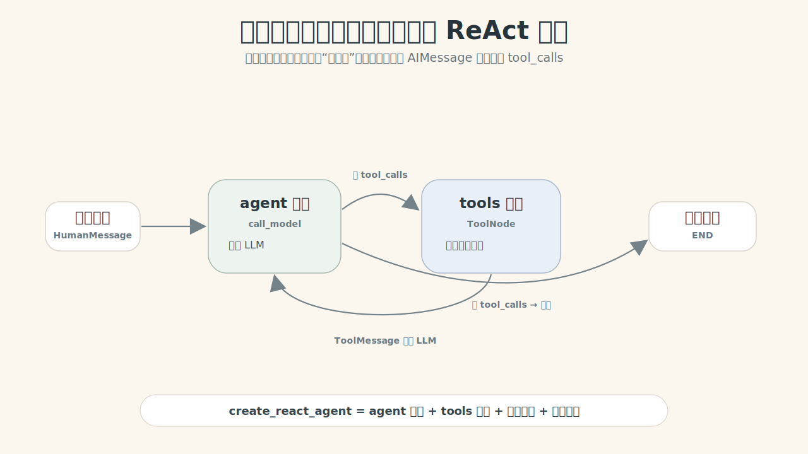
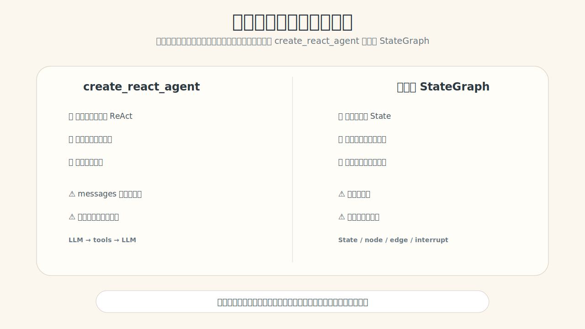
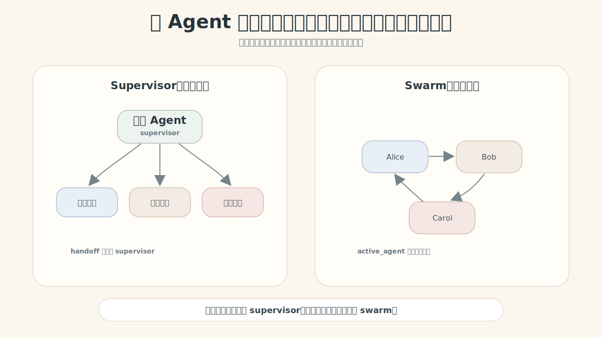

# LG-06：预构建 Agent，不是魔法，是标准循环的封装

> **核心冲突句：人会自然把“查工具 → 看结果 → 再判断”当成连续动作，但图不会；如果这是标准 ReAct 循环，预构建 Agent 可以帮你快速封装，代价是中间控制权变少。**

这节课从一个真实产品场景开始：**OpsBot 客服 / 运维助手**。

用户可能同时问：

> “查一下订单 A100 的状态，如果符合规则，帮我估算退款金额。”

这类需求很常见：LLM 判断要用哪些工具，工具返回结果，LLM 再整合回答。你当然可以从零写 StateGraph：agent 节点、tools 节点、条件边、循环边。但如果只是标准循环，先用预构建 Agent 更快。

本节课要训练的不是“背 `create_agent`”，而是判断：**什么时候用预构建快速验证，什么时候必须回到自定义 StateGraph。**

## 0. 为什么需要预构建 Agent？

<div style="max-width: 980px; margin: 1rem auto;">
  
</div>

OpsBot 同时有三类需求：

| 需求 | 适合的机制 | 为什么 |
|---|---|---|
| 快速验证一个能查工具的 Agent | `create_agent` | 标准 LLM → tools → LLM 循环不用重写 |
| 把订单查询、退款计算做成可复用能力 | tools | 能力原子化，可被不同 Agent 复用 |
| 多个专家协作：订单、退款、技术 | supervisor / swarm | 角色能力原子化，可被调度或交接 |
| 涉及审批、权限、审计 | 自定义 StateGraph | 需要显式状态、路由和人工边界 |

判断规则先记住：**预构建求快，自定义求控。**

## 1. 模型配置：本节继续用真实 LLM

需要在项目根目录 `.env` 或当前环境中配置：

```bash
OPENAI_MODEL=deepseek-v4-flash
OPENAI_BASE_URL=https://dashscope.aliyuncs.com/compatible-mode/v1
OPENAI_API_KEY=你的 key
OPENAI_TEMPERATURE=0
```

缺配置时直接报错，不做 fake fallback。因为这一课讲的是模型如何产生工具调用，不能用硬编码结果替代。

```python
import sys
from pathlib import Path

from langchain_core.messages import HumanMessage
from langchain_core.tools import tool
from langchain.agents import create_agent

chapter_dir = Path.cwd()
if not (chapter_dir / "prebuilt_agents_demo_support.py").exists():
    chapter_dir = Path("turtorial/LG-06-prebuilt-agents")
sys.path.append(str(chapter_dir.resolve()))

from prebuilt_agents_demo_support import chat_model, display_bool, print_json

print("模型已加载:", chat_model.__class__.__name__)
```

## 2. 先把外部能力原子化成 Tools

预构建 Agent 的价值不只是“能调工具”，而是把外部能力变成可复用的原子能力。

这里定义三个可控工具：订单查询、退款政策、退款金额计算。工具返回课堂数据，但是否调用、调用顺序、如何整合，由真实 LLM 决定。

```python
@tool
def query_order_status(order_id: str) -> str:
    """查询订单状态。"""
    order_db = {
        "A100": "已发货，签收前，可申请仅退款或退货退款",
        "B200": "已签收 12 天，仍在 15 天无理由退货窗口内",
        "C300": "已签收 40 天，超过无理由退货窗口",
    }
    return order_db.get(order_id, f"没有找到订单 {order_id}")


@tool
def query_refund_policy(product_type: str = "standard") -> str:
    """查询退款政策。"""
    return "标准商品：签收 15 天内可退；未发货可全额退；已发货需扣除 12 元物流成本。"


@tool
def calculate_refund_amount(order_amount: float, shipping_cost: float = 12.0) -> str:
    """计算预计退款金额。"""
    refund = max(order_amount - shipping_cost, 0)
    return f"预计退款金额：{refund:.2f} 元"


ops_tools = [query_order_status, query_refund_policy, calculate_refund_amount]

print("工具数量:", len(ops_tools))
print("工具名称:", [tool.name for tool in ops_tools])
print("能力是否已原子化:", "是 — 这些工具可以被不同 Agent 复用")
```

## 3. create_agent：标准循环三行封装

如果需求就是标准循环：

```text
用户问题 → LLM 判断需要哪些工具 → 工具返回结果 → LLM 整合回复
```

就没有必要一开始手写完整 StateGraph。

```python
opsbot_prompt = """
你是 OpsBot 客服助手。
你必须先调用工具获取订单状态和退款政策，再回答用户。
如果需要估算退款金额，请调用 calculate_refund_amount。
回答要说明你调用了哪些工具，以及结论依据。
""".strip()

opsbot_agent = create_agent(
    chat_model,
    ops_tools,
    system_prompt=opsbot_prompt,
)

user_question = "查一下订单 A100 的状态，如果这笔订单金额是 299 元，帮我估算可退多少钱。"
opsbot_result = opsbot_agent.invoke({"messages": [HumanMessage(content=user_question)]})

messages = opsbot_result["messages"]
ai_tool_messages = [message for message in messages if getattr(message, "tool_calls", None)]
tool_messages = [message for message in messages if message.type == "tool"]

print("消息总数:", len(messages))
print("是否产生 tool_calls:", display_bool(bool(ai_tool_messages)))
print("工具消息数量:", len(tool_messages))
print("最终回复:")
print(messages[-1].content)
```

这个例子已经不是假函数演示：真实 LLM 决定调用哪些工具，预构建 Agent 负责把 tool call、tool execution、再思考循环串起来。

## 4. 白盒化：create_agent 内部到底帮你搭了什么？

<div style="max-width: 980px; margin: 1rem auto;">
  
</div>

它内部至少做了四件事：

1. 调用模型的 `agent` 节点。
2. 执行工具的 `tools` 节点。
3. 检查最后一条 `AIMessage` 有没有 `tool_calls`。
4. 有工具调用就回到模型，没有工具调用就结束。

```python
print("观察消息链路:")
for index, message in enumerate(messages, 1):
    if message.type == "human":
        print(f"{index}. HumanMessage: {message.content[:80]}")
    elif message.type == "ai":
        tool_calls = getattr(message, "tool_calls", [])
        print(f"{index}. AIMessage: tool_calls={len(tool_calls)} content={str(message.content)[:80]}")
        for tool_call in tool_calls:
            print(f"   - {tool_call['name']}({tool_call['args']})")
    elif message.type == "tool":
        print(f"{index}. ToolMessage: {message.name} → {message.content[:80]}")
```

循环终止的关键不是模型说“我结束了”，而是程序看到最后一条 AIMessage 没有 `tool_calls`。这就是预构建 Agent 的核心路由规则。

## 5. 用 stream 观察黑盒内部

`invoke()` 只给最终结果，容易让学生觉得预构建是黑盒。用 `stream()` 可以看到每一步消息如何增长。

```python
stream_question = "查一下订单 B200 是否还能退款，并估算 520 元订单的退款金额。"
print("用户:", stream_question)

for step_index, chunk in enumerate(
    opsbot_agent.stream({"messages": [HumanMessage(content=stream_question)]}, stream_mode="values"),
    1,
):
    last_message = chunk["messages"][-1]
    print(f"\n--- Step {step_index} ---")
    print("消息类型:", last_message.type)
    if last_message.type == "ai":
        tool_calls = getattr(last_message, "tool_calls", [])
        print("tool_calls 数量:", len(tool_calls))
        if tool_calls:
            print("工具:", [tool_call["name"] for tool_call in tool_calls])
        else:
            print("最终回答片段:", str(last_message.content)[:120])
    elif last_message.type == "tool":
        print("工具结果:", last_message.name, "→", last_message.content[:120])
    print("当前 messages 数:", len(chunk["messages"]))
```

stream 的意义不是炫技，而是帮助学生看到：预构建虽然封装了图，但内部仍然是消息流、工具调用和循环路由。

## 6. 预构建的代价：快，但控制力少

<div style="max-width: 980px; margin: 1rem auto;">
  
</div>

只要出现下面需求，就不要迷信三行代码：

- 需要人工审批。
- 需要自定义业务状态，比如 `user_role`、`risk_level`、`pending_approval`。
- 需要复杂路由，不只是 LLM → tools → LLM。
- 需要完整审计每个中间节点。

```python
@tool
def issue_refund(order_id: str, amount: float) -> str:
    """执行退款动作。注意：这是有副作用的危险工具。"""
    return f"已为订单 {order_id} 发起退款 {amount:.2f} 元"

unsafe_agent = create_agent(
    chat_model,
    [query_order_status, issue_refund],
    system_prompt="你是退款助手。用户要求退款时，先查订单，再调用 issue_refund。",
)

unsafe_result = unsafe_agent.invoke({
    "messages": [HumanMessage(content="给订单 A100 直接退款 100 元。")]
})
unsafe_tool_messages = [message for message in unsafe_result["messages"] if message.type == "tool"]

print("危险工具是否被调用:", display_bool(any(message.name == "issue_refund" for message in unsafe_tool_messages)))
print("为什么这是问题:", "退款是副作用动作，生产环境必须先走审批边界")
print("正确迁移方向:", "自定义 StateGraph + interrupt / 审批节点 / wrapper 级审批")
```

这个例子要让学生形成判断：预构建 Agent 很适合原型，但遇到副作用工具、审批、权限时，应该迁移到自定义图，而不是继续往 prompt 里塞“请谨慎”。

## 7. 记忆与上下文：messages 会越来越长

预构建 Agent 的核心 state 是 `messages`。每次工具调用都会追加：

```text
HumanMessage → AIMessage(tool_calls) → ToolMessage → AIMessage(final)
```

这很方便，但也意味着长期对话会膨胀。这里先看同一个 thread 里的记忆行为。

```python
from langgraph.checkpoint.memory import InMemorySaver

memory = InMemorySaver()
opsbot_with_memory = create_agent(
    chat_model,
    ops_tools,
    system_prompt=opsbot_prompt,
    checkpointer=memory,
)

config = {"configurable": {"thread_id": "opsbot-user-001"}}

first_turn = opsbot_with_memory.invoke(
    {"messages": [HumanMessage(content="我关注订单 A100。")]} ,
    config=config,
)
second_turn = opsbot_with_memory.invoke(
    {"messages": [HumanMessage(content="刚才那个订单还能退款吗？")]} ,
    config=config,
)

print("第一轮 messages 数:", len(first_turn["messages"]))
print("第二轮 messages 数:", len(second_turn["messages"]))
print("第二轮是否接上同一 thread:", display_bool(len(second_turn["messages"]) > len(first_turn["messages"])))
print("第二轮回复:", second_turn["messages"][-1].content[:200])
```

这里衔接 LG-04：checkpointer 保存的是可恢复现场，不是长期偏好 Store。预构建 Agent 可以接 checkpointer，但如果你需要长期用户资料、权限、审批状态，仍然要认真设计外层状态。

## 8. 多 Agent 预构建：把专家角色原子化

LG-05 讲过 tools 和 subgraph 的能力原子化；LG-06 继续往上一层：把一个专家 Agent 原子化。

<div style="max-width: 980px; margin: 1rem auto;">
  
</div>

- `create_supervisor`：一个主管调度多个专家，适合任务分发。
- `create_swarm`：多个专家平级交接，适合客服转接。

```python
from langgraph_supervisor import create_supervisor

order_agent = create_agent(
    chat_model,
    [query_order_status],
    system_prompt="你是订单专员。只处理订单状态问题，必须调用 query_order_status。",
    name="order_expert",
)

refund_agent = create_agent(
    chat_model,
    [query_refund_policy, calculate_refund_amount],
    system_prompt="你是退款专员。只处理退款政策和退款金额估算问题。",
    name="refund_expert",
)

supervisor_builder = create_supervisor(
    [order_agent, refund_agent],
    model=chat_model,
    prompt="你是客服主管。根据用户问题，把任务交给订单专员或退款专员；必要时整合他们的结果。",
    output_mode="last_message",
)
supervisor_app = supervisor_builder.compile()

supervisor_result = supervisor_app.invoke({
    "messages": [HumanMessage(content="订单 A100 的状态是什么？如果金额是 299 元，能退多少钱？")]
})

print("Supervisor messages 数:", len(supervisor_result["messages"]))
print("最终回复:")
print(supervisor_result["messages"][-1].content)
```

Supervisor 的本质是：主管 Agent 把“订单专家”“退款专家”当成可调用的专家能力。它不是把所有工具塞给一个大 Agent，而是把角色能力原子化。

Swarm 适合另一类场景：没有固定主管，当前 Agent 可以把对话交接给另一个 Agent，并用 `active_agent` 记住当前由谁负责。课堂只需要先掌握选型：**任务分发用 supervisor，连续转接用 swarm。**

## 9. 什么时候从预构建迁移到自定义？

| 需求 | 推荐选择 | 原因 |
|---|---|---|
| 3 天内做一个能查工具的 demo | `create_agent` | 标准循环，速度优先 |
| 多个专家角色由主管分配 | `create_supervisor` | 角色能力原子化，中心调度 |
| 客服在多个专家间平级转接 | `create_swarm` | 用 `active_agent` 保持当前负责角色 |
| 退款、重启、发布等副作用动作 | 自定义 StateGraph | 需要审批、权限、审计 |
| 需要 `user_role`、`risk_level` 等字段 | 自定义 StateGraph | 预构建核心 state 以 messages 为主 |
| 需要复杂业务分支 | 自定义 StateGraph | 不只是 ReAct 循环 |

一句话：**预构建负责把常见循环和角色调度封装好；自定义图负责把业务控制权拿回来。**

## 10. 本节小结

学生应该能不用 API 名解释：

> 如果需求只是“模型判断工具、工具返回结果、模型再回答”，这是一条标准 ReAct 循环，可以先用预构建 Agent 快速验证。预构建的代价是中间状态、路由和审批不够可控；一旦业务需要显式状态、人工审批或复杂路由，就要迁移到自定义 StateGraph。

判断口诀：

```text
标准 ReAct → create_agent
主管分发专家 → create_supervisor
平级连续转接 → create_swarm
副作用审批 / 自定义状态 / 复杂路由 → 自定义 StateGraph
```

## 11. 课后练习

1. 给 OpsBot 增加 `query_invoice_status` 工具，观察 `create_agent` 是否能自动调用。
2. 把 `issue_refund` 包成审批工具：没有审批 token 时只返回“待审批”。
3. 给 supervisor 增加一个 `tech_expert`，专门处理“系统报错 / 日志查询”。
4. 设计一个适合 swarm 的客服转接场景，并说明为什么不适合 supervisor。
5. 给 5 个业务需求做选型判断：`create_agent` / `create_supervisor` / `create_swarm` / 自定义 StateGraph。
