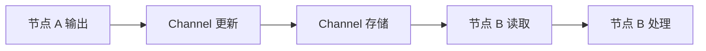
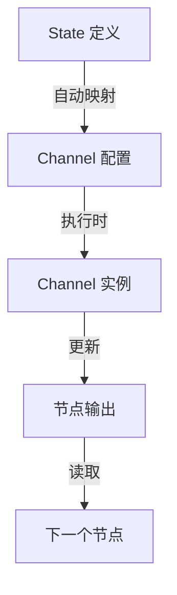

# LangGraph Channels 通道机制完整指南

## 概述

LangGraph Channels（通道）是 LangGraph 底层架构的核心组件，负责在 Graph 节点之间**传递和存储数据**。可以把 Channel 理解为节点之间的"数据管道"或"消息队列"。

在大多数情况下，你不需要直接操作 Channel，因为 LangGraph 会根据你定义的 State 自动创建和管理 Channel。但理解 Channel 的工作原理可以帮助你：
- 深入理解 LangGraph 的执行机制
- 实现高级的状态管理模式
- 优化 Graph 的性能
- 解决复杂的并发问题

---

## 核心概念

### 什么是 Channel？

**Channel（通道）** 是 LangGraph 中用于在节点之间传递和存储数据的抽象容器。每个 State 字段都对应一个 Channel。

```python
from typing import TypedDict

class MyState(TypedDict):
    messages: list      # 👈 对应一个 Channel
    counter: int        # 👈 对应另一个 Channel
    result: str         # 👈 又一个 Channel
```

### Channel 的工作流程



1. **更新（Update）**：节点执行完毕，输出数据到 Channel
2. **存储（Store）**：Channel 根据自己的规则存储/合并数据
3. **读取（Get）**：下一个节点从 Channel 读取数据
4. **检查点（Checkpoint）**：Channel 状态可以被序列化保存

---

## Channel 类型详解

LangGraph 提供了多种内置的 Channel 类型，每种类型有不同的数据处理策略：

### 1. **LastValue** - 保存最后一个值

**用途**：存储最新的单一值，每步最多接收一个值。

**特点**：
- 新值会覆盖旧值
- 每个步骤只能接收一个更新
- 最常用的 Channel 类型

**使用场景**：
- 单一结果字段（如 `result: str`）
- 状态标记（如 `current_step: str`）
- 计数器（如 `retry_count: int`）

**示例**：

```python
from langgraph.channels import LastValue

# 自动使用（通过 TypedDict）
class State(TypedDict):
    result: str         # 👈 自动使用 LastValue
    current_step: str   # 👈 自动使用 LastValue

# 手动使用
from langgraph.graph import StateGraph

builder = StateGraph(State)

# State 字段会自动映射到 LastValue Channel
```

**行为演示**：

```python
# 步骤 1
channel.update(["Hello"])
channel.get()  # 返回: "Hello"

# 步骤 2
channel.update(["World"])
channel.get()  # 返回: "World"  👈 覆盖了 "Hello"
```

---

### 2. **Topic** - 发布/订阅主题

**用途**：实现发布/订阅模式，可以累积多个值或每步清空。

**特点**：
- 支持多个订阅者
- 可配置是否跨步骤累积
- 返回值是序列（列表）

**参数**：
- `typ`：值的类型
- `accumulate`：是否累积值（默认 `False`，每步清空）

**使用场景**：
- 事件收集（如日志、错误信息）
- 多个节点同时消费同一数据
- 临时消息传递

**示例**：

```python
from langgraph.channels import Topic
from langgraph.graph import StateGraph

# 定义 Channel
event_channel = Topic(str, accumulate=False)  # 每步清空
log_channel = Topic(str, accumulate=True)     # 跨步累积

# 使用示例
class State(TypedDict):
    events: list[str]   # 使用 Topic Channel
    logs: list[str]     # 使用 Topic Channel

def node_a(state):
    return {"events": ["event_a"]}

def node_b(state):
    return {"events": ["event_b"]}

# accumulate=False 情况：
# 步骤 1: events = ["event_a"]
# 步骤 2: events = ["event_b"]  👈 清空后重新开始

# accumulate=True 情况：
# 步骤 1: logs = ["log_a"]
# 步骤 2: logs = ["log_a", "log_b"]  👈 累积
```

---

### 3. **BinaryOperatorAggregate** - 二元操作符聚合

**用途**：使用二元操作符（如加法、乘法）聚合多个更新值。

**特点**：
- 支持自定义聚合函数
- 适合数值累加、字符串拼接等
- 可以在一个步骤内接收多个更新

**使用场景**：
- 计数器累加（`operator.add`）
- 字符串拼接（`operator.add`）
- 集合合并（`operator.or_`）
- 自定义聚合逻辑

**示例**：

```python
import operator
from langgraph.channels import BinaryOperatorAggregate

# 创建累加器
total_channel = BinaryOperatorAggregate(int, operator.add)

# 使用演示
total_channel.update([5])       # total = 5
total_channel.update([3])       # total = 5 + 3 = 8
total_channel.update([2, 4])    # total = 8 + 2 + 4 = 14

total_channel.get()  # 返回: 14
```

**实际应用**：

```python
from typing import Annotated
import operator

class State(TypedDict):
    # 自动累加的计数器
    total_tokens: Annotated[int, operator.add]
    # 字符串拼接
    combined_text: Annotated[str, operator.add]

def node_1(state):
    return {"total_tokens": 100}

def node_2(state):
    return {"total_tokens": 50}  # total = 100 + 50 = 150

def node_3(state):
    print(state["total_tokens"])  # 输出: 150
```

---

### 4. **EphemeralValue** - 临时值

**用途**：只保存上一步的值，当前步骤结束后自动清空。

**特点**：
- 生命周期只有一个步骤
- 下一步读取后即清空
- 适合临时消息传递

**使用场景**：
- 一次性通知消息
- 临时状态标记
- 步骤间的瞬时信号

**示例**：

```python
from langgraph.channels import EphemeralValue

# 创建临时通道
notification_channel = EphemeralValue(str)

# 步骤 1
notification_channel.update(["任务开始"])
notification_channel.get()  # 返回: "任务开始"

# 步骤 2（读取后自动清空）
notification_channel.get()  # 抛出 EmptyChannelError

# 步骤 3
notification_channel.update(["任务完成"])
notification_channel.get()  # 返回: "任务完成"
```

---

### 5. **AnyValue** - 任意值

**用途**：存储最后接收到的值，假设如果多个值被接收，它们是相同的。

**特点**：
- 类似 LastValue，但允许多个相同的更新
- 如果接收到不同的值会抛出异常
- 用于确保一致性

**使用场景**：
- 多个节点更新同一字段，但值应该相同
- 冗余更新的场景
- 一致性检查

**示例**：

```python
from langgraph.channels import AnyValue

# 创建 AnyValue Channel
config_channel = AnyValue(str)

# 正常情况：多个相同的更新
config_channel.update(["config_v1", "config_v1"])  # ✅ 成功
config_channel.get()  # 返回: "config_v1"

# 异常情况：不同的值
config_channel.update(["config_v1", "config_v2"])  # ❌ 抛出异常
```

---

## Channel 类型对比表

| Channel 类型 | 更新策略 | 步骤内多值 | 跨步骤保持 | 典型用途 |
|-------------|---------|-----------|-----------|---------|
| **LastValue** | 覆盖 | ❌ 仅一个 | ✅ 保持 | 单一结果、状态标记 |
| **Topic** | 列表累积 | ✅ 允许 | 可配置 | 事件、日志、消息队列 |
| **BinaryOperatorAggregate** | 聚合函数 | ✅ 允许 | ✅ 保持 | 计数器、累加、拼接 |
| **EphemeralValue** | 覆盖 | ❌ 仅一个 | ❌ 清空 | 临时通知、一次性信号 |
| **AnyValue** | 覆盖（需相同） | ✅ 允许 | ✅ 保持 | 冗余更新、一致性检查 |

---

## 自动 vs 手动 Channel 配置

### 自动配置（推荐，99% 的场景）

LangGraph 会根据 State 定义自动选择合适的 Channel：

```python
from typing import TypedDict, Annotated
import operator

class State(TypedDict):
    # 自动使用 LastValue
    result: str
    
    # 自动使用 BinaryOperatorAggregate(int, operator.add)
    counter: Annotated[int, operator.add]
    
    # 自动使用 MessagesChannel（特殊的 list 处理）
    messages: list

# 直接使用，无需手动配置 Channel
builder = StateGraph(State)
```

### 手动配置（高级场景）

如果需要精细控制，可以手动指定 Channel：

```python
from langgraph.graph import StateGraph
from langgraph.channels import LastValue, Topic, BinaryOperatorAggregate
import operator

# 手动创建 Channel
channels = {
    "result": LastValue(str),
    "events": Topic(str, accumulate=True),
    "counter": BinaryOperatorAggregate(int, operator.add),
}

# 使用自定义 Channel
builder = StateGraph(State, channels=channels)
```

---

## 实际应用案例

### 案例 1：日志收集系统

```python
from typing import TypedDict, Annotated
import operator
from langgraph.graph import StateGraph, START, END

class LogState(TypedDict):
    # 累积所有日志（BinaryOperatorAggregate）
    logs: Annotated[list, operator.add]
    # 当前步骤（LastValue）
    current_step: str
    # 错误计数（BinaryOperatorAggregate）
    error_count: Annotated[int, operator.add]

def step_1(state):
    return {
        "logs": ["Step 1: Starting..."],
        "current_step": "step_1",
        "error_count": 0
    }

def step_2(state):
    return {
        "logs": ["Step 2: Processing..."],
        "current_step": "step_2",
        "error_count": 1  # 有一个错误
    }

def step_3(state):
    return {
        "logs": ["Step 3: Completed."],
        "current_step": "step_3",
        "error_count": 0
    }

# 构建 Graph
builder = StateGraph(LogState)
builder.add_node("step_1", step_1)
builder.add_node("step_2", step_2)
builder.add_node("step_3", step_3)
builder.add_edge(START, "step_1")
builder.add_edge("step_1", "step_2")
builder.add_edge("step_2", "step_3")
builder.add_edge("step_3", END)

graph = builder.compile()

# 执行
result = graph.invoke({
    "logs": [],
    "current_step": "",
    "error_count": 0
})

print(result["logs"])
# 输出: ["Step 1: Starting...", "Step 2: Processing...", "Step 3: Completed."]

print(result["error_count"])
# 输出: 1  (0 + 1 + 0)
```

---

### 案例 2：多源数据聚合

```python
from typing import TypedDict, Annotated
import operator

class AggregationState(TypedDict):
    # 累加来自多个来源的分数
    total_score: Annotated[int, operator.add]
    # 收集所有来源的名称
    sources: Annotated[list, operator.add]

def source_a(state):
    return {
        "total_score": 85,
        "sources": ["Source A"]
    }

def source_b(state):
    return {
        "total_score": 92,
        "sources": ["Source B"]
    }

def source_c(state):
    return {
        "total_score": 78,
        "sources": ["Source C"]
    }

# 构建并行处理
builder = StateGraph(AggregationState)
builder.add_node("source_a", source_a)
builder.add_node("source_b", source_b)
builder.add_node("source_c", source_c)

# 并行执行多个源
builder.add_edge(START, "source_a")
builder.add_edge(START, "source_b")
builder.add_edge(START, "source_c")
builder.add_edge("source_a", END)
builder.add_edge("source_b", END)
builder.add_edge("source_c", END)

graph = builder.compile()

result = graph.invoke({
    "total_score": 0,
    "sources": []
})

print(result["total_score"])
# 输出: 255  (85 + 92 + 78)

print(result["sources"])
# 输出: ["Source A", "Source B", "Source C"]
```

---

### 案例 3：临时通知机制

```python
from typing import TypedDict
from langgraph.channels import EphemeralValue

class NotificationState(TypedDict):
    result: str
    notification: str  # 使用 EphemeralValue

def process(state):
    return {
        "result": "Processing...",
        "notification": "Started processing"
    }

def validate(state):
    # 可以读取上一步的通知
    prev_notification = state.get("notification")
    print(f"Previous notification: {prev_notification}")
    
    return {
        "result": "Validated",
        "notification": "Validation complete"
    }

def finalize(state):
    # notification 已经被清空（EphemeralValue 特性）
    notification = state.get("notification")  # 可能为空
    return {"result": "Done"}
```

---

## Channel 底层方法详解

虽然通常不需要直接调用这些方法，但了解它们有助于理解 LangGraph 的工作原理：

### 核心方法

#### 1. `update(values: Sequence[Update]) -> bool`

**作用**：更新 Channel 的值。

```python
channel = LastValue(str)
channel.update(["Hello"])  # 返回 True（已更新）
channel.update([])         # 返回 False（无更新）
```

#### 2. `get() -> Value`

**作用**：获取当前值。

```python
value = channel.get()  # 返回当前存储的值
# 如果 Channel 为空，抛出 EmptyChannelError
```

#### 3. `is_available() -> bool`

**作用**：检查 Channel 是否有值。

```python
if channel.is_available():
    value = channel.get()
else:
    print("Channel is empty")
```

#### 4. `checkpoint() -> Checkpoint`

**作用**：返回可序列化的状态快照。

```python
snapshot = channel.checkpoint()
# 用于保存到数据库
```

#### 5. `from_checkpoint(checkpoint: Checkpoint) -> Self`

**作用**：从检查点恢复 Channel。

```python
restored_channel = LastValue.from_checkpoint(snapshot)
```

#### 6. `consume() -> bool`

**作用**：通知 Channel 订阅者已消费数据。

```python
channel.consume()  # Topic 会清空当前值
```

---

## 何时需要关心 Channel？

### 大多数情况：不需要

✅ **使用 TypedDict 定义 State** → 自动配置  
✅ **使用 Annotated 指定聚合函数** → 自动配置  
✅ **使用 MessagesState** → 自动配置  

```python
# 这样就够了，无需手动配置 Channel
class State(TypedDict):
    messages: list
    counter: Annotated[int, operator.add]
```

### 需要关心 Channel 的场景

❗ **高级状态管理**
- 需要自定义聚合逻辑
- 实现复杂的并发模式
- 优化内存使用

❗ **性能优化**
- 大规模数据处理
- 减少序列化开销
- 实现高效的数据传递

❗ **深入调试**
- 理解状态更新流程
- 排查数据传递问题
- 分析 Graph 执行细节

---

## 最佳实践

### 1. 优先使用 TypedDict + Annotated

```python
from typing import TypedDict, Annotated
import operator

# ✅ 推荐：清晰、自动配置
class State(TypedDict):
    counter: Annotated[int, operator.add]
    messages: list

# ❌ 避免：手动配置复杂
channels = {
    "counter": BinaryOperatorAggregate(int, operator.add),
    "messages": MessagesChannel(),
}
```

### 2. 合理选择聚合函数

```python
import operator

# 数值累加
total: Annotated[int, operator.add]

# 列表合并
items: Annotated[list, operator.add]

# 集合合并
tags: Annotated[set, operator.or_]

# 字典合并
metadata: Annotated[dict, operator.or_]
```

### 3. 避免过度使用 Topic

```python
# ❌ 不推荐：滥用 Topic
class BadState(TypedDict):
    result: list  # 应该用单值
    status: list  # 应该用单值

# ✅ 推荐：合理使用
class GoodState(TypedDict):
    result: str           # 单值用 LastValue
    events: list          # 事件用 Topic/Annotated
```

### 4. 命名约定

```python
class State(TypedDict):
    # 单数名词 → LastValue
    result: str
    status: str
    
    # 复数名词/列表 → Topic/Annotated
    messages: list
    events: list
    logs: Annotated[list, operator.add]
    
    # 计数器/累加器 → BinaryOperatorAggregate
    total_tokens: Annotated[int, operator.add]
    retry_count: Annotated[int, operator.add]
```

---

## 与 State 的关系

Channel 是 State 的底层实现机制：



**关系说明**：
1. **State 是用户接口**：你定义 State 字段和类型
2. **Channel 是底层实现**：LangGraph 根据 State 创建 Channel
3. **节点通过 State 操作**：读写 State，实际上是读写 Channel
4. **Checkpoint 保存 Channel 状态**：持久化机制

---

## 常见问题

### Q1: 什么时候需要手动配置 Channel？

**A**: 极少数情况：
- 需要自定义 Channel 类型
- 实现特殊的聚合逻辑
- 性能优化（减少序列化）

### Q2: Channel 和 State 有什么区别？

**A**:
- **State** 是高层抽象，定义数据结构
- **Channel** 是底层实现，管理数据传递
- State 字段映射到 Channel 实例

### Q3: 如何选择合适的 Channel 类型？

**A**: 参考决策树：

```
需要累加/聚合？
├─ 是 → BinaryOperatorAggregate
└─ 否
   └─ 需要保留历史？
      ├─ 是 → Topic (accumulate=True)
      └─ 否
         └─ 需要跨步骤保持？
            ├─ 是 → LastValue
            └─ 否 → EphemeralValue
```

### Q4: Channel 会影响性能吗？

**A**: 通常不会。Channel 的开销非常小，除非：
- 存储超大对象（GB级别）
- 频繁序列化/反序列化
- 使用复杂的自定义聚合函数

---

## 本项目中的应用

### 当前使用

你的项目中主要使用自动配置的 Channel：

```python
# backend/src/application/services/graph/deepresearch/state.py
from typing import TypedDict, Annotated
import operator

class DeepResearchState(TypedDict):
    # 自动使用 MessagesChannel
    messages: list
    
    # 自动使用 LastValue
    current_step: str
    
    # 自动使用 BinaryOperatorAggregate
    total_tokens: Annotated[int, operator.add]
```

### 潜在优化场景

如果需要高级功能，可以考虑：

```python
from langgraph.channels import Topic

class EnhancedState(TypedDict):
    # 收集多个节点的日志（累积）
    logs: Annotated[list, operator.add]
    
    # 临时通知（每步清空）
    notifications: list  # 配置为 Topic(accumulate=False)
```

---

## 总结

**LangGraph Channels 核心要点**：

✅ **自动管理**：99% 的情况下无需手动配置  
✅ **多种类型**：LastValue、Topic、BinaryOperatorAggregate 等  
✅ **灵活聚合**：通过 Annotated 指定聚合函数  
✅ **底层机制**：理解 Channel 有助于深入掌握 LangGraph  
✅ **性能优化**：合理选择 Channel 类型可以提升效率  

**推荐做法**：
1. 使用 `TypedDict` + `Annotated` 定义 State
2. 让 LangGraph 自动选择 Channel 类型
3. 只在特殊需求时手动配置
4. 理解 Channel 原理以便调试

---

## 官方参考

- **Channels 参考文档**：https://langchain-ai.github.io/langgraph/reference/channels/
- **State 和 Channels**：https://langchain-ai.github.io/langgraph/concepts/low_level/
- **StateGraph 教程**：https://langchain-ai.github.io/langgraph/tutorials/introduction/

---

**最后建议**：对于日常开发，重点关注 State 的设计，Channel 的底层细节交给 LangGraph 自动处理即可。只有在遇到特殊需求或性能问题时，再深入研究 Channel 的自定义配置。
